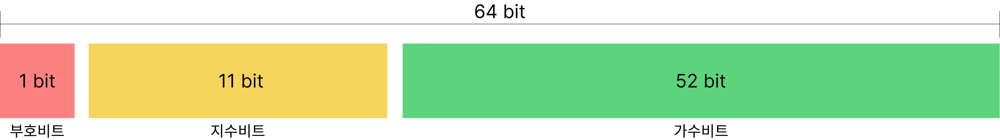

# 2. Number 타입에서 0.1 + 0.2 = 0.3이 아닌 이유

```javascript
0.1 + 0.2;         // -> 0.30000000000000004
0.1 + 0.2 === 0.3; // -> false
```

자바스크립트의 넘버 타입은 정수와 실수 구분 없이 하나의 Number로 다 표현 합니다.

컴퓨터는 2진수로 숫자를 표현합니다. 소수를 2진수로 표현할 때 표현되지 못하는 소수가 발생합니다.
이럴 때 컴퓨터는 어쩔 수 없이 표현할 수 있는 가장 근사치의 값을 저장하는데
이 근사값을 저장하는 방법이 2가지가 있습니다. 고정소수점 방식과 **64비트 부동소수점** 방식입니다.

서론이 길었는데 자바스크립트는 숫자를 저장할 때 두가지 방법 중 64비트 부동 소수점 방식을 사용합니다.

여기서 부동소수점이란? 영어로 floating point 라고 하며 영어 뜻처럼 소수점이 고정되어 있지 않고 좌우로 움직일 수 있다는 뜻입니다.
부동소수점을 표현하는 방식도 여러가지가 있지만 일반적으로 사용하고 있는 IEEE 에서 표준으로 제안한 IEEE 754 방식을 사용합니다.



부호부부은 부호를 결정합니다. 양수(0), 음수(1)를 표현하고
지수부분은 2^(n-1)-1+m 이라는 계산원리를 이용
가수부부은 가수를 표현하고 소수점 이후 숫자의 전체를 표시.

이러한 부동소수점 방식에서 소수를 변환하는 과정에서 무한소수가 발생하게 됩니다.
이 과정에서 미세한 오차가 발생하면서 값들이 손실되거나 초과하게 됩니다.
이것을 정밀도 문제라고 합니다.
따라서 0.1과 0.2를 더해서 0.3이 나오지 않는 것이 이러한 문제 때문입니다.

부동소수점 오차는 Number.epsilon을 사용하여 해결할 수 있습니다.

```javascript
function isEqual(a, b){
  // a와 b를 뺀 값의 절대값이 Number.EPSILON보다 작으면 같은 수로 인정한다.
  return Math.abs(a - b) < Number.EPSILON;
}

isEqual(0.1 + 0.2, 0.3); // -> true
```
