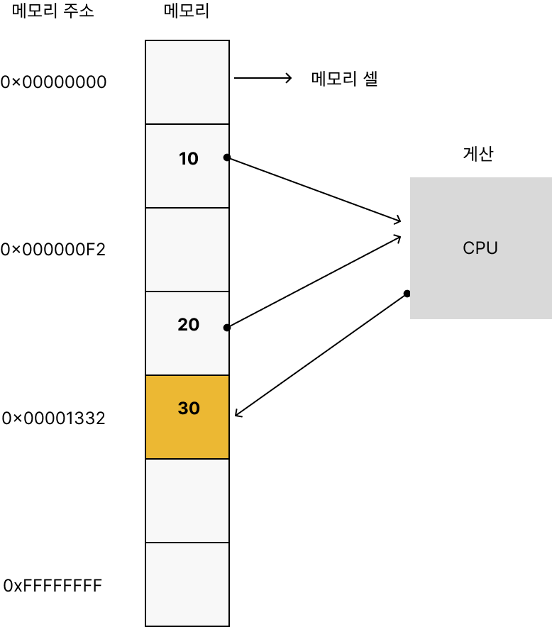
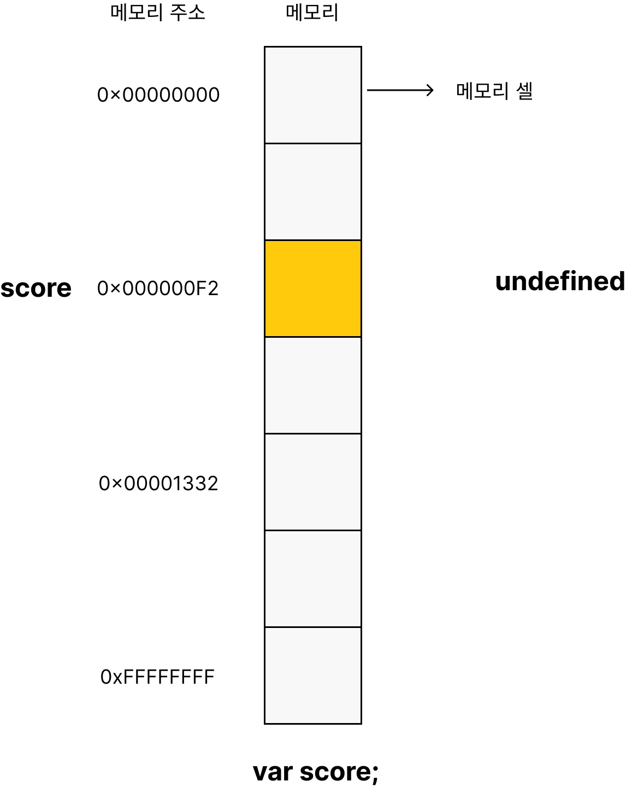

# 4. 변수

## 4.1 변수란? 왜 필요한가?

- 하나의 값을 저장하기 위해 확보한 메모리 공간 자체
- 메모리 공간을 식별하기 위해 붙인 이름.
=> 값의 위치를 가리키는 상징적인 이름



```javascript
var result = 10 + 20;
```


## 4.2 식별자

- 메모리의 주소를 기억한다. 어떤 값을 구분해서 식별할 수 있는 고유한 이름

## 4.3 변수 선언

변수를 생성하는 것. 변수를 사용하기 위해 반드시 선언이 필요하다.
var, let, const 키워드를 사용한다.

```javascript
var score;
```



1. 선언단계
2. 초기화단계 => 값을 할당하지 않았을 경우 undefined를 자동으로 할당해준다.

[var,let, const](https://github.com/juhee-playground/reading/blob/main/ModernJavascriptDeepDivee/15_let%2CconstAndBlockLevelScope.md)

## 4.4 변수 선언의 실행 시점과 변수 호이스팅

```javascript
console.log(score); // undefined

var score; // 변수 선언
```

변수 호이스팅: 변수 선언문이 코드의 선두로 끌어올려진 것처럼 동작하는 자바스크립트의 고유의 특징. 변수 선언이 런타임이 아니라 그 이전 단계에서 먼저 실행.

호이스팅이란? 어디에 선언하든지 상관 없이 선언을 맨 위로 끌어올려 주는 것을 말한다.

var의 단점

1. var hoisting(move declaration from bottom to top) : 선언을 아래에서 위로 이동
2. has no block scope : 블록범위가 없다.

> 인터프리터: 런타임(코드가 실행되는 단계)에 문 단위로 한줄 씩 바이트 코드로 변환한 후 실행
> 컴파일러: 컴파일 타임(코드가 실행되기 전 단계)에 소스코드 전체를 한번에 머신 코드로 변환한 후 실행

## 4.5 값의 할당

선언과 할당의 실행 시점은 다르다.
선언은 런타임 이전에 실행되고 값의 할당은 런타임에 실행된다.

```javascript
console.log(score); // undefined
var score = 80; 

console.log(score); // 80
```
