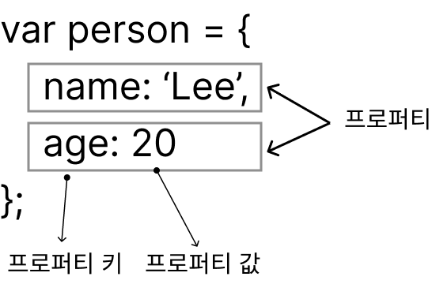

# 10. 객체 리터럴

## 10.1 객체란?

즉 객체는 변경 가능한 값.
프로퍼티의 집합



- 프로퍼티 : 객체의 상태를 나타내는 값(data)
- 메서드 : 프로퍼티(상태 데이터)를 참조하고 조작할 수 있는 동작(behavior)


## 10.2 객체 리터럴에 의한 객체 생성

객체 생성 방법

- 객체 리터럴
- Object 생성 함수
- 생성자 함수
- Object.create 메서드
- 클래스(ES6)

## 10.3 프로퍼티

객체는 프로퍼티의 집합이며, 프로퍼티는 키와 값으로 구성된다.
프로퍼티를 나열할 때 ,로 구분한다.

[예제 10-3]

```javascript
var person = {
    // 프로퍼티 키는 name, 프로퍼티 값은 'Baek'
    name: 'Baek',
    // 프로퍼티 키는 age, 프로퍼티 값은 20
    age: 20
};
```

## 10.4 메서드

프로퍼티 값이 함수일 경우 일반 함수와 구분하기 위해 메소드라 부른다.
객체에 묶여 있는 함수를 의마한다.

[예제 10-11]

```javascript
var circle = {
    radius: 5, // 프로퍼티

    // 원의 지름
    getDiameter: function() {       // 메서드
        return 2 * this.radius;     // this는 circle을 가리킨다.
    }
};

console.log(circle.getDiameter());  // 10
```
