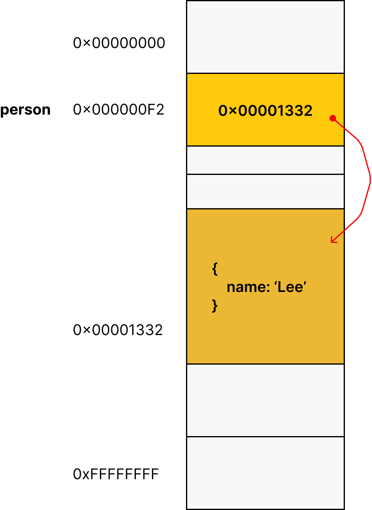
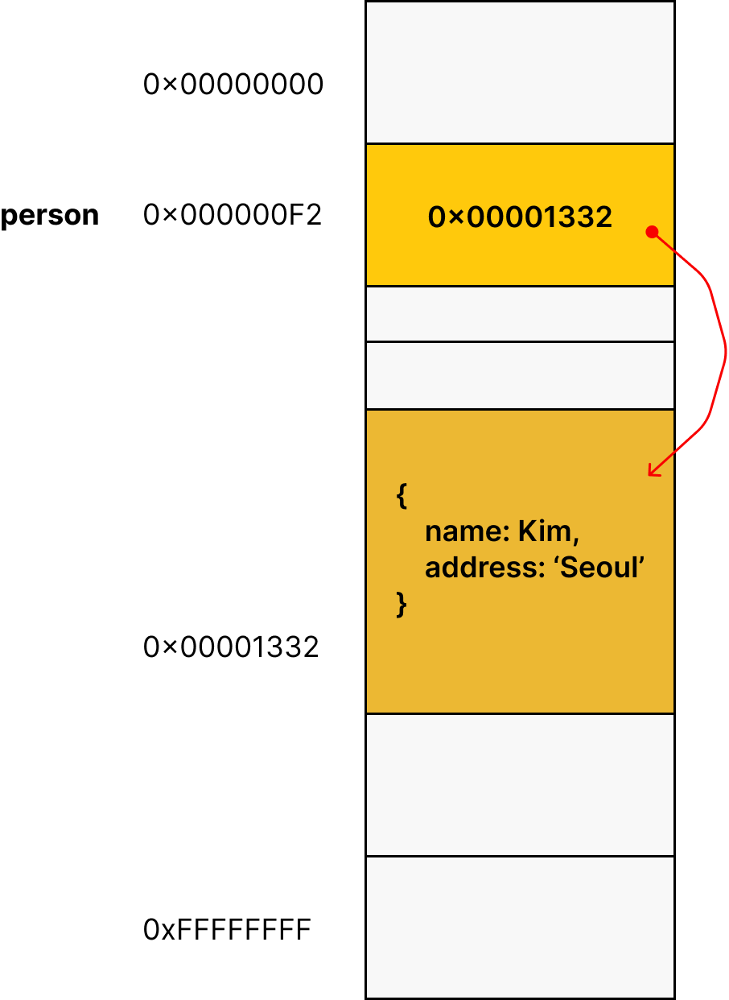
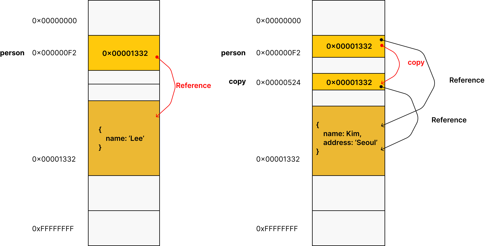

# 11. 원시값과 객체의 비교

|원시타입|객체타입|
|--------|--------|
|변경불가능한 값|변경 가능한 값|
|변수에 실제값이 저장|변수에 참조값이 저장|
| **원시 값이 복사되어** 전달 => **값에 의한 전달**|**참조값이 복사되어**전달 => **참조에 의한 전달**|

## 11.1 원시 값?

### 11.1.1 변경 불가능한 값

원시타입의**값**은 변경 불가능 한 값
원시값은 **불변성**을 가진다.
할당한 변수는 재할당 으로만 값을 변경할 수 있다.

### 11.1.2 문자열과 불변성

```javascript
var sre = 'string';

// 문자열은 유사 배열이므로 배열과 유사하게 인덱스를 사용해 각 문자에 접근할 수 있다.
// 하지만 문자열은 원시값이므로 변경할 수 없다. 이 때 에러가 발생하지 않는다.
str[0] = 'S';
console.log(str); // string
```

이미 생성된 문자열의 일부문자를 변경해도 반영되지 않는다.
=> 이는 **데이터의 신뢰성**을 보장한다.

### 11.1.3 값에 의한 전달

변수에 변수를 할당했을 때 무엇이 어떻게 전달되는가?
=> **값에 의한 전달**: 할당되는 변수의 원시값이 복사되어 전달된다. 

```javascript
var score = 80;

// copy 변수에는 score 변수의 값 80이 복사되어 할당된다.
var copy = score;

console.log(score, copy); //80 80
console.log(score === copy);  // true
```

두개의 변수는 80이라는 값을 갖지만 score변수와 copy변수의 값 80은 다른 메모리 공간에 저장된 별개의 값이다.

## 11.2 객체

### 11.2.1 변경 가능한 값

객체 타입의 값. 즉 객체는 변경 가능한 값이다.

```javascript
var person = {
    name: "Baek"
}
```



```javascript
var person = {
    name: "Baek"
}

// 프로퍼티 값 갱신
person.name = 'Kim';

// 프로퍼티 동적 생성
person.address = 'Seoul';

console.log(person); // { name: 'Baek', address: 'Seoul' }
```



객체는 변경이 가능하다. 재할당 없이 객체를 직접 변경할 수 있다.
프로퍼티를 동적으로 추가, 갱신, 삭제까지 가능하다.

### 11.2.2 참조에 의한 전달

부작용

```javascript
var person = {
    name: 'Baek'
}

// 참조값을 얕은 복사
var copy = person;
```



```javascript
var person = {
    name: 'Baek'
}

// 참조값을 복사(얕은 복사). copy와 person은 동일한 참조 값을 갖는다.
var copy = person;

// copy와 person은  동일한 객체를 참조한다.
console.log(copy === person); // true

// copy를 통해 객체를 변경한다.
copy.name = 'Kim';

// person을 통해 객체를 변경한다.
person.address = 'Seoul';

// copy와 person은 동일한 객체를 가리킨다.
// 따라서 어느 한쪽에서 객체를 변경하면 서로 영향을 주고 받는다.
console.log(person); // { name: 'Kim', address: 'Seoul' }
console.log(copy);   // { name: 'Kim', address: 'Seoul' }
```

**값에 의한 전달**과 **참조에 의한 전달**은 식별자가 기억하는 메모리 공간에 저장되어 있는 값을 복사해서 전달한다는 면에서 동일하다.
디민 식별자가 기억하는 메모리 공간, 즉 변수에 저장되어 있는 값이 원시값이냐 참조값이냐의 차이만 있을 뿐이다.
자바스크립트에는 "참조에 의한 전다"은 존재하지 않고 **"값에 의한 전달"**만 존재한다고 말할 수 있다.

#### [얕은 복사와 깊은 복사]

얕은 복사는 한단계까지 복사하는 것
깊은 복사는 객체에 중첩되어 있는 객체까지 모두 복사해서 원시값처럼 완전한 복사본을 만든다.

```javascript
const o = { x: { y: 1 } };

// 얕은 복사
const c1 - { ...o };
console.log(c1  === o);     // false
console.log(c1.x === o.x);  // true

// lodash의 cloneDeep을 사용한 깊은 복사
const _ = require('lodash');
// 깊은 복사
const c2 = _.cloneDeep(o);
console.log(c2 === o);      // false
console.log(c2.x === o.x);  // false
