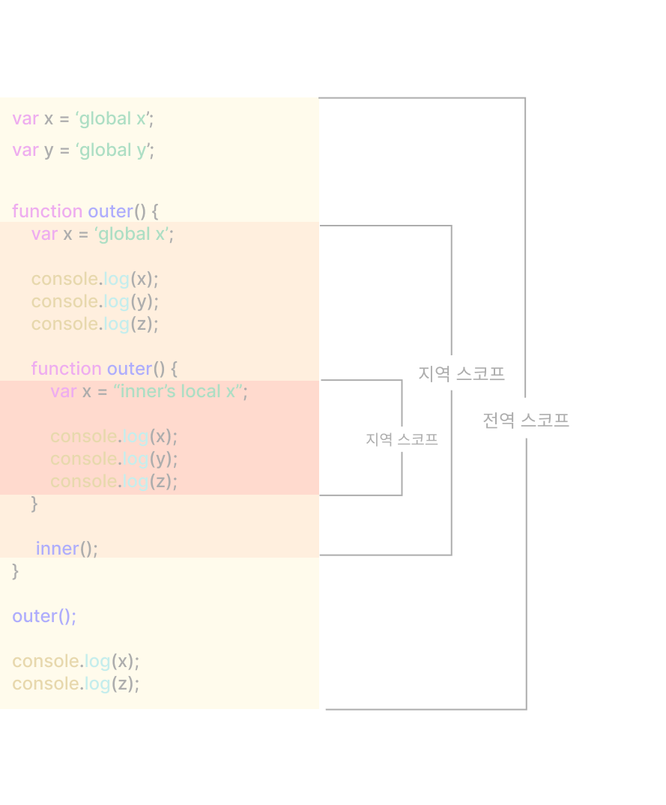

# 13. 스코프

## 13.1 스코프란?

스코프

- 식별자가 유효한 범위를 말한다.
- 식별자를 검색할 때 사용하는 규칙
- 네임스페이스다.

식별자란? 어떤 값을 구별할 수 있는 유일해야 하는 것. 하나의 값은 유일한 식별자에 연결.

[예제 13-1]

```javascript
function add(x, y) {
    // 매개변수는 함수 몸체 내부에서만 참조할 수 있다.
    // 즉, 매개변수의 스코프(유효범위)는 함수 몸체 내부이다.
    console.log(x, y); // 2 5
    return x + y;
}

add(2, 5);

// 매개변수는 함수 몸체 내부에서만 참조할 수 있다.
console.log(x, y); // ReferenceError: x is not defined
```

[예제 13-3]

```javascript
var x = 'global';       // 전역 스코프

function foo() {
    var x = 'local';    // foo 함수 스코프
    console.log(x);     // local
}

foo();

console.log(x);         // global

// 이름은 동일한 식별자지만 스코프가 다른 별개의 변수다.
```

**var 키워드로 선언한 변수의 중복 선언**
var 키워드로 선언된 변수는 같은 스코프 내에서 중복 선언이 허용된다.
이는 의도치 않게 변수값이 재할당되어 변경되는 부작용을 발생한다.

[예제 13-4]

```javascript
function foo() {
    var x = 1;
    // var 키워드로 선언된 변수는 같은 스코프 내에서 중복 선언을 허용한다.
    // 아래 변수선언문은 자바스크립트 엔진에 의해 var키워드가 없는 것처럼 동작한다.
    var x = 2;
    console.log(x);     // 2
}
```

[예제 13-5]

```javascript
function bar() {
    let x = 1;
    // let이나 const 키워드로 선언된 변수는 같은 스코프 내에서 중복 선언을 허용하지 않는다.
    let x = 2;  // SyntaxError: Identifier 'x' has already been declared
    console.log(x);    
}
```

## 13.2 스코프의 종류

|구분|설명|스코프|변수|
|:---:|:---:|:---:|:---:|
|전역|코드의 가장 바깥 영역|전역 스코프|전역 변수|
|지역|함수의 몸체 내부|지역 스코프|지역 변수|

### 13.2.1 전역과 전역 스코프



전역

- 코드의 가장 바깥쪽 영역
- 전역스코프를 만든다
- 어디서든지 참조할 수 있다

### 13.2.2 지역과 지역스코프

지역

- 함수 몸체 내부
- 지역스코프를 만든다
- 자신의 지역 스코프와 하위 지역 스코프에서 유효하다
  
## 13.3 스코프 체인

함수는 중첩될 수 있으므로 함수의 지역스코프도 중첩될 수 있다.
스코프가 함수의 중첩에 의해 계층적 구조를 갖는다.


스코프 체인: 스코프가 계층적으로 연결된 것. 물리적인 실체로 존재.

변수를 참조할 때 자바스크립트 엔진은 스코프 체인을 통해 변수를 참조하는 코드의 스코프에서 시작하여 **상위스코프 방향**으로 이동하며 선언된 변수를 **검색**한다.

자바스크립트 엔진은 코드를 실행하기 전에 위 그림과 유사한 자료구조인 렉시컬 환경(TODO: 23장 연결하기)을 실제로 생성.

변수 선언이 실행되면 변수 식별자가 이 렉시컬 환경에 키로 등록되고 변수 할당이 일어나면 변수 식별자에 해당하는 값을 변경한다.

### 13.3.1 스코프 체인에 의한 변수 검색

상위 스코프에서 유효한 변수는 하위 스코프에서 자유롭게 참조할 수 있지만 하위 스코프에서 유효한 변수를 상위 스코프에서 참조할 수 없다.

절대 하위 스코프로 내려가면서 식별자를 검색하는 일은 없다.

### 13.3.2 스코프 체인에 의한 함수 검색

[예제 13-6]

```javascript
// 전역 함수
function foo() {
    console.log('global function foo');
}

function bar() {
    // 중첩 함수
    function foo() {
        console.log('local function foo');
    }
    foo(); // local function foo
}

bar();
```

여기서 보면 스코프를 변수를 검색할 때 사용하는 규칙 이라고 표현하기 보다는 **식별자를 검색하는 규칙**이라고 표현하는 것이 더 적합하다.

## 13.4 함수 레벨 스코프

지역스코프는 코드 블록이 아닌 함수에 의해서만 생성된다.

블록 레벨 스코프: C나 자바 등을 비롯한 대부분의 프로그래밍 언어는 함수 몸체뿐만 아니라 모든 코드 블록이 지역 스코프를 만든다.

함수 레벨 스코프: var 키워드로 선언된 변수는 오로지 함수의 코드블록(함수 몸체)만을 지역 스코프로 인정한다.

[예제 13-7]

```javascript
var x = 1;

if (true) {
    // var 키워드로 선언된 변수는 함수의 코드 블록(함수 몸체)만을 지역 스코프로 인정한다.
    // 함수 밖에서 var키워드로 선언된 변수는 코드 블록 내에서 선언되었다 할지라도 모두 전역 변수다.
    // 따라서 x는 전역 변수다. 이미 선언된 전역 변수 x가 있으므로 x변수는 중복 선언된다.
    // 이는 의도치 않게 변수 값이 변경되는 부작용을 발생시킨다.
    var x = 10;
}

console.log(x); //10
```

[예제 13-8]

```javascript
var i = 10;

// for 문에서 선언한 i는 전역변수 i가 있으므로 중복 선언된다.
for(var i = 0; i < 5; i++) {
    console.log(i); // 0 1 2 3 4
}

// 의도치 않게 변수의 값이 변경되었다.
console.log(i); // 5
```

## 13.5 렉시컬 스코프

[예제 13-9]

```javascript
var x = 1;

function foo () {
    var x = 10;
    bar();
}

function bar() {
    console.log(x);
}

foo();      // 1
bar();      // 1
```

두가지 패턴 예측

1. **함수를 어디서 호출**했는지에 따라 함수의 상위 스코프가 결정한다.
2. **함수를 어디서 정의**했는지에 따라 함수의 상위 스코프가 결정한다.

동적스코프: 함수를 정의하는 시점에는 함수가 어디서 호출되는지 알 수 없다. 따라서 함수가 호출되는 시점에 동적으로 상위 스코프를 결정한다,

정적스코프(렉시컬스코프): 함수가 평가되는 시점에 상위 스코프가 정적으로 결정된다.

자바스크립트는 렉시컬 스코프를 따르므로 함수를 어디서 호출했는지가 아니라 **함수를 어디서 정의했는지**에 따라 상위 스코프를 결정한다.
함수의 상위 스코프는 언제나 자신이 정의된 스코프다.
함수의 상위 스코프는 함수 정의가 실행될 때 정적으로 결정된다.
함수정의가 실행되어 생성된 함수 객체는 이렇게 결정된 상위 스코프를 기억한다.
함수가 호출될 때마다 함수의 상위 스코프를 참조할 필요가 있기 때문이다.