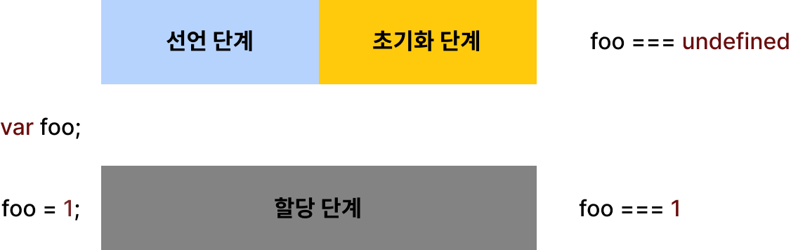
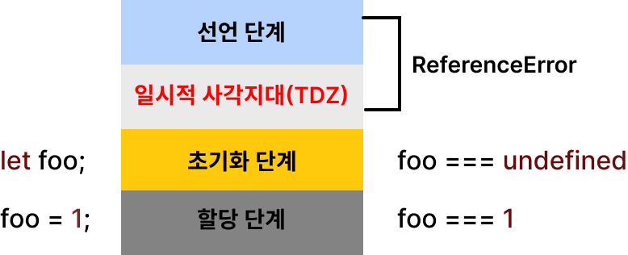

# 15. let, const 키워드와 블록 레벨 스코프

var키워드로 선언한 변수의 문제점

- 변수 중복 선언이 가능하다
- 함수레벨 스코프를 따른다. var는 함수 코드 블록만을 지역스코프로 인정한다.
- 변수 호이스팅이 발생한다.

## 15.2 let 키워드

- 변수 중복 선언 금지
- 블록 레벨 스코프를 따른다. 모든 코드 블록을 지역스코프로 인정한다.
- 변수 호이스팅이 발생하지 않는 것처럼 보인다.
  let은 선언단계와 초기화 단계가 분리되어 진행되는데
  선언 초기화 단계 사이에 변수를 참조할 수 없는 구간인 일시적 사각지대가 생긴다.

자바스크립트 ES6에서 도입된 let, cons를 포함해서 모든 선언(var, let, const, function, class 등)을 호이스팅한다. 단 ES6에서 도입된 let, const, class를 사용한 선언문은 호이스팅이 발생하지 않는 것처럼 동작한다.

## 15.3 const 키워드

const 키워드로 선언한 변수는 반드시 선언과 동시에 초기화해야 한다.

- 선언과 초기화
- 재할당 금지
- 상수: 재할당이 금지된 변수
- const 키워드와 객체 => 값 변경이 가능하다.
  const 키워드는 재할당이 금지할 뿐 불변은 아니다.

**const 키워드로 선언된 변수에 원시값을 할당할 경우 원시 값은 변경할 수 없는 값이고 const 키워드에 의해 재할당이 금지되므로 할당된 값을 변경할 수 있는 방법은 없다.**

### 15.4.3 const 키워드와 객체

**const 키워드로 선언된 변수에 객체를 할당한 경우 값을 변경할 수 있다.**
변경 불가능한 값인 원시 값은 재할당 없이 변경할 수 있는 방법은 없지만
변경 가능한 값인 객체는 재할당 없이도 직접 변경이 가능하기 때문이다.

## 15.4 var vs. let vs. const

변수 선언엔 기본적은로 const를 사용.
재할당이 필요한 경우에 한정해 let을 사용하는 것이 좋다.

- ES6를 사용한다면 var 키워드는 사용하지 않는다.
- 재할당이 필요한 경우에 한정해 let 키워드를 사용한다. 이 때 변수 스코프는 최대한 좁게 만든다.
- 변경이 발생하지 않고 읽기 전용으로 사용하는(재할당이 필요 없는 상수) 원시 값과 객체에는 const키워드를 사용한다. const키워드는 재할당을 금지하므로 var, let 키워드보다 안전하다.
