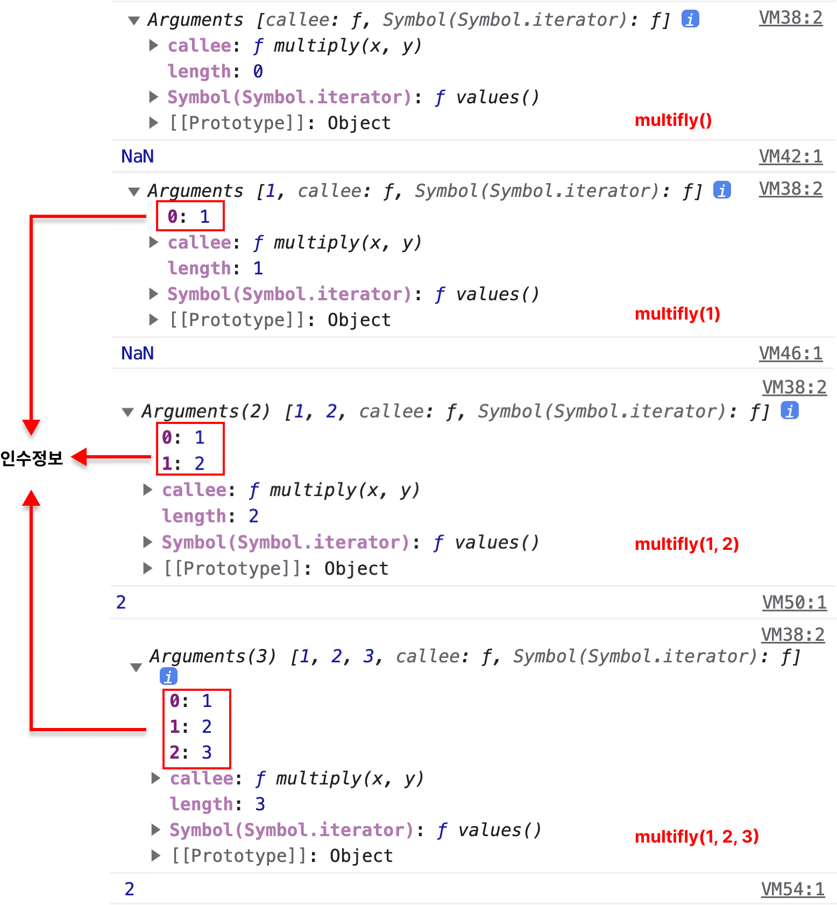

# 18. 함수와 일급객체

## 18.1 일급 객체

1. 무명의 리터럴로 생성할 수 있다. 즉 런타임에 생성 가능 하다.
2. 변수나 자료구조(객체, 배열 등)에 저장할 수 있다.
3. 함수의 매개변수에 전달할 수 있다.
4. 함수의 반환값으로 사용할 수 있다.

[예제 18-01]

```javascript
// 1. 함수는 무명의 리터럴로 생성할 수 있다.
// 2. 함수는 변수에 저장할 수 있다.
// 런타임(할당 단계)에 함수 리터럴이 평가되어 함수 객체가 생성되고 변수에 할당된다.
const increase = function (num) {
  return ++num;
};

const decrease = function (num) {
  return --num;
};

// 2. 함수는 객체에 저장할 수 있다.
const auxs = { increase, decrease };

// 3. 함수의 매개변수에게 전달할 수 있다.
// 4. 함수의 반환값으로 사용할 수 있다.
function makeCounter(aux) {
  let num = 0;

  return function () {
    num = aux(num);
    return num;
  };
}

// 3. 함수는 매개변수에게 함수를 전달할 수 있다.
const increaser = makeCounter(auxs.increase);
console.log(increaser()); // 1
console.log(increaser()); // 2

// 3. 함수는 매개변수에게 함수를 전달할 수 있다.
const decreaser = makeCounter(auxs.decrease);
console.log(decreaser()); // -1
console.log(decreaser()); // -2
```

## 18.2 함수 객체의 프로퍼티

### 18.2.1 arguments 프로퍼티

[예제 18-04]

```javascript
function multiply(x, y) {
  console.log(arguments);
  return x * y;
}

console.log(multiply());        // NaN
console.log(multiply(1));       // NaN
console.log(multiply(1, 2));    // 2
console.log(multiply(1, 2, 3)); // 2
```



arguments 객체

- 함수 호출 시 전달된 인수들의 정보를 담고 있다
- 순회 가능한 유사 배열 객체
- 함수 내부에서 지역 변수처럼 사용
- 매개변수 개수를 확정할 수 없는 **가변 인자 함수**를 구현할 때 유용

caller 프로퍼티
호출되어 arguments 객체를 생성한 함수, 즉 함수 자신을 가리키고

length 프로퍼티 = 인수의 개수

[예제 18-06]

```javascript
function sum() {
  let res = 0;

  // arguments 객체는 length 프로퍼티가 있는 유사 배열 객체이므로 for 문으로 순회할 수 있다.
  for (let i = 0; i < arguments.length; i++) {
    res += arguments[i];
  }

  return res;
}

console.log(sum());        // 0
console.log(sum(1, 2));    // 3
console.log(sum(1, 2, 3)); // 6
```

> **유사 배열 객체와 이터러블**
> ES6에서 도입된 이터레이션 프로토콜을 준수하면 순회 가능한 자료구조인 이터러블이 된다.
> 이터러블 개념이 없던 ES5에서 arguments 객체는 유사배열 객체로 구분되었다.
> 하지만 이터러블이 도입된 ES6부터 arguments 객체는 유사배열 객체이면서 동시에 이터러블이다.


### 18.2.5 __proto__ 접근자 프로퍼티

[예제 18-12]

```javascript
const obj = { a: 1 };

// 객체 리터럴 방식으로 생성한 객체의 프로토타입 객체는 Object.prototype이다.
console.log(obj.__proto__ === Object.prototype); // true

// 객체 리터럴 방식으로 생성한 객체는 프로토타입 객체인 Object.prototype의 프로퍼티를 상속받는다.
// hasOwnProperty 메서드는 Object.prototype의 메서드다.
console.log(obj.hasOwnProperty('a'));         // true
console.log(obj.hasOwnProperty('__proto__')); // false
```

> **hasOwnProperty메서드**
> hasOwnProperty 메서드는 이름에서 알 수 있듯이 인수로 전달받은 프로퍼티 키가 객체 고유의 프로퍼티 키인 경우에만 true를 반환하고 상속받은 프로포타입의 프로퍼티 키인 경우 false를 반환한다.

### 18.2.6 prototype 프로퍼티

생성자 함수로 호출할 수 있는 함수 객체 consrtuctor 만이 소유한 프로퍼티

[예제 18-13]

```javascript
// 함수 객체는 prototype 프로퍼티를 소유한다.
(function () {}).hasOwnProperty('prototype'); // -> true

// 일반 객체는 prototype 프로퍼티를 소유하지 않는다.
({}).hasOwnProperty('prototype'); // -> false
```
