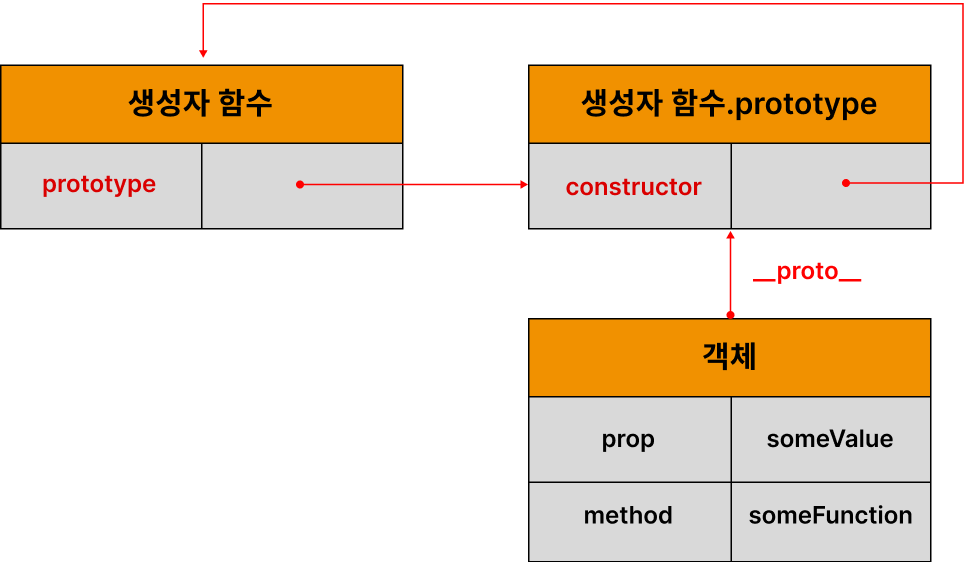
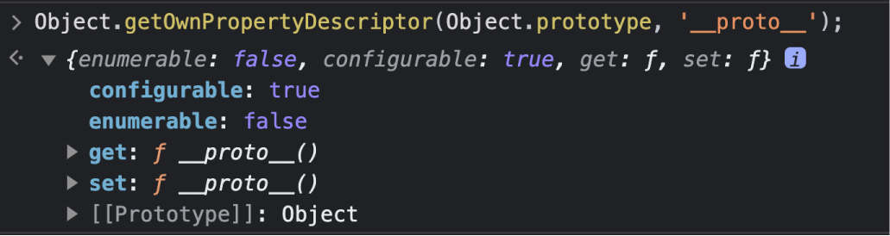
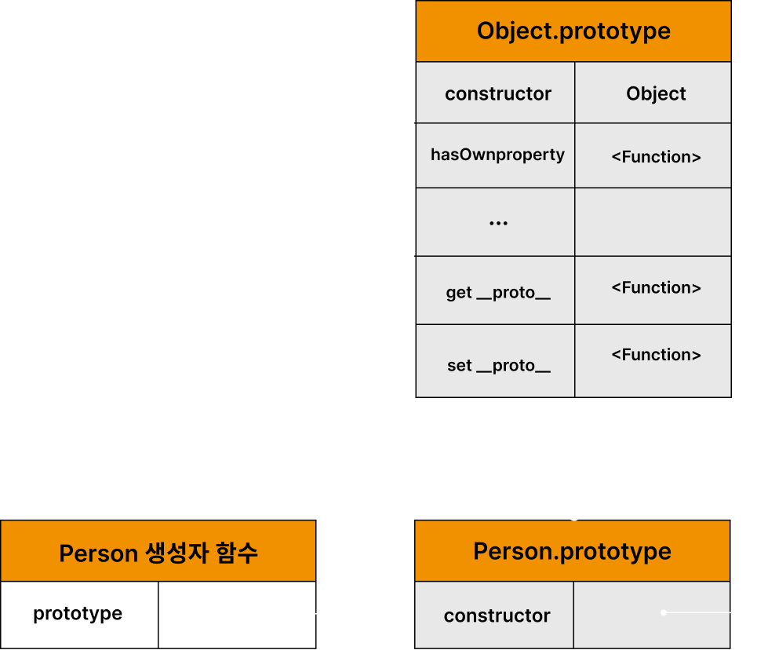
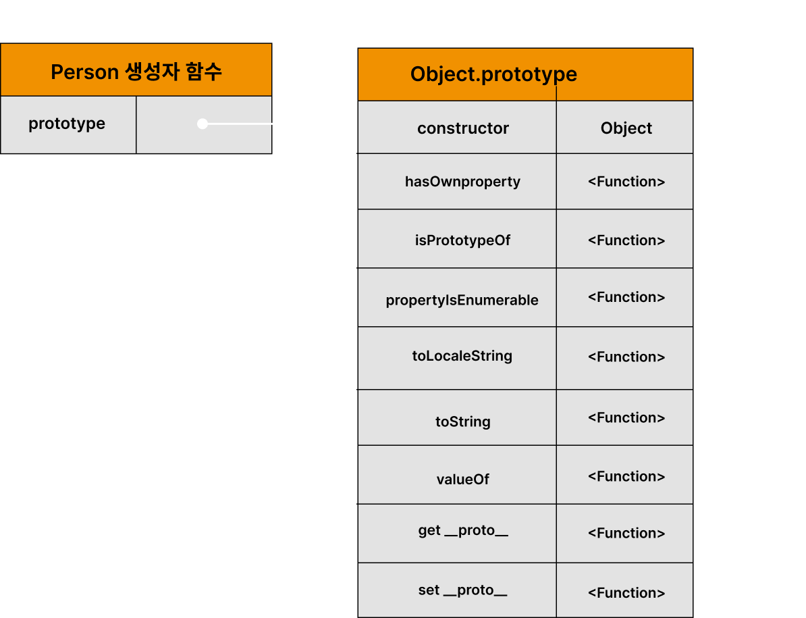
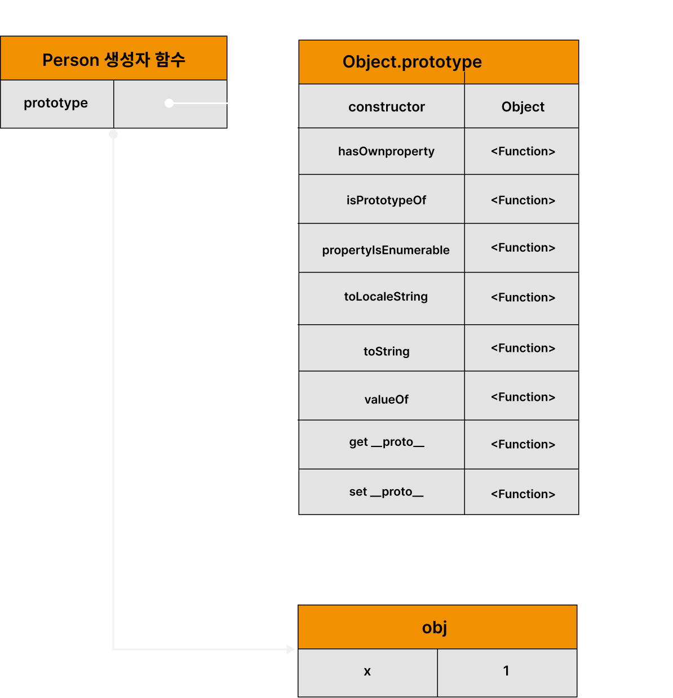
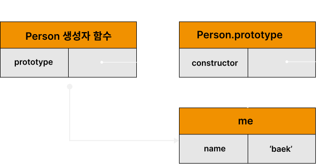
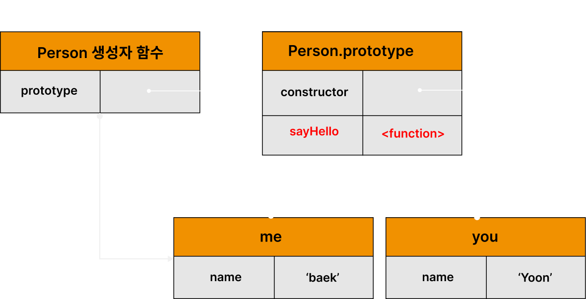
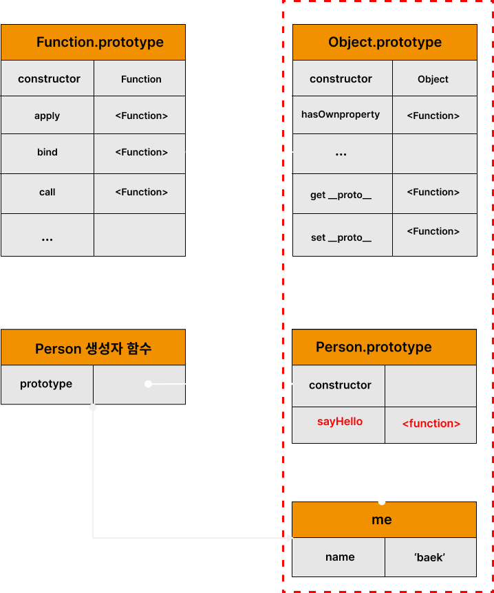
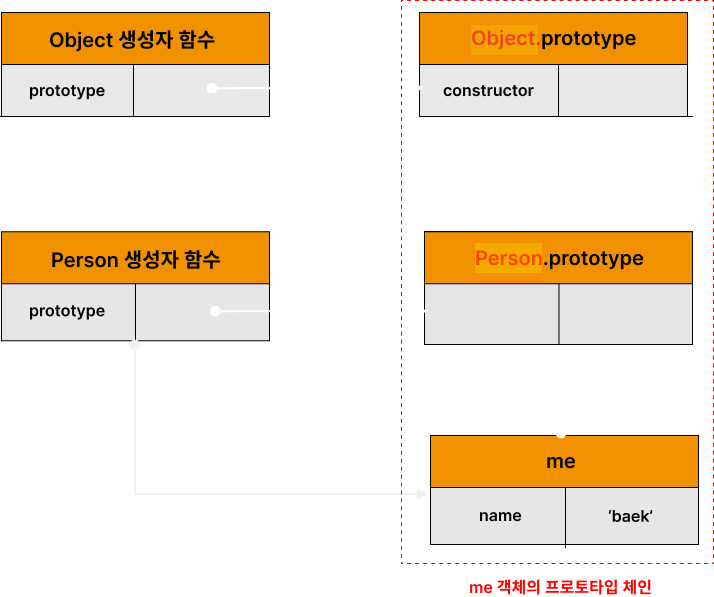

# 19. 프로토타입

//TODO: ch.25 클래스랑 연동하기
> **클래스(Class)**
> ES6에서 클래스가 도입되었다. 하지만 ES6의 클래스가 기존의 프로토타입 기반 객체지향 모델을 폐지하고 새로운 객체지향 모델을 제공하는 것은 아니다. 사실 클래스도 함수이며, 기존 프로토타입 기반 패턴 문법적 설탕 이라고 볼 수 있다.
> 클래스와 생성자 함수는 모두 프로토타입 기반의 인스턴스를 생성하지만 정확히 동일하게 동작하지는 않는다. 클래스는 생성자 함수보다 엄격하여 클래스는 생성자 함수에서는 제공하지 않는 기능도 제공한다.
> 따라서 클래스를 프로토타입 기반 객체 생성 패턴의 단순한 문법적 설탕으로 보기보다는 새로운 객체 생성 매커니즘으로 보는것이 좀 더 합당하다고 할 수 있다.

자바스크립트는 객체 기반의 프로그래밍 언어이며 **자바스크립트를 이루고 있는 거의 "모든 것"이 객체다.**

## 19.1 객체지향 프로그래밍

객체지향 프로그래밍은 실세계의 실체를 인식하는 철학적 사고를 프로그래밍에 접목하려는 시도에서 시작. 실체는 특징이나 성질을 나타내는 **속성**을 가지고 있다.

사람에게는 다양한 속성이 있으나 우리가 구현하려는 프로그램에서는 사람의 이름과 주소라는 속성만 관심이 있다. 다양한 속성 중에서 필요한 속성만 간추려 내어 표현 하는 것이 **추상화**라 한다.

[예제 19-01]

```javascript
// 이름과 주소 속성을 갖는 객체
const person = {
  name: 'Kim',
  address: 'Seoul'
};

console.log(person); // {name: "Kim", address: "Seoul"}
```

**속성을 통해 여러 개의 값을 하나의 단위로 구성한 복합적인 자료구조**를 객체라 한다.

원이라는 개념을 만들고 원에는 반지름이라는 속성이 있다. 이 반지름을 가지고 지름, 둘레, 넓이를 구할 수 있다. 이 때 반지름은 원의 **상태를 나타내는 데이터**이며 원의 지름, 둘레, 넓이를 구하는 것은 **동작**이다.

[예제 19-02]

```javascript
const circle = {
  radius: 5, // 반지름

  // 원의 지름: 2r
  getDiameter() {
    return 2 * this.radius;
  },

  // 원의 둘레: 2πr
  getPerimeter() {
    return 2 * Math.PI * this.radius;
  },

  // 원의 넓이: πrr
  getArea() {
    return Math.PI * this.radius ** 2;
  }
};

console.log(circle);
// {radius: 5, getDiameter: ƒ, getPerimeter: ƒ, getArea: ƒ}

console.log(circle.getDiameter());  // 10
console.log(circle.getPerimeter()); // 31.41592653589793
console.log(circle.getArea());      // 78.53981633974483
```

객체지향 프로그래밍은 객체의 **상태**를 나타내는 데이터와 상태 데이터를 조작할 수 있는 **동작**을 묶어서 생각한다.
따라서 객체는 **상태 데이터와 동작을 하나의 논리적인 단위로 묶은 복합적인 자료구조**라고 할 수 있다.

## 19.2 상속과 프로토타입

상속은 객체지향 프로그래밍의 핵심 개념이다. 어떤 객체의 프로퍼티 또는 메서드를 다른 객체가 상속받아 그대로 사용할 수 있는 것을 말한다.

[예제 19-03]

```javascript
// 생성자 함수
function Circle(radius) {
  this.radius = radius;
  this.getArea = function () {
    // Math.PI는 원주율을 나타내는 상수다.
    return Math.PI * this.radius ** 2;
  };
}

// 반지름이 1인 인스턴스 생성
const circle1 = new Circle(1);
// 반지름이 2인 인스턴스 생성
const circle2 = new Circle(2);

// Circle 생성자 함수는 인스턴스를 생성할 때마다 동일한 동작을 하는
// getArea 메서드를 중복 생성하고 모든 인스턴스가 중복 소유한다.
// getArea 메서드는 하나만 생성하여 모든 인스턴스가 공유해서 사용하는 것이 바람직하다.
console.log(circle1.getArea === circle2.getArea); // false

console.log(circle1.getArea()); // 3.141592653589793
console.log(circle2.getArea()); // 12.566370614359172
```


상속을 통해 불필요한 중복을 제거 하고 **자바스크립트는 프로토타입을 기반으로 상속을 구현한다.**

[예제 19-04]

```javascript
// 생성자 함수
function Circle(radius) {
  this.radius = radius;
}

// Circle 생성자 함수가 생성한 모든 인스턴스가 getArea 메서드를
// 공유해서 사용할 수 있도록 프로토타입에 추가한다.
// 프로토타입은 Circle 생성자 함수의 prototype 프로퍼티에 바인딩되어 있다.
Circle.prototype.getArea = function () {
  return Math.PI * this.radius ** 2;
};

// 인스턴스 생성
const circle1 = new Circle(1);
const circle2 = new Circle(2);

// Circle 생성자 함수가 생성한 모든 인스턴스는 부모 객체의 역할을 하는
// 프로토타입 Circle.prototype으로부터 getArea 메서드를 상속받는다.
// 즉, Circle 생성자 함수가 생성하는 모든 인스턴스는 하나의 getArea 메서드를 공유한다.
console.log(circle1.getArea === circle2.getArea); // true

console.log(circle1.getArea()); // 3.141592653589793
console.log(circle2.getArea()); // 12.566370614359172
```


## 19.3 프로토타입 객체



### 19.3.1 __proto__ 접근자 프로퍼티

[예제 19-05]

```javascript
const person = { name: 'Baek' };
```


**__proto__는 접근자 프로퍼티다.**



[예제 19-06]

```javascript
const obj = {};
const parent = { x: 1 };

// getter 함수인 get __proto__가 호출되어 obj 객체의 프로토타입을 취득
obj.__proto__;
// setter함수인 set __proto__가 호출되어 obj 객체의 프로토타입을 교체
obj.__proto__ = parent;

console.log(obj.x); // 1
```

**__proto__는 접근자 프로퍼티는 상속을 통해 사용된다.**

접근자 프로퍼티는 객체가 **직접 소유하는** 프로퍼티가 아니다.
Object.prototype의 프로퍼티다.
모든 객체는 상속을 통해 Object.prototype.__proto__접근자 프로퍼를 사용할 수 있다.

[예제 19-07]

```javascript
const person = { name: 'Baek' };

// person 객체는 __proto__ 프로퍼티를 소유하지 않는다.
console.log(person.hasOwnProperty('__proto__')); // false

// __proto__ 프로퍼티는 모든 객체의 프로토타입 객체인 Object.prototype의 접근자 프로퍼티다.
console.log(Object.getOwnPropertyDescriptor(Object.prototype, '__proto__'));
// {get: ƒ, set: ƒ, enumerable: false, configurable: true}

// 모든 객체는 Object.prototype의 접근자 프로퍼티 __proto__를 상속받아 사용할 수 있다.
console.log({}.__proto__ === Object.prototype); // true
```

**__proto__ 접근자 프로퍼티를 통해 프로토타입에 접근하는 이유**

[예제 19-08]


```javascript
const parent = {};
const child = {};

// child의 프로토타입을 parent로 설정
child.__proto__ = parent;
// parent의 프로토타입을 child로 설정
parent.__proto__ = child; // TypeError: Cyclic __proto__ value
```


프로토타입 체인은 단방향 링크드 리스트로 구현되어야 한다.

**__proto__ 접근자 프로퍼티를 코드 내에서 직접 사용하는 것은 권장 하지 않음**

[예제 19-09]

```javascript
// obj는 프로토타입 체인의 종점이다. 따라서 Object.__proto__를 상속받을 수 없다.
const obj = Object.create(null);

// obj는 Object.__proto__를 상속받을 수 없다.
console.log(obj.__proto__); // undefined

// 따라서 __proto__보다 Object.getPrototypeOf 메서드를 사용하는 편이 좋다.
console.log(Object.getPrototypeOf(obj)); // null
```

[예제 19-10]

```javascript
const obj = {};
const parent = { x: 1 };

// obj 객체의 프로토타입을 취득
Object.getPrototypeOf(obj); // obj.__proto__;
// obj 객체의 프로토타입을 교체
Object.setPrototypeOf(obj, parent); // obj.__proto__ = parent;

console.log(obj.x); // 1
```

### 19.3.2 함수 객체의 prototype 프로퍼티

함수 객체만이 소유하는 prototype 프로퍼티는 생성자 함수가 생성할 인스턴스의 프로토타입을 가리킨다.

[예제 19-11]

```javascript
// 함수 객체는 prototype 프로퍼티를 소유한다.
(function () {}).hasOwnProperty('prototype'); // -> true

// 일반 객체는 prototype 프로퍼티를 소유하지 않는다.
({}).hasOwnProperty('prototype'); // -> false
```

prototype 프로퍼티는 생성자 함수가 생성할 객체(인스턴스)의 프로토타입을 가리킨다.
non-constructor인 화살표 함수와 ES6 메서드 축약표현으로 정의한 메서드는 prototype 프로퍼티를 소유하지 않으며 프로토타입도 생성하지 않는다.

[예제 19-12]

```javascript
// 화살표 함수는 non-constructor다.
const Person = name => {
  this.name = name;
};

// non-constructor는 prototype 프로퍼티를 소유하지 않는다.
console.log(Person.hasOwnProperty('prototype')); // false

// non-constructor는 프로토타입을 생성하지 않는다.
console.log(Person.prototype); // undefined

// ES6의 메서드 축약 표현으로 정의한 메서드는 non-constructor다.
const obj = {
  foo() {}
};

// non-constructor는 prototype 프로퍼티를 소유하지 않는다.
console.log(obj.foo.hasOwnProperty('prototype')); // false

// non-constructor는 프로토타입을 생성하지 않는다.
console.log(obj.foo.prototype); // undefined
```

모든 객체가 가지고 있는(엄밀히 말하면 Object.prototype으로부터 상속받은) __proto__ 접근자 프로퍼티와 
함수 객체만이 가지고 있는 prototype 프로퍼티는 결국 동일한 프로토타입을 가리킨다.

|구분|소유|값|사용주체|사용목적|
|---|---|-|------|-----------------------|
|__proto__ 접근자 프로퍼티|모든객체|프로토타입의 참조|모든 객체|객체가 자신의 프로토타입에 접근 또는 교체하기 위해 사용|
|prototype 프로퍼티|constructor|프로토타입의 참조|생성자 함수|생성자 함수가 자신이 생성할 객체(인스턴스)의 프로토타입을 할당하기 위해 사용|

[예제 19-13]

```javascript
// 생성자 함수
function Person(name) {
  this.name = name;
}

const me = new Person('Baek');

// 결국 Person.prototype과 me.__proto__는 결국 동일한 프로토타입을 가리킨다.
console.log(Person.prototype === me.__proto__);  // true


### 19.3.3 프로토타입의 constructor 프로퍼티와 생성자 함수

[예제 19-14]
`
```javascript
// 생성자 함수
function Person(name) {
  this.name = name;
}

const me = new Person('Baek');

// me 객체의 생성자 함수는 Person이다.
// me 객체는 프로토타입인 Person.prototype의 constructor 프로퍼티를 상속받아 사용
console.log(me.constructor === Person);  // true
```


## 19.4 리터럴 표기법에 의해 생성된 객체의 생성자 함수와 프로토타입

[예제 19-15]

```javascript
// obj 객체를 생성한 생성자 함수는 Object다.
const obj = new Object();
console.log(obj.constructor === Object); // true

// add 함수 객체를 생성한 생성자 함수는 Function이다.
const add = new Function('a', 'b', 'return a + b');
console.log(add.constructor === Function); // true

// 생성자 함수
function Person(name) {
  this.name = name;
}

// me 객체를 생성한 생성자 함수는 Person이다.
const me = new Person('Baek');
console.log(me.constructor === Person); // true
```

[예제 19-16]

```javascript
// 객체 리터럴
const obj = {};

// 함수 리터럴
const add = function (a, b) { return a + b; };

// 배열 리터럴
const arr = [1, 2, 3];

// 정규표현식 리터럴
const regexp = /is/ig;
```

[예제 19-17]

```javascript
// obj 객체는 Object 생성자 함수로 생성한 객체가 아니라 객체 리터럴로 생성했다.
const obj = {};

// 하지만 obj 객체의 생성자 함수는 Object 생성자 함수다.
console.log(obj.constructor === Object); // true
```


[참조](https://262.ecma-international.org/11.0/#sec-object-objects)


[예제 19-18]

```javascript
// 2. Object 생성자 함수에 의한 객체 생성
// 인수가 전달되지 않았을 때 추상 연산 OrdinaryObjectCreate를 호출하여 빈 객체를 생성한다.
let obj = new Object();
console.log(obj); // {}

// 1. new.target이 undefined나 Object가 아닌 경우
// 인스턴스 -> Foo.prototype -> Object.prototype 순으로 프로토타입 체인이 생성된다.
class Foo extends Object {}
new Foo(); // Foo {}

// 3. 인수가 전달된 경우에는 인수를 객체로 변환한다.
// Number 객체 생성
obj = new Object(123);
console.log(obj); // Number {123}

// String  객체 생성
obj = new Object('123');
console.log(obj); // String {"123"}
```


[참조](https://262.ecma-international.org/11.0/#sec-object-initializer-runtime-semantics-evaluation)

[예제 19-19]

```javascript
// foo 함수는 Function 생성자 함수로 생성한 함수 객체가 아니라 함수 선언문으로 생성했다.
function foo() {}

// 하지만 constructor 프로퍼티를 통해 확인해보면 함수 foo의 생성자 함수는 Function 생성자 함수다.
console.log(foo.constructor === Function); // true
```

프로토타입과 생성자함수는 단독으로 존재할 수 없고 언제나 쌍으로 존재한다.

|리터럴 표기법|생성자 함수|프로토타입|
|----------|--------|-------|
|객체 리터럴|Object|Object.prototype|
|함수 리터럴|Function|Function.prototype|
|배열 리터럴|Array|Array.prototype|
|정규 표현식 리터럴|RegExp|RegExp.prototype|

## 19.5 프로토타입의 생성 시점

프로토타입은 생성자 함수가 생성되는 시점에 더불어 생성된다.

### 19.5.1 사용자 정의 생성자 함수와 프로토타입 생성 시점

생성자 함수로서 호출할 수 있는 함수, 즉 constructor는 함수 정의가 평가되어 함수 객체를 생성하는 시점에 프로토타입도 더불어 생성된다.

[예제 19-20]

```javascript
// 함수 정의(constructor)가 평가되어 함수 객체를 생성하는 시점에 프로토타입도 더불어 생성된다.
console.log(Person.prototype); // {constructor: ƒ}

// 생성자 함수
function Person(name) {
  this.name = name;
}
```

함수 선언문은 런타임 이전에 자바스크립트 엔진에 의해 먼저 실행된다. 
따라서 함수 선언문으로 정의된 Person 생성자 함수는 어떤 코드보다 먼저 평가되어 함수 객체가 된다.
이 때 프로토타입도 더불어 생성된다.

[예제 19-21]

```javascript
// 화살표 함수는 non-constructor다.
const Person = name => {
  this.name = name;
};

// non-constructor는 프로토타입이 생성되지 않는다.
console.log(Person.prototype); // undefined
// 에러 발생: Uncaught SyntaxError: Identifier 'Person' has already been declared
```



### 19.5.2 빌트인 생성자 함수와 프로토타입 생성 시점



객체가 생성되기 이전에 생성자 함수와 프로토타입은 이미 객체화가 되어 존재한다.
이후 생성자 함수 또는 리터럴 표기법으로 객체를 생성하면 프로토타입은 생성된 객체의 [[Prototype]] 내부 슬롯에 할당된다.

## 19.6 객체 생성 방식과 프로토타입 결정

객체 생성 방법

- 객체 리터럴
- Object 생성자 함수
- 생성자 함수
- Object.create 메서드
- 클래스(ES6)

### 19.6.1 객체 리터럴에 의해 생성된 객체의 프로토타입

[예제 19-23]

```javascript
const obj = { x: 1 };
```


[예제 19-24]

```javascript
const obj = { x: 1 };

// 객체 리터럴에 의해 생성된 obj 객체는 Object.prototype을 상속받는다.
console.log(obj.constructor === Object); // true
console.log(obj.hasOwnProperty('x'));    // true
```

### 19.6.2 Object 생성자 함수에 의해 생성된 객체의 프로토타입

[예제 19-25]

```javascript
const obj = new Object();
obj.x = 1;
```



[예제 19-26]

```javascript
const obj = new Object();
obj.x = 1;

// Object 생성자 함수에 의해 생성된 obj 객체는 Object.prototype을 상속받는다.
console.log(obj.constructor === Object); // true
console.log(obj.hasOwnProperty('x'));    // true
```

### 19.6.3 생성자 함수에 의해 생성된 객체의 프로토타입

[예제 19-27]

```javascript
function Person(name) {
  this.name = name;
}

const me = new Person('Baek');
```



[예제 19-28]

```javascript
function Person(name) {
  this.name = name;
}

// 프로토타입 메서드
Person.prototype.sayHello = function () {
  console.log(`Hi! My name is ${this.name}`);
};

const me = new Person('Baek');
const you = new Person('Kim');

me.sayHello();  // Hi! My name is Baek
you.sayHello(); // Hi! My name is Kim
```



## 19.7 프로토타입 체인

[예제 19-29]

```javascript
function Person(name) {
  this.name = name;
}

// 프로토타입 메서드
Person.prototype.sayHello = function () {
  console.log(`Hi! My name is ${this.name}`);
};

const me = new Person('Baek');

// hasOwnProperty는 Object.prototype의 메서드다.
console.log(me.hasOwnProperty('name')); // true
```

[예제 19-30]

```javascript
Object.getPrototypeOf(me) === Person.prototype; // -> true
```

[예제 19-31]

```javascript
Object.getPrototypeOf(Person.prototype) === Object.prototype; // -> true
```



자바스크립트의 객체의 프로퍼티에 접근하려고 할 때 해당 객체에 접근하려는 프로퍼티가 없다면 [[Prototype]]
내부 슬롯의 참조를 따라 자신의 부모 역활을 하는 프로토타입의 프로퍼티를 순차적으로 검색한다.
이를 프로토타입 체인이라 한다. 프로토타입 체인은 자바스크립트가 객체지향 프로그래밍의 상속을 구현하는 매커니즘이다.

[예제 19-32]

```javascript
// hasOwnProperty는 Object.prototype의 메서드다.
// me 객체는 프로토타입 체인을 따라 hasOwnProperty 메서드를 검색하여 사용한다.
me.hasOwnProperty('name'); // -> true
```

1. 먼저 hasOwnProperty 메서드를 호출한 me 객체에서 hasOwnProperty 메서드를 검색한다.
   me 객체에는 hasOwnProperty 메서드가 없으므로 프로토타입 체인을 따라, 다시말해 [[Prototype]] 내부 슬롯에 반인딩되어 있는
   프로토타입(위 예제의 경우 Peron.prototype)으로 이동하여 hasOwnProperty 메서드를 검색한다.
2. Person.prototype에도 hasOwnProperty 메서드가 없으므로 프로토타 체인을 따라, 다시 말해 [[Prototype]] 내부 슬롯에 바인딩 되어 있는
   프로토타입(위 예제의 경우 Object.prototype)으로 이동하여 hasOwnProperty 메서드를 검색한다.
3. Object.prototype에는 hasOwnProperty 메서드가 존재한다. 자바스크립트 엔진은 Object.prototype.hasOwnProperty 메서드를 호출한다.
   이 때 Objects.prototype.hasOwnProperty 메서드의 this에는 me 객체가 바인딩된다.

[예제 19-33]

```javascript
Object.prototype.hasOwnProperty.call(me, 'name');
```

> call 메서드
> this로 사용할 객체를 전달하면서 함수를 호출한다. 이에 대해서는 22.2.4절 에서 자세히 보자.
> 지금은 this로 사용할 me 객체를 전달하면서 Object.prototype.hasOwnProperty 메서드를 호출한다고 이해하자.

Object.prototype을 프로토타입 체인의 종점이라 한다.

[예제 19-34]

```javascript
console.log(me.foo); // undefined
```

자바스크립트 엔진은 프로토타입 체인을 따라 프로퍼티/메서드를 검색한다.
객체 간의 **상속 관계**로 이루어진 프로토타입의 계층적인 구조에서 객체의 프로퍼티를 검색한다.
**프로토타입 체인은 상속과 프로퍼티 검색을 위한 메커니즘**

이에 반해 프로퍼티가 아닌 식별자는 스코프 체인에서 검색한다.
자바스크립트 엔진은 함수의 **중첩 관계**로 이루어진 스코프의 계층 구조에서 식별자를 검색한다.
스코프 체인은 식별자 검색을 위한 메커니즘.

[예제 19-35]

```javascript
me.hasOwnProperty('name');
```

스코프 체인과 프로토타입 체인은 서로 연관없이 별도로 동작하는 것이 아니라 서로 협력하여 식별자와 프로퍼티를 검색하는데 사용된다.

## 19.8 오버라이딩과 프로퍼티 섀도잉

[예제 19-36]

```javascript
const Person = (function () {
  // 생성자 함수
  function Person(name) {
    this.name = name;
  }

  // 프로토타입 메서드
  Person.prototype.sayHello = function () {
    console.log(`Hi! My name is ${this.name}`);
  };

  // 생성자 함수를 반환
  return Person;
}());

const me = new Person('Baek');

// 인스턴스 메서드
me.sayHello = function () {
  console.log(`Hey! My name is ${this.name}`);
};

// 인스턴스 메서드가 호출된다. 프로토타입 메서드는 인스턴스 메서드에 의해 가려진다.
me.sayHello(); // Hey! My name is Baek
```


[예제 19-37]

```javascript
// 인스턴스 메서드를 삭제한다.
delete me.sayHello;
// 인스턴스에는 sayHello 메서드가 없으므로 프로토타입 메서드가 호출된다.
me.sayHello(); // Hi! My name is Baek
```

[예제 19-38]

```javascript
// 프로토타입 체인을 통해 프로토타입 메서드가 삭제되지 않는다.
delete me.sayHello;
// 프로토타입 메서드가 호출된다.
me.sayHello(); // Hi! My name is Baek
```

[예제 19-39]

```javascript
// 프로토타입 메서드 변경
Person.prototype.sayHello = function () {
  console.log(`Hey! My name is ${this.name}`);
};
me.sayHello(); // Hey! My name is Baek

// 프로토타입 메서드 삭제
delete Person.prototype.sayHello;
me.sayHello(); // TypeError: me.sayHello is not a function
```

## 19.9 프로토타입의 교체

### 19.9.1 생성자 함수에 의한 프로토타입의 교체

[예제 19-40]

```javascript
const Person = (function () {
  function Person(name) {
    this.name = name;
  }

  // ① 생성자 함수의 prototype 프로퍼티를 통해 프로토타입을 교체
  Person.prototype = {
    sayHello() {
      console.log(`Hi! My name is ${this.name}`);
    }
  };

  return Person;
}());

const me = new Person('Baek');
```

[예제 19-41]

```javascript
// 프로토타입을 교체하면 constructor 프로퍼티와 생성자 함수 간의 연결이 파괴된다.
console.log(me.constructor === Person); // false
// 프로토타입 체인을 따라 Object.prototype의 constructor 프로퍼티가 검색된다.
console.log(me.constructor === Object); // true
```

[예제 19-42]

```javascript
const Person = (function () {
  function Person(name) {
    this.name = name;
  }

  // 생성자 함수의 prototype 프로퍼티를 통해 프로토타입을 교체
  Person.prototype = {
    // constructor 프로퍼티와 생성자 함수 간의 연결을 설정
    constructor: Person,
    sayHello() {
      console.log(`Hi! My name is ${this.name}`);
    }
  };

  return Person;
}());

const me = new Person('Baek');

// constructor 프로퍼티가 생성자 함수를 가리킨다.
console.log(me.constructor === Person); // true
console.log(me.constructor === Object); // false
```

### 19.9.2 인스턴스에 의한 프로토타입의 교체

[예제 19-43]

```javascript
function Person(name) {
  this.name = name;
}

const me = new Person('Baek');

// 프로토타입으로 교체할 객체
const parent = {
  sayHello() {
    console.log(`Hi! My name is ${this.name}`);
  }
};

// ① me 객체의 프로토타입을 parent 객체로 교체한다.
Object.setPrototypeOf(me, parent);
// 위 코드는 아래의 코드와 동일하게 동작한다.
// me.__proto__ = parent;

me.sayHello(); // Hi! My name is Baek
```

[예제 19-44]

```javascript
// 프로토타입을 교체하면 constructor 프로퍼티와 생성자 함수 간의 연결이 파괴된다.
console.log(me.constructor === Person); // false
// 프로토타입 체인을 따라 Object.prototype의 constructor 프로퍼티가 검색된다.
console.log(me.constructor === Object); // true
```

[예제 19-45]

```javascript
function Person(name) {
  this.name = name;
}

const me = new Person('Baek');

// 프로토타입으로 교체할 객체
const parent = {
  // constructor 프로퍼티와 생성자 함수 간의 연결을 설정
  constructor: Person,
  sayHello() {
    console.log(`Hi! My name is ${this.name}`);
  }
};

// 생성자 함수의 prototype 프로퍼티와 프로토타입 간의 연결을 설정
Person.prototype = parent;

// me 객체의 프로토타입을 parent 객체로 교체한다.
Object.setPrototypeOf(me, parent);
// 위 코드는 아래의 코드와 동일하게 동작한다.
// me.__proto__ = parent;

me.sayHello(); // Hi! My name is Baek

// constructor 프로퍼티가 생성자 함수를 가리킨다.
console.log(me.constructor === Person); // true
console.log(me.constructor === Object); // false

// 생성자 함수의 prototype 프로퍼티가 교체된 프로토타입을 가리킨다.
console.log(Person.prototype === Object.getPrototypeOf(me)); // true
```

## 19.10 instanceof 연산자

```javascript
객체 instanceof 생성자 함수
```

우변의 생성자 함수의 prototype에 바인딩된 객체가 좌변의 객체의 프로토타입 체인 상에 존재하면 true로 평가되고, 그렇지 않으면 false로 평가된다.

[예제 19-46]

```javascript
// 생성자 함수
function Person(name) {
  this.name = name;
}

const me = new Person('Baek');

// Person.prototype이 me 객체의 프로토타입 체인 상에 존재하므로 true로 평가된다.
console.log(me instanceof Person); // true

// Object.prototype이 me 객체의 프로토타입 체인 상에 존재하므로 true로 평가된다.
console.log(me instanceof Object); // true
```

[예제 19-47]

```javascript
// 생성자 함수
function Person(name) {
  this.name = name;
}

const me = new Person('Baek');

// 프로토타입으로 교체할 객체
const parent = {};

// 프로토타입의 교체
Object.setPrototypeOf(me, parent);

// Person 생성자 함수와 parent 객체는 연결되어 있지 않다.
console.log(Person.prototype === parent); // false
console.log(parent.constructor === Person); // false

// Person.prototype이 me 객체의 프로토타입 체인 상에 존재하지 않기 때문에 false로 평가된다.
console.log(me instanceof Person); // false

// Object.prototype이 me 객체의 프로토타입 체인 상에 존재하므로 true로 평가된다.
console.log(me instanceof Object); // true
```

[예제 19-48]

```javascript
// 생성자 함수
function Person(name) {
  this.name = name;
}

const me = new Person('Baek');

// 프로토타입으로 교체할 객체
const parent = {};

// 프로토타입의 교체
Object.setPrototypeOf(me, parent);

// Person 생성자 함수와 parent 객체는 연결되어 있지 않다.
console.log(Person.prototype === parent); // false
console.log(parent.constructor === Person); // false

// parent 객체를 Person 생성자 함수의 prototype 프로퍼티에 바인딩한다.
Person.prototype = parent;

// Person.prototype이 me 객체의 프로토타입 체인 상에 존재하므로 true로 평가된다.
console.log(me instanceof Person); // true

// Object.prototype이 me 객체의 프로토타입 체인 상에 존재하므로 true로 평가된다.
console.log(me instanceof Object); // true
```



[예제 19-49]

```javascript
function isInstanceof(instance, constructor) {
  // 프로토타입 취득
  const prototype = Object.getPrototypeOf(instance);

  // 재귀 탈출 조건
  // prototype이 null이면 프로토타입 체인의 종점에 다다른 것이다.
  if (prototype === null) return false;

  // 프로토타입이 생성자 함수의 prototype 프로퍼티에 바인딩된 객체라면 true를 반환한다.
  // 그렇지 않다면 재귀 호출로 프로토타입 체인 상의 상위 프로토타입으로 이동하여 확인한다.
  return prototype === constructor.prototype || isInstanceof(prototype, constructor);
}

console.log(isInstanceof(me, Person)); // true
console.log(isInstanceof(me, Object)); // true
console.log(isInstanceof(me, Array));  // false
```

생성자 함수의 prototype에 바인딩된 객체가 프로토타입 체인 상에 존재하는지 확인한다.

[예제 19-50]

```javascript
const Person = (function () {
  function Person(name) {
    this.name = name;
  }

  // 생성자 함수의 prototype 프로퍼티를 통해 프로토타입을 교체
  Person.prototype = {
    sayHello() {
      console.log(`Hi! My name is ${this.name}`);
    }
  };

  return Person;
}());

const me = new Person('Baek');

// constructor 프로퍼티와 생성자 함수 간의 연결은 파괴되어도 instanceof는 아무런 영향을 받지 않는다.
console.log(me.constructor === Person); // false

// Person.prototype이 me 객체의 프로토타입 체인 상에 존재하므로 true로 평가된다.
console.log(me instanceof Person); // true
// Object.prototype이 me 객체의 프로토타입 체인 상에 존재하므로 true로 평가된다.
console.log(me instanceof Object); // true
```

## 19.11 직접 상속

### 19.11.1 Object.create에 의한 직접 상속

```javascript
/**
 * 지정된 프로토타입 및 프로퍼티를 갖는 새로운 객체를 생성하여 반환한다.
 * @param {Object} prototype - 생성할 객체의 프로토타입으로 지정할 객체
 * @param {Object} [proprtiesObject] - 생성할 객체의 프로퍼티를 갖는 객체
 * @returns {Object} 지정된 프로토타입 및 프로퍼티를 갖는 새로운 객체
 */

Object.create(prototype[, propertiesObject])
```

[예제 19-51]

```javascript
// 프로토타입이 null인 객체를 생성한다. 생성된 객체는 프로토타입 체인의 종점에 위치한다.
// obj → null
let obj = Object.create(null);
console.log(Object.getPrototypeOf(obj) === null); // true
// Object.prototype을 상속받지 못한다.
console.log(obj.toString()); // TypeError: obj.toString is not a function

// obj → Object.prototype → null
// obj = {};와 동일하다.
obj = Object.create(Object.prototype);
console.log(Object.getPrototypeOf(obj) === Object.prototype); // true

// obj → Object.prototype → null
// obj = { x: 1 };와 동일하다.
obj = Object.create(Object.prototype, {
  x: { value: 1, writable: true, enumerable: true, configurable: true }
});
// 위 코드는 다음과 동일하다.
// obj = Object.create(Object.prototype);
// obj.x = 1;
console.log(obj.x); // 1
console.log(Object.getPrototypeOf(obj) === Object.prototype); // true

const myProto = { x: 10 };
// 임의의 객체를 직접 상속받는다.
// obj → myProto → Object.prototype → null
obj = Object.create(myProto);
console.log(obj.x); // 10
console.log(Object.getPrototypeOf(obj) === myProto); // true

// 생성자 함수
function Person(name) {
  this.name = name;
}

// obj → Person.prototype → Object.prototype → null
// obj = new Person('Baek')와 동일하다.
obj = Object.create(Person.prototype);
obj.name = 'Baek';
console.log(obj.name); // Baek
console.log(Object.getPrototypeOf(obj) === Person.prototype); // true
```

Object.create 메서드는 첫 번째 매개변수에 전달하는 객체의 프로토타입 체인에 속하는 객체를 생성한다.
객체를 생성하면서 직접적으로 상속을 구현하는 것.

Object.create 메서드 장점

- new 연산자 없이도 객체를 생성할 수 있다.
- 프로토타입을 지정하면서 객체를 생성할 수 있다.
- 객체 리터럴에 의해 생성된 객체도 상속받을 수 있다.

[예제 19-52]

```javascript
const obj = { a: 1 };

obj.hasOwnProperty('a');       // -> true
obj.propertyIsEnumerable('a'); // -> true
```

[예제 19-53]

```javascript
// 프로토타입이 null인 객체, 즉 프로토타입 체인의 종점에 위치하는 객체를 생성한다.
const obj = Object.create(null);
obj.a = 1;

console.log(Object.getPrototypeOf(obj) === null); // true

// obj는 Object.prototype의 빌트인 메서드를 사용할 수 없다.
console.log(obj.hasOwnProperty('a')); // TypeError: obj.hasOwnProperty is not a function
```

이 같은 에러를 발생시킬 위험을 없애기 위해 Object.prototype의 빌트인 메서드는 다음과 같이 간접적으로 호출하는 것이 좋다.

[예제 19-54]

```javascript
// 프로토타입이 null인 객체를 생성한다.
const obj = Object.create(null);
obj.a = 1;

// console.log(obj.hasOwnProperty('a')); // TypeError: obj.hasOwnProperty is not a function

// Object.prototype의 빌트인 메서드는 객체로 직접 호출하지 않는다.
console.log(Object.prototype.hasOwnProperty.call(obj, 'a')); // true
```

### 19.11.2 객체 리터럴 내부에서 __proto__ 에 의한 직접 상속

[예제 19-55]

```javascript
const myProto = { x: 10 };

// 객체 리터럴에 의해 객체를 생성하면서 프로토타입을 지정하여 직접 상속받을 수 있다.
const obj = {
  y: 20,
  // 객체를 직접 상속받는다.
  // obj → myProto → Object.prototype → null
  __proto__: myProto
};
/* 위 코드는 아래와 동일하다.
const obj = Object.create(myProto, {
  y: { value: 20, writable: true, enumerable: true, configurable: true }
});
*/

console.log(obj.x, obj.y); // 10 20
console.log(Object.getPrototypeOf(obj) === myProto); // true
```

## 19.12 정적 프로퍼티/메서드

[예제 19-56]

```javascript
// 생성자 함수
function Person(name) {
  this.name = name;
}

// 프로토타입 메서드
Person.prototype.sayHello = function () {
  console.log(`Hi! My name is ${this.name}`);
};

// 정적 프로퍼티
Person.staticProp = 'static prop';

// 정적 메서드
Person.staticMethod = function () {
  console.log('staticMethod');
};

const me = new Person('Baek');

// 생성자 함수에 추가한 정적 프로퍼티/메서드는 생성자 함수로 참조/호출한다.
Person.staticMethod(); // staticMethod

// 정적 프로퍼티/메서드는 생성자 함수가 생성한 인스턴스로 참조/호출할 수 없다.
// 인스턴스로 참조/호출할 수 있는 프로퍼티/메서드는 프로토타입 체인 상에 존재해야 한다.
me.staticMethod(); // TypeError: me.staticMethod is not a function
```

[예제 19-57]

```javascript
// Object.create는 정적 메서드다.
const obj = Object.create({ name: 'Baek' });

// Object.prototype.hasOwnProperty는 프로토타입 메서드다.
obj.hasOwnProperty('name'); // -> false
```

[예제 19-58]

```javascript
function Foo() {}

// 프로토타입 메서드
// this를 참조하지 않는 프로토타입 메소드는 정적 메서드로 변경해도 동일한 효과를 얻을 수 있다.
Foo.prototype.x = function () {
  console.log('x');
};

const foo = new Foo();
// 프로토타입 메서드를 호출하려면 인스턴스를 생성해야 한다.
foo.x(); // x

// 정적 메서드
Foo.x = function () {
  console.log('x');
};

// 정적 메서드는 인스턴스를 생성하지 않아도 호출할 수 있다.
Foo.x(); // x
```

## 19.13 프로퍼티 존재 확인

### 19.13.1 in 연산자

```javascript
/**
 * key: 프로퍼티 키를 나타내는 문자열
 * object: 객체로 평가되는 표현식
 */

key in object
```

[예제 19-59]

```javascript
const person = {
  name: 'Baek',
  address: 'Seoul'
};

// person 객체에 name 프로퍼티가 존재한다.
console.log('name' in person);    // true
// person 객체에 address 프로퍼티가 존재한다.
console.log('address' in person); // true
// person 객체에 age 프로퍼티가 존재하지 않는다.
console.log('age' in person);     // false
```

[예제 19-60]

```javascript
console.log('toString' in person); // true
```

in 연산자가 person 객체가 속한 프로토타입 체인 상에 존재하는 모든 프로토타입에서 toString 프로퍼티를 검색해서 true 출력.
toString은 Object.property의 메서드다.

[예제 19-61]

```javascript
const person = { name: 'Baek' };

console.log(Reflect.has(person, 'name'));     // true
console.log(Reflect.has(person, 'toString')); // true
```

### 19.13.2 Object.prototype.hasOwnProperty 메서드

[예제 19-62]

```javascript
console.log(person.hasOwnProperty('name')); // true
console.log(person.hasOwnProperty('age'));  // false
```

Object.prototype.hasOwnProperty 메서드는 이름에서 알 수 있듯이 인수로 전달받은 프로퍼티 키가 객체 고유의 프로퍼티 키인 경우에만 true를 반환하고
상속받은 프로퍼티 키인 경우 false를 반환한다.

[예제 19-63]

```javascript
console.log(person.hasOwnProperty('toString')); // false
```

## 19.14 프로퍼티 열거

```javascript
for (변수선언문 in 객체) {...}
```

[예제 19-64]

```javascript
const person = {
  name: 'Baek',
  address: 'Seoul'
};

// for...in 문의 변수 key에 person 객체의 프로퍼티 키가 할당된다.
for (const key in person) {
  console.log(key + ': ' + person[key]);
}
// name: Baek
// address: Seoul
```

for ... in 문은 in 연산자처럼 순회 대상 객체의 프로퍼티 뿐만 아니라 상속받은 프로토타입의 프로퍼티까지 열거한다.

[예제 19-65]

```javascript
const person = {
  name: 'Baek',
  address: 'Seoul'
};

// in 연산자는 객체가 상속받은 모든 프로토타입의 프로퍼티를 확인한다.
console.log('toString' in person); // true

// for...in 문도 객체가 상속받은 모든 프로토타입의 프로퍼티를 열거한다.
// 하지만 toString과 같은 Object.prototype의 프로퍼티가 열거되지 않는다.
for (const key in person) {
  console.log(key + ': ' + person[key]);
}

// name: Lee
// address: Seoul
```

[예제 19-66]

```javascript
// Object.getOwnPropertyDescriptor 메서드는 프로퍼티 디스크립터 객체를 반환한다.
// 프로퍼티 디스크립터 객체는 프로퍼티 어트리뷰트 정보를 담고 있는 객체다.
console.log(Object.getOwnPropertyDescriptor(Object.prototype, 'toString'));
// {value: ƒ, writable: true, enumerable: false, configurable: true}
```

for ... in 문은 객체의 프로토타입 체인 상에 존재하는 모든 프로토타입의 프로퍼티 중에서
프로퍼티 어트리뷰트 [[Enumerable]]의 값이 true인 프로퍼티를 순회하며 열거한다.

[예제 19-67]

```javascript
const person = {
  name: 'Lee',
  address: 'Seoul',
  __proto__: { age: 20 }
};

for (const key in person) {
  console.log(key + ': ' + person[key]);
}
// name: Lee
// address: Seoul
// age: 20
```

for ... in 문은 프로퍼티 키가 심벌인 프로퍼티는 열거하지 않는다.

[예제 19-68]

```javascript
const sym = Symbol();
const obj = {
  a: 1,
  [sym]: 10
};

for (const key in obj) {
  console.log(key + ': ' + obj[key]);
}
// a: 1
```

상속받은 프로퍼티는 제외하고 객체 자신의 프로퍼티만을 열거하려면
Object.hasOwnProperty 메서드를 사용하여 객체 자신의 프로퍼티 인지 확인해야 한다.

[예제 19-69]

```javascript
const person = {
  name: 'Lee',
  address: 'Seoul',
  __proto__: { age: 20 }
};

for (const key in person) {
  // 객체 자신의 프로퍼티인지 확인한다.
  if (!person.hasOwnProperty(key)) continue;
  console.log(key + ': ' + person[key]);
}
// name: Lee
// address: Seoul
```

[예제 19-70]

```javascript
const obj = {
  2: 2,
  3: 3,
  1: 1,
  b: 'b',
  a: 'a'
};

for (const key in obj) {
  if (!obj.hasOwnProperty(key)) continue;
  console.log(key + ': ' + obj[key]);
}

/*
1: 1
2: 2
3: 3
b: b
a: a
*/
```

[예제 19-71]

```javascript
const arr = [1, 2, 3];
arr.x = 10; // 배열도 객체이므로 프로퍼티를 가질 수 있다.

for (const i in arr) {
  // 프로퍼티 x도 출력된다.
  console.log(arr[i]); // 1 2 3 10
};

// arr.length는 3이다.
for (let i = 0; i < arr.length; i++) {
  console.log(arr[i]); // 1 2 3
}

// forEach 메서드는 요소가 아닌 프로퍼티는 제외한다.
arr.forEach(v => console.log(v)); // 1 2 3

// for...of는 변수 선언문에서 선언한 변수에 키가 아닌 값을 할당한다.
for (const value of arr) {
  console.log(value); // 1 2 3
};
```

### 19.14.2 Object.keys/values/entries 메서드

[예제 19-72]

```javascript
const person = {
  name: 'Lee',
  address: 'Seoul',
  __proto__: { age: 20 }
};

console.log(Object.keys(person)); // ["name", "address"]
```

[예제 19-73]

```javascript
console.log(Object.values(person)); // ["Lee", "Seoul"]
```

[예제 19-74]

```javascript
console.log(Object.entries(person)); // [["name", "Lee"], ["address", "Seoul"]]

Object.entries(person).forEach(([key, value]) => console.log(key, value));
/*
name Lee
address Seoul
*/
```