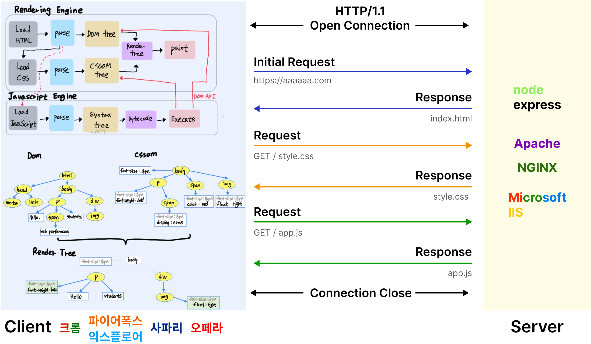
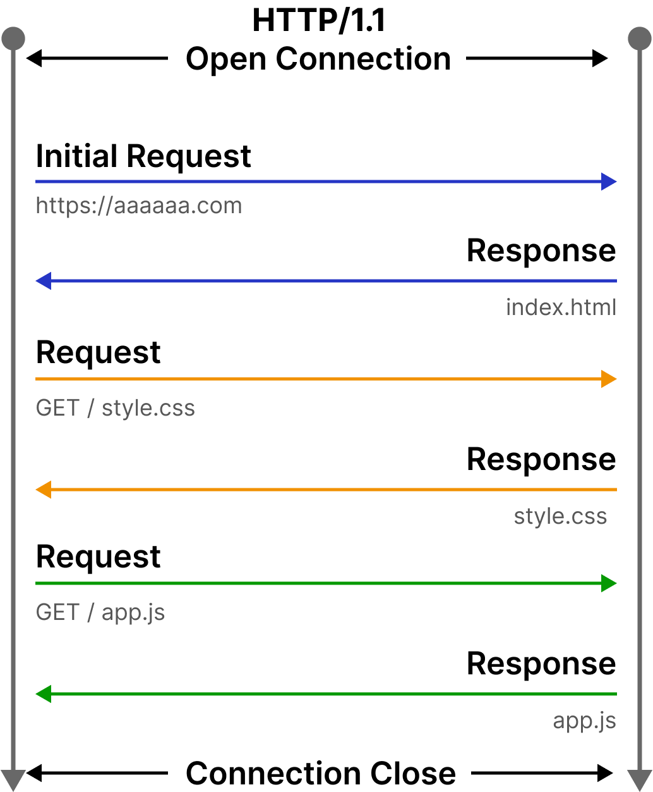
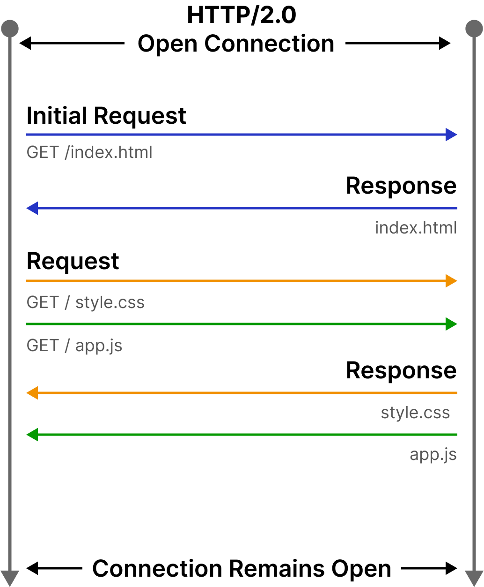
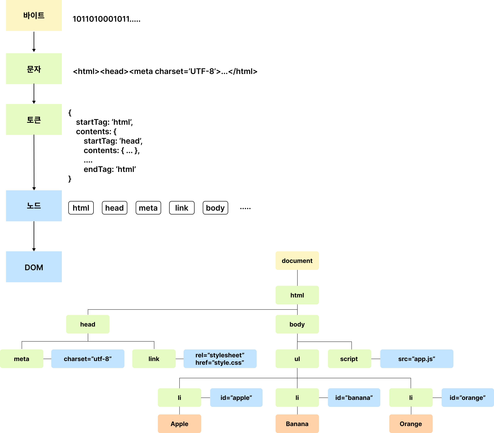
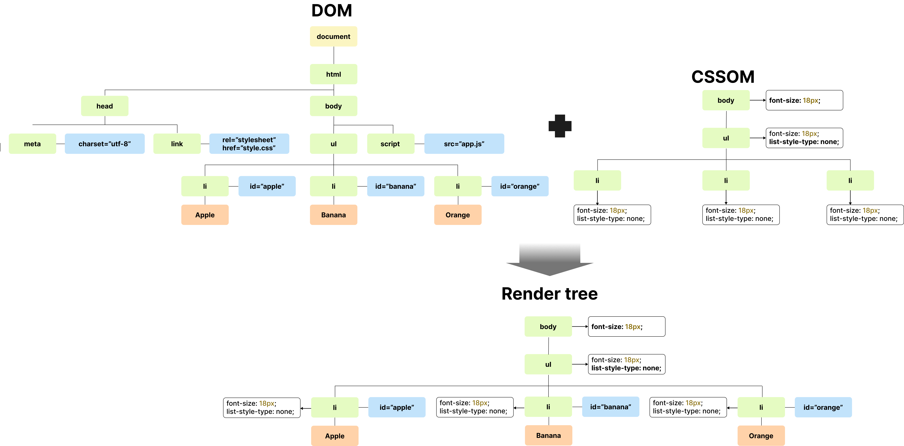
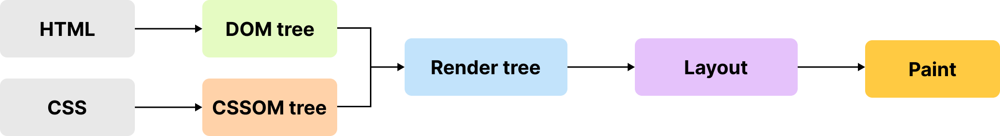
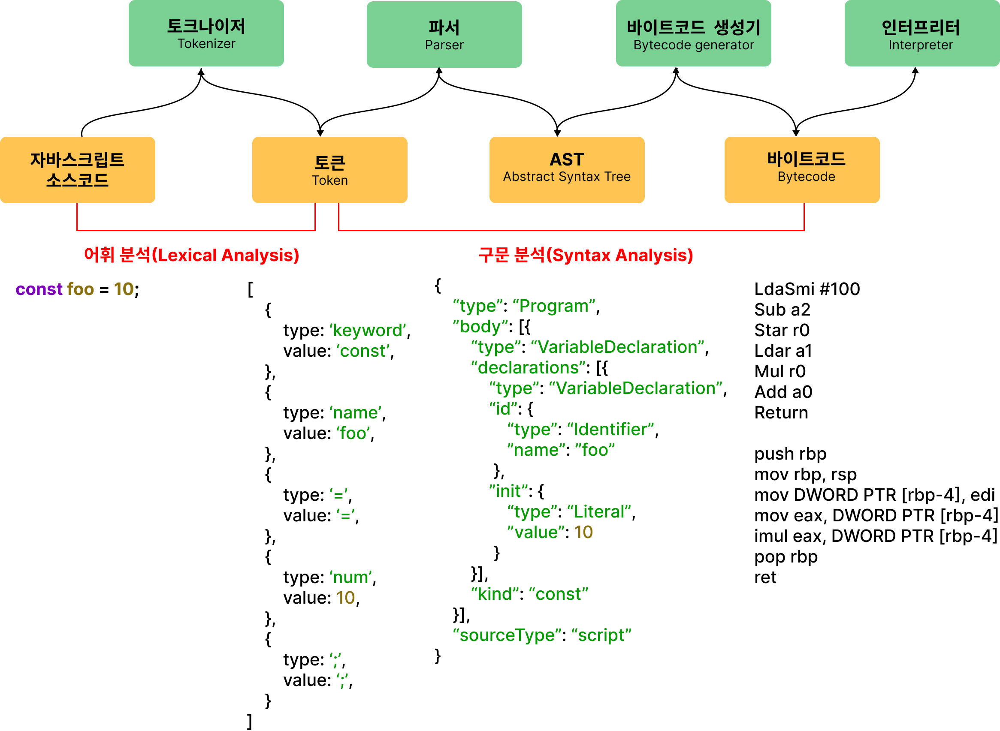
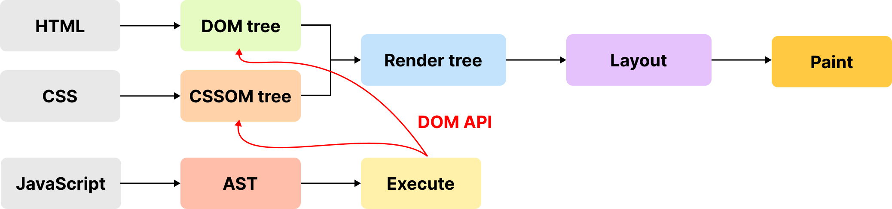

# 38. 브라우저 렌더링 과정



1. 브라우저는 HTML, CSS, JavaScript, 이미지, 폰트 파일 등 렌더링에 필요한 리소스를 요청하고 서버로부터 응답을 받는다.
2. 브라우저의 렌더링 엔진은 서버로부터 응답된 HTML과 CSS를 파싱하여 DOM과 CSSOM을 생성하고 이들을 결합하여 렌더 트리를 생성한다.
3. 브라우저의 자바스크립트 엔진은 서버로부터 응답된 자바스크립트를 파싱하여 AST를 생성하고 바이트코드로 변환하여 실행한다. 이 때 자바스크립트는 DOM API를 통해 DOM이나 CSSOM을 변경할 수 있다. DOM과 CSSOM은 다시 렌더 트리로 결합된다.
4. 렌더 트리를 기반으로 HTML 요소의 레이아웃을 계산하고 브라우저 화면에 HTML 요소를 페인팅한다.

## 38.2 HTTP 1.1과 HTTP 2.0

HTTP는 웹에서 브라우저와 서버가 통신하기 위한 프로토콜(규약)이다.

HTTP 1.1은 기본적으로 커넥션당 하나의 요청과 응답만 처리한다. 여러 개의 요청을 한 번에 전송할 수 없고 응답 또한 마찬가지다.
리소스의 동시 전송이 불가능한 구조이므로 요청할 리소스의 개수에 비례하여 응답 시간도 증가하는 단점이 있다.



HTTP 2.0은 커넥션 당 여러 개의 요청과 응답 다중 요청/응답이 가능하다.



## 38.3 HTML 파싱과 DOM 생성

HTML은 문자열로 이루어진 순수한 텍스트

[예제 38-01]

```html
<!DOCTYPE html>
<html>
  <head>
    <meta charset="UTF-8">
    <link rel="stylesheet" href="style.css">
  </head>
  <body>
    <ul>
      <li id="apple">Apple</li>
      <li id="banana">Banana</li>
      <li id="orange">Orange</li>
    </ul>
    <script src="app.js"></script>
  </body>
</html>
```



DOM은 HTML 문서를 파싱한 결과물이다.

## 38.4 CCS 파싱과 CSSOM 생성

렌더링 엔진은 처음부터 한줄 씩 순차적으로 파싱하여 DOM을 생성해 나간다.

CSS를 HTML과 동일한 파싱 과정(바이트-문자-토큰-노드-CSSOM)을 거치며 CSSOM을 생성한다.
CSS 파싱이 완료되면 HTML 파싱이 중단된 지점부터 다시 HTML을 파싱하기 시작하여 DOM 생성을 재개한다.

[예제 38-02]

```html
<!DOCTYPE html>
<html>
  <head>
    <meta charset="UTF-8">
    <link rel="stylesheet" href="style.css">
...
```


## 38.5 렌더 트리 생성

DOM + CSSOM = 렌더 트리

렌더 트리는 브라우저 화면에 렌더링되는 노드만으로 구성된다.





반복 실행 되는 경우

- 자바스크립트에 의한 노드 추가 또는 삭제
- 브라우저 창의 리사이징에 의한 뷰포트 크기 변경
- HTML 요소의 레이아웃에 변경을 발생시키는 width/height, margin, padding, border, display, position, top/left/right/bottom 등의 스타일 변경

레이아웃 계산과 페인팅을 다시 실행하는 리렌더링 비용이 많이 드는 작업은 빈번하게 발생하지 않도록 주의가 필요

## 38.6 자바스크립트 파싱과 실행

DOM API를 사용하면 이미 생성된 DOM을 동적으로 조작할 수 있다.

렌더링 엔진은 HTML을 순차적으로 한 줄씩 파싱하여 DOM을 생성해 나가다가 script 태그를 만나면 DOM 생성을 일시 중단한다.

자바스크립트 파일을 서버에 요청하여 파싱과 실행이 종료되면 렌더링 엔진으로 제어권을 넘겨서 HTML 파싱이 중단된 지점부터 다시 HTML 파싱을 시작하여 DOM 생성을 재개한다.

자바스크립트 엔진

- 자바스크립트 코드를 파싱하여 CPU가 이해할 수 있는 저수준 언어로 변환하고 실행하는 역활
- 모든 자바스크립트 엔진은 ECMAScript 사양을 준수한다.
- 자바스크립를 해석하여 AST(Abstract Syntax Tree) 추상적 구문트리를 생성
- AST를 기반으로 인터프리터 실행할 수 있는 바이트코드를 생성하여 실행



## 38.7 리플로우와 리페인트

DOM과 CSSOM을 변경하는 DOM API가 사용된 경우 DOM과 CSSOM이 변경된다.
**리플로우, 리페인트**는 변경된 DOM과 CSSOM은 다시 렌더 트리로 결합되고 변경된 렌더 트리를 기반으로 레이아웃과 페인트 과정을 거쳐 브라우저 화면에 다시 렌더링하는 것.



리플로우: 레이아웃 계산을 다시 하는 것(노드 추가/삭제, 요소의 크기/위치 변경, 윈도우 리사이징)
리페인트: 재결합된 렌더 크리를 기반으로 다시 페인트를 하는 것.

레이아웃에 영향이 없는 변경은 리플로우 없이 리페인트만 실행.

## 38.8 자바스크립트 파싱에 의한 HTML 파싱 중단

자바스크립트 엔진은 병렬적으로 파싱을 실행하지 않고 직렬적으로 파싱을 수행한다.

위에서 아래로 순차적으로 HTML, CSS, 자바스크립트를 파싱하고 실행한다.
script 태그의 위치는 중요한 의미를 갖는다.

[예제 38-04]

```html
<!DOCTYPE html>
<html>
  <head>
    <meta charset="UTF-8">
    <link rel="stylesheet" href="style.css">
    <script>
      /*
      DOM API인 document.getElementById는 DOM에서 id가 'apple'인 HTML 요소를
      취득한다. 아래 DOM API가 실행되는 시점에는 아직 id가 'apple'인 HTML 요소를 파싱하지
      않았기 때문에 DOM에는 id가 'apple'인 HTML 요소가 포함되어 있지 않다.
      따라서 아래 코드는 정상적으로 id가 'apple'인 HTML 요소를 취득하지 못한다.
      */
      const $apple = document.getElementById('apple');

      // id가 'apple'인 HTML 요소의 css color 프로퍼티 값을 변경한다.
      // 이때 DOM에는 id가 'apple'인 HTML 요소가 포함되어 있지 않기 때문에 에러가 발생한다.
      $apple.style.color = 'red'; // TypeError: Cannot read property 'style' of null
    </script>
  </head>
  <body>
    <ul>
      <li id="apple">Apple</li>
      <li id="banana">Banana</li>
      <li id="orange">Orange</li>
    </ul>
  </body>
</html>
```

body 요소 가장 아래에 자바스크립트 위치시키는 것이 좋은 아이디어다.

- DOM이 완성되지 않은 상태에서 자바스크립트가 DOM을 조작하면 에러가 발생할 수 있다.
- 자바스크립트 로딩/파싱/실행으로 인해 HTML 요소들의 렌더링에 지장받는 일이 발생하지 않아 페이지 로딩 시간이 단축된다.

[예제 38-05]

```html
<!DOCTYPE html>
<html>
  <head>
    <meta charset="UTF-8">
    <link rel="stylesheet" href="style.css">
  </head>
  <body>
    <ul>
      <li id="apple">Apple</li>
      <li id="banana">Banana</li>
      <li id="orange">Orange</li>
    </ul>
    <script>
      /*
      DOM API인 document.getElementById는 DOM에서 id가 'apple'인 HTML 요소를
      취득한다. 아래 코드가 실행되는 시점에는 id가 'apple'인 HTML 요소의 파싱이 완료되어
      DOM에 포함되어 있기 때문에 정상적으로 동작한다.
      */
      const $apple = document.getElementById('apple');

      // apple 요소의 css color 프로퍼티 값을 변경한다.
      $apple.style.color = 'red';
    </script>
  </body>
</html>
```

## 38.9 script 태그의 async/defer 어트리뷰트

[예제 38-06]

```html
<script async src="extern.js"></script>
<script defer src="extern.js"></script>
```

IE10 이상에서 지원.

### async 어트리뷰트


### defer 어트리뷰트


