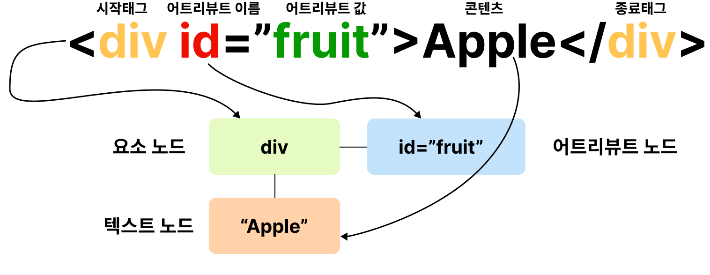
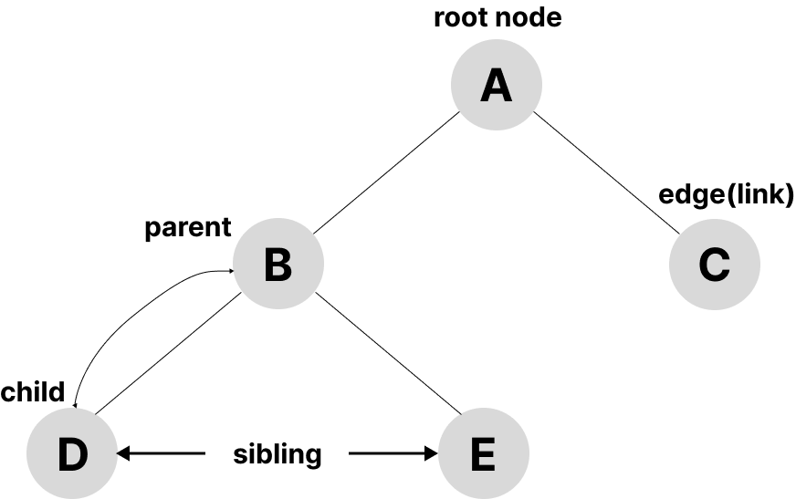
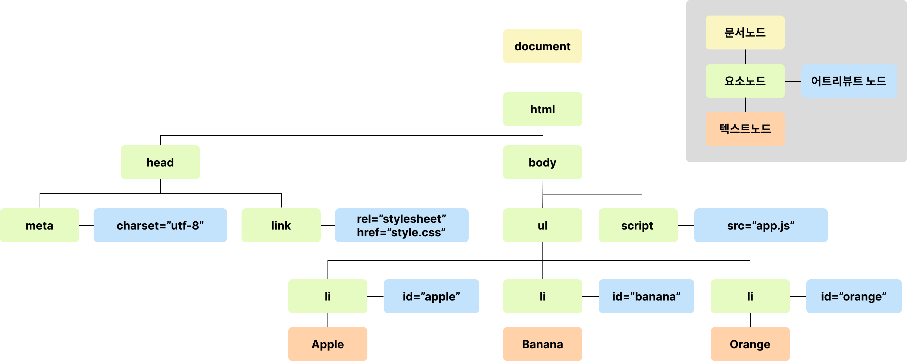

# 39. Dom

Dom(Document Object Model)

- HTML문서의 계층적 구조와 정보를 표현하며 이를 제어할 수 있는 API.
- 프로퍼티와 메서드를 제공하는 트리 자료 구조

## 39.1 노드



트리 자료구조



노드 객체들로 구성된 트리 자료 구조를 DOM이라 한다.

[예제 39-01]

```html
<!DOCTYPE html>
<html>
  <head>
    <meta charset="UTF-8">
    <link rel="stylesheet" href="style.css">
  </head>
  <body>
    <ul>
      <li id="apple">Apple</li>
      <li id="banana">Banana</li>
      <li id="orange">Orange</li>
    </ul>
    <script src="app.js"></script>
  </body>
</html>
```



### 39.1.3 노드 객체의 상속 구조

[예제 39-02]

```html
<!DOCTYPE html>
<html>
<body>
  <input type="text">
  <script>
    // input 요소 노드 객체를 선택
    const $input = document.querySelector('input');

    // input 요소 노드 객체의 프로토타입 체인
    console.log(
      Object.getPrototypeOf($input) === HTMLInputElement.prototype,
      Object.getPrototypeOf(HTMLInputElement.prototype) === HTMLElement.prototype,
      Object.getPrototypeOf(HTMLElement.prototype) === Element.prototype,
      Object.getPrototypeOf(Element.prototype) === Node.prototype,
      Object.getPrototypeOf(Node.prototype) === EventTarget.prototype,
      Object.getPrototypeOf(EventTarget.prototype) === Object.prototype
    ); // 모두 true
  </script>
</body>
</html>
```

|input 요소 노드 객체의 특성|프로토타입을 제공하는 객체|
|---------------------------|--------------------------|
|객체|Object|
|이벤트를 발생시키는 객체|EventTarget|
|트리 자료구조의 노드 객체|Node|
|브라우저가 렌더링할 수 있는 웹 문서의 요소(HTML, XML, SVG)를 표현하는 객체|Element|
|웹 문서의 요소 중에서 HTML 요소를 표현하는 객체|HTMLElement|
|HTML 요소 중에서 input 요소를 표현하는 객체|HTMLInputElement|HTML|

DOM은 HTML 문서의 계층적 구조와 정보를 표현하는 것은 물론 노드 객체의 종류, 즉 노드 타입에 따라 필요한 기능을 프로퍼티와 메서드의 집합인 DOM API로 제공한다.
이 DOM API를 통해 HTML의 구조나 내용 또는 스타일 등을 동적으로 조작할 수 있다.

## 3.9.2 요소 노드 취득

### 39.2.4 CSS 선택자를 이용한 요소 노드 취득

[예제 39-13]

```css
/* 전체 선택자: 모든 요소를 선택 */
* { ... }
/* 태그 선택자: 모든 p 태그 요소를 모두 선택 */
p { ... }
/* id 선택자: id 값이 'foo'인 요소를 모두 선택 */
#foo { ... }
/* class 선택자: class 값이 'foo'인 요소를 모두 선택 */
.foo { ... }
/* 어트리뷰트 선택자: input 요소 중에 type 어트리뷰트 값이 'text'인 요소를 모두 선택 */
input[type=text] { ... }
/* 후손 선택자: div 요소의 후손 요소 중 p 요소를 모두 선택 */
div p { ... }
/* 자식 선택자: div 요소의 자식 요소 중 p 요소를 모두 선택 */
div > p { ... }
/* 인접 형제 선택자: p 요소의 형제 요소 중에 p 요소 바로 뒤에 위치하는 ul 요소를 선택 */
p + ul { ... }
/* 일반 형제 선택자: p 요소의 형제 요소 중에 p 요소 뒤에 위치하는 ul 요소를 모두 선택 */
p ~ ul { ... }
/* 가상 클래스 선택자: hover 상태인 a 요소를 모두 선택 */
a:hover { ... }
/* 가상 요소 선택자: p 요소의 콘텐츠의 앞에 위치하는 공간을 선택
   일반적으로 content 프로퍼티와 함께 사용된다. */
p::before { ... }
```

### 39.2.5 특정 요소 노드를 취득할 수 있는지 확인

[예제 39-17]

```html
<!DOCTYPE html>
<html>
  <body>
    <ul id="fruits">
      <li class="apple">Apple</li>
      <li class="banana">Banana</li>
      <li class="orange">Orange</li>
    </ul>
  </body>
  <script>
    const $apple = document.querySelector('.apple');

    // $apple 노드는 '#fruits > li.apple'로 취득할 수 있다.
    console.log($apple.matches('#fruits > li.apple'));  // true

    // $apple 노드는 '#fruits > li.banana'로 취득할 수 없다.
    console.log($apple.matches('#fruits > li.banana')); // false
  </script>
</html>
```

[Element.prototype.matches](https://developer.mozilla.org/en-US/docs/Web/API/Element/matches)

### 39.2.6 HTMLCollection과 NodeList

#### HTMLCollection

[예제 38-18]

```html
<!DOCTYPE html>
<head>
  <style>
    .red { color: red; }
    .blue { color: blue; }
  </style>
</head>
<html>
  <body>
    <ul id="fruits">
      <li class="red">Apple</li>
      <li class="red">Banana</li>
      <li class="red">Orange</li>
    </ul>
    <script>
      // class 값이 'red'인 요소 노드를 모두 탐색하여 HTMLCollection 객체에 담아 반환한다.
      const $elems = document.getElementsByClassName('red');
      // 이 시점에 HTMLCollection 객체에는 3개의 요소 노드가 담겨 있다.
      console.log($elems); // HTMLCollection(3) [li.red, li.red, li.red]

      // HTMLCollection 객체의 모든 요소의 class 값을 'blue'로 변경한다.
      for (let i = 0; i < $elems.length; i++) {
        $elems[i].className = 'blue';
      }

      // HTMLCollection 객체의 요소가 3개에서 1개로 변경되었다.
      console.log($elems); // HTMLCollection(1) [li.red]
    </script>
  </body>
</html>
```

예상한대로라면 모든 li가 파란색으로 변해야 하지만 그렇지 않다.
HTMLCollection 객체는 실시간으로 노드 객체의 상태를 변경하기 때문에 점점 $elems의 배열에 담긴 li가 줄어든다.

이 문제를 해결하기 위해 다양한 방법들

[예제 39-19]

```javascript
// for 문을 역방향으로 순회
for (let i = $elems.length - 1; i >= 0; i--) {
  $elems[i].className = 'blue';
}
```

[예제 39-20]

```javascript
// while 문으로 HTMLCollection에 요소가 남아 있지 않을 때까지 무한 반복
let i = 0;
while ($elems.length > i) {
  $elems[i].className = 'blue';
}
```

[예제 39-21]

```javascript
// 유사 배열 객체이면서 이터러블인 HTMLCollection을 배열로 변환하여 순회
[...$elems].forEach(elem => elem.className = 'blue');
```

#### NodeList

querySelectorAll 메서드를 사용하는 방법도 있다.

```javascript
[예제 39-22]

// querySelectorAll은 DOM 컬렉션 객체인 NodeList를 반환한다.
const $elems = document.querySelectorAll('.red');

// NodeList 객체는 NodeList.prototype.forEach 메서드를 상속받아 사용할 수 있다.
$elems.forEach(elem => elem.className = 'blue');
```

childNodes 프로퍼티가 반환하는 NodeList 객체는 HTMLCollection 객체와 같이 실시간으로 노드 객체의 상태 변경을 반영하는 live 객체로 동작하므로 주의가 필요하다.

[예제 39-23]

```html
<!DOCTYPE html>
<html>
  <body>
    <ul id="fruits">
      <li>Apple</li>
      <li>Banana</li>
    </ul>
  </body>
  <script>
    const $fruits = document.getElementById('fruits');

    // childNodes 프로퍼티는 NodeList 객체(live)를 반환한다.
    const { childNodes } = $fruits;
    console.log(childNodes instanceof NodeList); // true

    // $fruits 요소의 자식 노드는 공백 텍스트 노드(39.3.1절 "공백 텍스트 노드" 참고)를 포함해 모두 5개다.
    console.log(childNodes); // NodeList(5) [text, li, text, li, text]

    for (let i = 0; i < childNodes.length; i++) {
      // removeChild 메서드는 $fruits 요소의 자식 노드를 DOM에서 삭제한다.
      // (39.6.9절 "노드 삭제" 참고)
      // removeChild 메서드가 호출될 때마다 NodeList 객체인 childNodes가 실시간으로 변경된다.
      // 따라서 첫 번째, 세 번째 다섯 번째 요소만 삭제된다.
      $fruits.removeChild(childNodes[i]);
    }

    // 예상과 다르게 $fruits 요소의 모든 자식 노드가 삭제되지 않는다.
    console.log(childNodes); // NodeList(2) [li, li]
  </script>
</html>
```

노드 객체의 상태 변경과 상관 없이 안전하게 DOM 컬렉션을 사용하려면 HTMLCollection이나 NodeList 객체를 배열로 변환하여 사용하는 것을 권장한다.

[예제 39-24]

```html
<!DOCTYPE html>
<html>
  <body>
    <ul id="fruits">
      <li>Apple</li>
      <li>Banana</li>
    </ul>
  </body>
  <script>
    const $fruits = document.getElementById('fruits');

    // childNodes 프로퍼티는 NodeList 객체(live)를 반환한다.
    const { childNodes } = $fruits;

    // 스프레드 문법을 사용하여 NodeList 객체를 배열로 변환한다.
    [...childNodes].forEach(childNode => {
      $fruits.removeChild(childNode);
    });

    // $fruits 요소의 모든 자식 노드가 모두 삭제되었다.
    console.log(childNodes); // NodeList []
  </script>
</html>
```

## 39.3 노드 탐색

### 39.3.1 공백 텍스트 노드

[예제 39-26]

```html
<!DOCTYPE html>
<html>
  <body>
    <ul id="fruits">
      <li class="apple">Apple</li>
      <li class="banana">Banana</li>
      <li class="orange">Orange</li>
    </ul>
  </body>
</html>
```

HTML 요소 사이의 스페이스, 탭, 줄바꿈 등의 공백문자는 텍스트 노드를 생성한다.

[예제 39-27]

```html
<!-- 아래와 같이 인위적으로 할 수 있지만 가독성이 좋지 않으므로 권장하지 않는다. -->
<ul id="fruits"><li
  class="apple">Apple</li><li
  class="banana">Banana</li><li
  class="orange">Orange</li></ul>
```

### 39.3.2 자식 노드 탐색

[예제 39-28]

```html
<!DOCTYPE html>
<html>
  <body>
    <ul id="fruits">
      <li class="apple">Apple</li>
      <li class="banana">Banana</li>
      <li class="orange">Orange</li>
    </ul>
  </body>
  <script>
    // 노드 탐색의 기점이 되는 #fruits 요소 노드를 취득한다.
    const $fruits = document.getElementById('fruits');

    // #fruits 요소의 모든 자식 노드를 탐색한다.
    // childNodes 프로퍼티가 반환한 NodeList에는 요소 노드뿐만 아니라 텍스트 노드도 포함되어 있다.
    console.log($fruits.childNodes);
    // NodeList(7) [text, li.apple, text, li.banana, text, li.orange, text]

    // #fruits 요소의 모든 자식 노드를 탐색한다.
    // children 프로퍼티가 반환한 HTMLCollection에는 요소 노드만 포함되어 있다.
    console.log($fruits.children);
    // HTMLCollection(3) [li.apple, li.banana, li.orange]

    // #fruits 요소의 첫 번째 자식 노드를 탐색한다.
    // firstChild 프로퍼티는 텍스트 노드를 반환할 수도 있다.
    console.log($fruits.firstChild); // #text

    // #fruits 요소의 마지막 자식 노드를 탐색한다.
    // lastChild 프로퍼티는 텍스트 노드를 반환할 수도 있다.
    console.log($fruits.lastChild); // #text

    // #fruits 요소의 첫 번째 자식 노드를 탐색한다.
    // firstElementChild 프로퍼티는 요소 노드만 반환한다.
    console.log($fruits.firstElementChild); // li.apple

    // #fruits 요소의 마지막 자식 노드를 탐색한다.
    // lastElementChild 프로퍼티는 요소 노드만 반환한다.
    console.log($fruits.lastElementChild); // li.orange
  </script>
</html>
```

### 39.3.3 자식 노드 존재 확인

[예제 39-29]

```html
<!DOCTYPE html>
<html>
  <body>
    <ul id="fruits">
    </ul>
  </body>
  <script>
    // 노드 탐색의 기점이 되는 #fruits 요소 노드를 취득한다.
    const $fruits = document.getElementById('fruits');

    // #fruits 요소에 자식 노드가 존재하는지 확인한다.
    // hasChildNodes 메서드는 텍스트 노드를 포함하여 자식 노드의 존재를 확인한다.
    console.log($fruits.hasChildNodes()); // true
  </script>
</html>
```

[예제 39-30]

```html
<!DOCTYPE html>
<html>
  <body>
    <ul id="fruits">
    </ul>
  </body>
  <script>
    // 노드 탐색의 기점이 되는 #fruits 요소 노드를 취득한다.
    const $fruits = document.getElementById('fruits');

    // hasChildNodes 메서드는 텍스트 노드를 포함하여 자식 노드의 존재를 확인한다.
    console.log($fruits.hasChildNodes()); // true

    // 자식 노드 중에 텍스트 노드가 아닌 요소 노드가 존재하는지는 확인한다.
    console.log(!!$fruits.children.length); // 0 -> false
    // 자식 노드 중에 텍스트 노드가 아닌 요소 노드가 존재하는지는 확인한다.
    console.log(!!$fruits.childElementCount); // 0 -> false
  </script>
</html>
```

### 39.3.6 형제 노드 탐색

```html
<!DOCTYPE html>
<html>
  <body>
    <ul id="fruits">
      <li class="apple">Apple</li>
      <li class="banana">Banana</li>
      <li class="orange">Orange</li>
    </ul>
  </body>
  <script>
    // 노드 탐색의 기점이 되는 #fruits 요소 노드를 취득한다.
    const $fruits = document.getElementById('fruits');

    // #fruits 요소의 첫 번째 자식 노드를 탐색한다.
    // firstChild 프로퍼티는 요소 노드뿐만 아니라 텍스트 노드를 반환할 수도 있다.
    const { firstChild } = $fruits;
    console.log(firstChild); // #text

    // #fruits 요소의 첫 번째 자식 노드(텍스트 노드)의 다음 형제 노드를 탐색한다.
    // nextSibling 프로퍼티는 요소 노드뿐만 아니라 텍스트 노드를 반환할 수도 있다.
    const { nextSibling } = firstChild;
    console.log(nextSibling); // li.apple

    // li.apple 요소의 이전 형제 노드를 탐색한다.
    // previousSibling 프로퍼티는 요소 노드뿐만 아니라 텍스트 노드를 반환할 수도 있다.
    const { previousSibling } = nextSibling;
    console.log(previousSibling); // #text

    // #fruits 요소의 첫 번째 자식 요소 노드를 탐색한다.
    // firstElementChild 프로퍼티는 요소 노드만 반환한다.
    const { firstElementChild } = $fruits;
    console.log(firstElementChild); // li.apple

    // #fruits 요소의 첫 번째 자식 요소 노드(li.apple)의 다음 형제 노드를 탐색한다.
    // nextElementSibling 프로퍼티는 요소 노드만 반환한다.
    const { nextElementSibling } = firstElementChild;
    console.log(nextElementSibling); // li.banana

    // li.banana 요소의 이전 형제 요소 노드를 탐색한다.
    // previousElementSibling 프로퍼티는 요소 노드만 반환한다.
    const { previousElementSibling } = nextElementSibling;
    console.log(previousElementSibling); // li.apple
  </script>
</html>
```

## 39.4 노드 정보 취득

|프로퍼티|설명|
|--------|----|
|Node.prototype.nodeType|노드 객체의 종류, 즉 노드 타입을 나타내는 상수를 반환 <br/> - Node.ELEMENT_NODE: 요소 노드 타입(상수 1 반환)<br/> - Node.TEXT_NODE: 텍스트 노드 타입(상수 3 반환)<br/> - Node.DOCUMENT_NODE: 문서 노드 타입(상수 9 반환)|
|Node.prototype.NodeName|노드의 이름을 문자열로 반환<br/> - 요소 노드: 대문자 문자열로 태그이름 반환<br/> - 텍스트 노드: 문자열 "#text" 반환<br/> - 문서 노드: 문자열 "#document" 반환|

[예제 39-34]

```html
<!DOCTYPE html>
<html>
  <body>
    <div id="foo">Hello</div>
  </body>
  <script>
    // 문서 노드의 노드 정보를 취득한다.
    console.log(document.nodeType); // 9
    console.log(document.nodeName); // #document

    // 요소 노드의 노드 정보를 취득한다.
    const $foo = document.getElementById('foo');
    console.log($foo.nodeType); // 1
    console.log($foo.nodeName); // DIV

    // 텍스트 노드의 노드 정보를 취득한다.
    const $textNode = $foo.firstChild;
    console.log($textNode.nodeType); // 3
    console.log($textNode.nodeName); // #text
</script>
</html>
```

## 39.5 요소 노드의 텍스트 조작

### 39.5.2 textContext

[예제 39-37]

```html
<!DOCTYPE html>
<html>
  <body>
    <div id="foo">Hello <span>world!</span></div>
  </body>
  <script>
    // #foo 요소 노드의 텍스트를 모두 취득한다. 이때 HTML 마크업은 무시된다.
    console.log(document.getElementById('foo').textContent); // Hello world!
  </script>
</html>
```

[예제 39-38]

```html
<!DOCTYPE html>
<html>
  <body>
    <div id="foo">Hello <span>world!</span></div>
  </body>
  <script>
    // #foo 요소 노드는 텍스트 노드가 아니다.
    console.log(document.getElementById('foo').nodeValue); // null
    // #foo 요소 노드의 자식 노드인 텍스트 노드의 값을 취득한다.
    console.log(document.getElementById('foo').firstChild.nodeValue); // Hello
    // span 요소 노드의 자식 노드인 텍스트 노드의 값을 취득한다.
    console.log(document.getElementById('foo').lastChild.firstChild.nodeValue); // world!
  </script>
</html>
```

[예제 39-39]

```html
<!DOCTYPE html>
<html>
  <body>
    <!-- 요소 노드의 콘텐츠 영역에 다른 요소 노드가 없고 텍스트만 존재 -->
    <div id="foo">Hello</div>
  </body>
  <script>
    const $foo = document.getElementById('foo');

    // 요소 노드의 콘텐츠 영역에 자식 요소 노드가 없고 텍스트만 존재한다면
    // firstChild.nodeValue와 textContent는 같은 결과를 반환한다.
    console.log($foo.textContent === $foo.firstChild.nodeValue); // true
  </script>
</html>
```

[예제 39-40]

```html
<!DOCTYPE html>
<html>
  <body>
    <div id="foo">Hello <span>world!</span></div>
  </body>
  <script>
    // #foo 요소 노드의 모든 자식 노드가 제거되고 할당한 문자열이 텍스트로 추가된다.
    // 이때 HTML 마크업이 파싱되지 않는다.
    document.getElementById('foo').textContent = 'Hi <span>there!</span>';
  </script>
</html>
```

textContent 프로퍼티와 유사한 동작을 하는 innerText 프로퍼티가 있는데 사용하지 않는 이유

- innerText 프로퍼티는 CSS에 순종적이다. 에를 들어 CSS에 의해 비표시(visibility: hidden)로 지정된 요소 노드의 텍스트를 반환하지 않는다.
- innerText 프로퍼티는 CSS 고려해야 하므로 textContent 프로퍼티보다 느리다.

## 39.6 DOM 조작

### 39.6.1 innerHTML

- 구현이 간다하고 직관적이라는 장점이 있다.
- 크로스 사이트 스크립팅 공격에 취약하다.
- 기존의 자식 노드까지 모두 제거하고 다시 처음부터 새롭게 자식 노드를 생성하여 DOM에 반영하므로 효율적이지 않다.

> HTML 새니티제이션
> DOMPurify 라이브러리를 사용하는 것을 권장
> DOMPurify 다음과 같은 잠재적 위험을 내포한 HTML 마크업을 살균하여 잠재적 위험을 제거한다.
> DOMPurify.sanitize('')

### 39.6.2 insertAdjacentHTML 메서드

Element.prototype.insertAdjacentHTML(position, DOMString)

postion = 'beforbegin' | 'afterbegin' | 'beforeend' | 'afterend';

[예제 39-50]

```html
<!DOCTYPE html>
<html>
  <body>
    <!-- beforebegin -->
    <div id="foo">
      <!-- afterbegin -->
      text
      <!-- beforeend -->
    </div>
    <!-- afterend -->
  </body>
  <script>
    const $foo = document.getElementById('foo');

    $foo.insertAdjacentHTML('beforebegin', '<p>beforebegin</p>');
    $foo.insertAdjacentHTML('afterbegin', '<p>afterbegin</p>');
    $foo.insertAdjacentHTML('beforeend', '<p>beforeend</p>');
    $foo.insertAdjacentHTML('afterend', '<p>afterend</p>');
  </script>
</html>
```

기존 요소에 영향을 주지 않고 새롭게 삽입될 요소만을 파싱하여 자식요소를 추가하기 때문에
innerHTML 프로퍼티 보다 효율적이고 빠르지만 여전히 크로스사이트 스크립팅 공격에 취약하다.

### 39.6.3 노드 생성과 추가

#### 요소 노드 생성

```javascript
// 1. 요소 노드 생성
const $li = document.createElement('li');
// 생성된 요소 노드는 아무런 자식 노드가 없다.
console.log($li.childNodes); // NodeList []
```

#### 텍스트 노드 생성

```javascript
// 2. 텍스트 노드 생성
const textNode = document.createTextNode('Banana');
```

#### 텍스트 노드를 요소 노드의 자식 노드로 추가

```javascript
// 3. 텍스트 노드를 $li 요소 노드의 자식 노드로 추가
$li.appendChild(textNode);
```

```javascript
// 텍스트 노드를 생성하여 요소 노드의 자식 노드로 추가
$li.appendChild(document.createTextNode('Banana'));

// $li 요소 노드에 자식 노드가 하나도 없는 위 코드와 동일하게 동작한다.
// 단, 요소 노드에 자식 노드가 있는 경우 요소 노드의 모든 자식 노드가 제거되고 할당한 문자열이 추가되므로 주의하여야 한다.
$li.textContent = 'Banana';
```

#### 요소 노드를 DOM에 추가

```javascript
// 4. $li 요소 노드를 #fruits 요소 노드의 마지막 자식 노드로 추가
$fruits.appendChild($li);
```

### 39.6.4 복수의 노드 생성과 추가

[예제 39-58]

```html
<!DOCTYPE html>
<html>
  <body>
    <ul id="fruits"></ul>
  </body>
  <script>
    const $fruits = document.getElementById('fruits');

    ['Apple', 'Banana', 'Orange'].forEach(text => {
      // 1. 요소 노드 생성
      const $li = document.createElement('li');

      // 2. 텍스트 노드 생성
      const textNode = document.createTextNode(text);

      // 3. 텍스트 노드를 $li 요소 노드의 자식 노드로 추가
      $li.appendChild(textNode);

      // 4. $li 요소 노드를 #fruits 요소 노드의 마지막 자식 노드로 추가
      $fruits.appendChild($li);
    });
  </script>
</html>
```

요소 노드를 생성하여 DOM에 3번 추가하므로 DOM이 3번 변경된다. DOM을 변경하는 것은 높은 비용이 드므로 가급적 횟수를 줄이는 것이 좋다.

[예제 39-59]

```html
<!DOCTYPE html>
<html>
  <body>
    <ul id="fruits"></ul>
  </body>
  <script>
    const $fruits = document.getElementById('fruits');

    // 컨테이너 요소 노드 생성
    const $container = document.createElement('div');

    ['Apple', 'Banana', 'Orange'].forEach(text => {
      // 1. 요소 노드 생성
      const $li = document.createElement('li');

      // 2. 텍스트 노드 생성
      const textNode = document.createTextNode(text);

      // 3. 텍스트 노드를 $li 요소 노드의 자식 노드로 추가
      $li.appendChild(textNode);

      // 4. $li 요소 노드를 컨테이너 요소의 마지막 자식 노드로 추가
      $container.appendChild($li);
    });

    // 5. 컨테이너 요소 노드를 #fruits 요소 노드의 마지막 자식 노드로 추가
    $fruits.appendChild($container);
  </script>
</html>
```

DOM을 한번만 변경하므로 성능에 유리하지만 불필요한 컨테니어 요소(div)가 추가되는 부작용이 생긴다.

[예제 39-60]

```html
<ul id="fruits">
  <div>
    <li>apple</li>
    <li>banana</li>
    <li>orange</li>
  </div>
</ul>
```

이러한 문제를 해결하기 위해 DocumentFragment 노드를 통해 해결 가능하다.

[예제 39-61]

```html
<!DOCTYPE html>
<html>
  <body>
    <ul id="fruits"></ul>
  </body>
  <script>
    const $fruits = document.getElementById('fruits');

    // DocumentFragment 노드 생성
    const $fragment = document.createDocumentFragment();

    ['Apple', 'Banana', 'Orange'].forEach(text => {
      // 1. 요소 노드 생성
      const $li = document.createElement('li');

      // 2. 텍스트 노드 생성
      const textNode = document.createTextNode(text);

      // 3. 텍스트 노드를 $li 요소 노드의 자식 노드로 추가
      $li.appendChild(textNode);

      // 4. $li 요소 노드를 DocumentFragment 노드의 마지막 자식 노드로 추가
      $fragment.appendChild($li);
    });

    // 5. DocumentFragment 노드를 #fruits 요소 노드의 마지막 자식 노드로 추가
    $fruits.appendChild($fragment);
  </script>
</html>
```

### 39.6.5 노드 삽입

#### 마지막 노드 추가 : Node.prototype.appendChild

[예제 39-62]

```html
<!DOCTYPE html>
<html>
  <body>
    <ul id="fruits">
      <li>Apple</li>
      <li>Banana</li>
    </ul>
  </body>
  <script>
    // 요소 노드 생성
    const $li = document.createElement('li');

    // 텍스트 노드를 $li 요소 노드의 마지막 자식 노드로 추가
    $li.appendChild(document.createTextNode('Orange'));

    // $li 요소 노드를 #fruits 요소 노드의 마지막 자식 노드로 추가
    document.getElementById('fruits').appendChild($li);
  </script>
</html>
```

#### 지정한 위치에 노드 삽입 : Node.prototype.insertBefore(newNode, childNode)

[예제 39-63]

```html
<!DOCTYPE html>
<html>
  <body>
    <ul id="fruits">
      <li>Apple</li>
      <li>Banana</li>
    </ul>
  </body>
  <script>
    const $fruits = document.getElementById('fruits');

    // 요소 노드 생성
    const $li = document.createElement('li');

    // 텍스트 노드를 $li 요소 노드의 마지막 자식 노드로 추가
    $li.appendChild(document.createTextNode('Orange'));

    // $li 요소 노드를 #fruits 요소 노드의 마지막 자식 요소 앞에 삽입
    $fruits.insertBefore($li, $fruits.lastElementChild);
    // Apple - Orange - Banana
  </script>
</html>
```

두번째 인수 childNode는 반드시 insertBefore 메서드를 호출한 노드의 자식 노드이어야 한다. 그렇지 않으면 DomException 에러가 발생.

### 39.6.7 노드 복사 : Node.prototype.cloneNode([deepL true | false])

[예제 39-67]

```html
<!DOCTYPE html>
<html>
  <body>
    <ul id="fruits">
      <li>Apple</li>
    </ul>
  </body>
  <script>
    const $fruits = document.getElementById('fruits');
    const $apple = $fruits.firstElementChild;

    // $apple 요소를 얕은 복사하여 사본을 생성. 텍스트 노드가 없는 사본이 생성된다.
    const $shallowClone = $apple.cloneNode();
    // 사본 요소 노드에 텍스트 추가
    $shallowClone.textContent = 'Banana';
    // 사본 요소 노드를 #fruits 요소 노드의 마지막 노드로 추가
    $fruits.appendChild($shallowClone);

    // #fruits 요소를 깊은 복사하여 모든 자손 노드가 포함된 사본을 생성
    const $deepClone = $fruits.cloneNode(true);
    // 사본 요소 노드를 #fruits 요소 노드의 마지막 노드로 추가
    $fruits.appendChild($deepClone);
  </script>
</html>
```

### 39.6.8 노드 교체 : Node.prototype.replaceChild(newChild, oldChild)

[예제 39-68]

```html
<!DOCTYPE html>
<html>
  <body>
    <ul id="fruits">
      <li>Apple</li>
    </ul>
  </body>
  <script>
    const $fruits = document.getElementById('fruits');

    // 기존 노드와 교체할 요소 노드를 생성
    const $newChild = document.createElement('li');
    $newChild.textContent = 'Banana';

    // #fruits 요소 노드의 첫 번째 자식 요소 노드를 $newChild 요소 노드로 교체
    $fruits.replaceChild($newChild, $fruits.firstElementChild);
  </script>
</html>
```

### 39.6.9 노드 삭제 : Node.prototype.removeChild(child)

[예제 39-69]

```html
<!DOCTYPE html>
<html>
  <body>
    <ul id="fruits">
      <li>Apple</li>
      <li>Banana</li>
    </ul>
  </body>
  <script>
    const $fruits = document.getElementById('fruits');

    // #fruits 요소 노드의 마지막 요소를 DOM에서 삭제
    $fruits.removeChild($fruits.lastElementChild);
  </script>
</html>
```

## 39.7 어트리뷰트

### 39.7.2 HTML 어트리뷰트 조작

요소 노드의 attributes 프로퍼티는 getter만 존재하는 읽기 전용 접근자 프로퍼티.
모든 어트리뷰트 노드의 참조가 담긴 NamedNodeMap 객체를 반환

[예제 39-72]

```html
<!DOCTYPE html>
<html>
<body>
  <input id="user" type="text" value="ungmo2">
  <script>
    const $input = document.getElementById('user');

    // value 어트리뷰트 값을 취득
    const inputValue = $input.getAttribute('value');
    console.log(inputValue); // ungmo2

    // value 어트리뷰트 값을 변경
    $input.setAttribute('value', 'foo');
    console.log($input.getAttribute('value')); // foo
  </script>
</body>
</html>
```

[예제 39-73]

```html
<!DOCTYPE html>
<html>
<body>
  <input id="user" type="text" value="ungmo2">
  <script>
    const $input = document.getElementById('user');

    // value 어트리뷰트의 존재 확인
    if ($input.hasAttribute('value')) {
      // value 어트리뷰트 삭제
      $input.removeAttribute('value');
    }

    // value 어트리뷰트가 삭제되었다.
    console.log($input.hasAttribute('value')); // false
  </script>
</body>
</html>
```

### 39.7.3 HTML 어트리뷰트 vs DOM 프로퍼티

DOM 프로퍼티는 setter와 getter 모두 존재하는 접근자 프로퍼티다. 참조와 변경이 가능하다.

HTML 어트리뷰트와 DOM에서 중복관리가 되는것처럼 보인다.

1. 요소 노드의 attributes 프로퍼티에서 관리하는 어트리뷰트 노드
2. HTML 어트리뷰트에 대응하는 요소 노드의 프로퍼티(DOM 프로퍼티)

**HTML 어트리뷰트의 값은 HTML 요소의 초기 상태를 의미하며 이는 변하지 않는다.**

사용자가 input 요소에 무언가를 입력하면 상황이 달라진다.
요소 노드는 상태를 가지고 있다.

- 최신 상태: 사용자의 입력에 의해 변경된 상태
- 초기 상태: HTML 어트리뷰트로 지정한 것.

요소 노드는 2개의 상태를 관리

- 요소 노드의 초기 상태는 어트이뷰트 노드가 관리하고
- 요소 노드의 최신 상태는 DOM 프로퍼티가 관리한다.

#### 어트리뷰트 노드

HTML 어트리뷰트로 지정한 HTML 요소의 초기 상태는 어트리뷰트 노드에서 관리한다.

[예제 39-76]

```javascript
// attributes 프로퍼티에 저장된 value 어트리뷰트 값을 취득한다. 결과는 언제나 동일하다.
document.getElementById('user').getAttribute('value'); // ungmo2
```

[예제 39-77]

```html
<!DOCTYPE html>
<html>
<body>
  <input id="user" type="text" value="ungmo2">
  <script>
    // HTML 요소에 지정한 어트리뷰트 값, 즉 초기 상태 값을 변경한다.
    document.getElementById('user').setAttribute('value', 'foo');
  </script>
</body>
</html>
```

#### DOM 프로퍼티

사용자가 입력한 최신 상태는 HTML 어트리뷰트에 대응하는 요소 노드의 DOM 프로퍼티가 관리한다.
DOM 프로퍼티는 사용자의 입력에 의한 상태 변화에 반응하여 언제나 최신 상태를 유지한다.

[예제 39-78]

```html
<!DOCTYPE html>
<html>
<body>
  <input id="user" type="text" value="ungmo2">
  <script>
    const $input = document.getElementById('user');

    // 사용자가 input 요소의 입력 필드에 값을 입력할 때마다 input 요소 노드의
    // value 프로퍼티 값, 즉 최신 상태 값을 취득한다. value 프로퍼티 값은 사용자의 입력에
    // 의해 동적으로 변경된다.
    $input.oninput = () => {
      console.log('value 프로퍼티 값', $input.value);
    };

    // getAttribute 메서드로 취득한 HTML 어트리뷰트 값, 즉 초기 상태 값은 변하지 않고 유지된다.
    console.log('value 어트리뷰트 값', $input.getAttribute('value'));
  </script>
</body>
</html>
```

[예제 39-79]

```html
<!DOCTYPE html>
<html>
<body>
  <input id="user" type="text" value="ungmo2">
  <script>
    const $input = document.getElementById('user');

    // DOM 프로퍼티에 값을 할당하여 HTML 요소의 최신 상태를 변경한다.
    $input.value = 'foo';
    console.log($input.value); // foo

    // getAttribute 메서드로 취득한 HTML 어트리뷰트 값, 즉 초기 상태 값은 변하지 않고 유지된다.
    console.log($input.getAttribute('value')); // ungmo2
  </script>
</body>
</html>
```

[예제 39-80]

```html
<!DOCTYPE html>
<html>
<body>
  <input id="user" type="text" value="ungmo2">
  <script>
    const $input = document.getElementById('user');

    // id 어트리뷰트와 id 프로퍼티는 사용자 입력과 관계없이 항상 동일한 값으로 연동한다.
    $input.id = 'foo';

    console.log($input.id); // foo
    console.log($input.getAttribute('id')); // foo
  </script>
</body>
</html>
```

### 39.7.4 data 어트리뷰트와 dataset 프로퍼티

data 어트리뷰트와 dataset 프로퍼티를 사용하면 HTML 요소에 정의한 사용자 정의 어트리뷰트와 자바스크립트 간에 데이터를 교환할 수 있다.
data 어트리뷰트는 data- 접두사 다음에 임의의 이름을 붙여 사용한다.

[예제 39-82]

```html
<!DOCTYPE html>
<html>
<body>
  <ul class="users">
    <li id="1" data-user-id="7621" data-role="admin">Lee</li>
    <li id="2" data-user-id="9524" data-role="subscriber">Kim</li>
  </ul>
</body>
</html>
```

[예제 39-83]

```html
<!DOCTYPE html>
<html>
<body>
  <ul class="users">
    <li id="1" data-user-id="7621" data-role="admin">Lee</li>
    <li id="2" data-user-id="9524" data-role="subscriber">Kim</li>
  </ul>
  <script>
    const users = [...document.querySelector('.users').children];

    // user-id가 '7621'인 요소 노드를 취득한다.
    const user = users.find(user => user.dataset.userId === '7621');
    // user-id가 '7621'인 요소 노드에서 data-role의 값을 취득한다.
    console.log(user.dataset.role); // "admin"

    // user-id가 '7621'인 요소 노드의 data-role 값을 변경한다.
    user.dataset.role = 'subscriber';
    // dataset 프로퍼티는 DOMStringMap 객체를 반환한다.
    console.log(user.dataset); // DOMStringMap {userId: "7621", role: "subscriber"}
  </script>
</body>
</html>
```

[예제 39-84]

```html
<!DOCTYPE html>
<html>
<body>
  <ul class="users">
    <li id="1" data-user-id="7621">Lee</li>
    <li id="2" data-user-id="9524">Kim</li>
  </ul>
  <script>
    const users = [...document.querySelector('.users').children];

    // user-id가 '7621'인 요소 노드를 취득한다.
    const user = users.find(user => user.dataset.userId === '7621');

    // user-id가 '7621'인 요소 노드에 새로운 data 어트리뷰트를 추가한다.
    user.dataset.role = 'admin';
    console.log(user.dataset);
    /*
    DOMStringMap {userId: "7621", role: "admin"}
    -> <li id="1" data-user-id="7621" data-role="admin">Lee</li>
    */
  </script>
</body>
</html>
```

## 39.8 스타일

### 39.8.1 인라인 스타일 조작

HTMLElement.prototype.style 프로퍼티는 setter와 getter 모두 존재하는 접근자 프로퍼티로서 요소 노도의 인라인 스타일을 취득하거나 추가 또는 변경 가능하다.

[예제 39-85]

```html
<!DOCTYPE html>
<html>
<body>
  <div style="color: red">Hello World</div>
  <script>
    const $div = document.querySelector('div');

    // 인라인 스타일 취득
    console.log($div.style); // CSSStyleDeclaration { 0: "color", ... }

    // 인라인 스타일 변경
    $div.style.color = 'blue';

    // 인라인 스타일 추가
    $div.style.width = '100px';
    $div.style.height = '100px';
    $div.style.backgroundColor = 'yellow';
  </script>
</body>
</html>
```

### 39.8.2 클래스 조작

#### classList 

```html
<!DOCTYPE html>
<html>
<head>
  <style>
    .box {
      width: 100px; height: 100px;
      background-color: antiquewhite;
    }
    .red { color: red; }
    .blue { color: blue; }
  </style>
</head>
<body>
  <div class="box red">Hello World</div>
  <script>
    const $box = document.querySelector('.box');

    // .box 요소의 class 어트리뷰트 정보를 담은 DOMTokenList 객체를 취득
    // classList가 반환하는 DOMTokenList 객체는 HTMLCollection과 NodeList와 같이
    // 노드 객체의 상태 변화를 실시간으로 반영하는 살아 있는(live) 객체다.
    console.log($box.classList);
    // DOMTokenList(2) [length: 2, value: "box blue", 0: "box", 1: "blue"]

    // .box 요소의 class 어트리뷰트 값 중에서 'red'만 'blue'로 변경
    $box.classList.replace('red', 'blue');
  </script>
</body>
</html>
```

DOMTokenList 객체는 class 어트리뷰트의 정보를 나타내는 컬렉션 객체로 유사 배열 객체이면서 이터러블이다.

DOMTokenList 메서드들

[예제 39-91]

```javascript
// add(...className): 인수로 전달한 1개 이상의 문자열을 class 어트리뷰트 값으로 추가.
$box.classList.add('foo'); // -> class="box red foo"
$box.classList.add('bar', 'baz'); // -> class="box red foo bar baz"
```

[예제 39-92]

```javascript
// remove(...className): 인수로 전달한 1개 이상의 문자열과 일치하는 class 어트리뷰트를 삭제한다.
// 인수로 전달한 문자열과 일치하는 클래스가 없을 경우 에러 없이 무시된다.
$box.classList.remove('foo'); // -> class="box red bar baz"
$box.classList.remove('bar', 'baz'); // -> class="box red"
$box.classList.remove('x'); // -> class="box red"
```

[예제 39-93]

```javascript
// item(index): index에 해당하는 클래스를 class 어트리뷰트에서 반환한다.
$box.classList.item(0); // -> "box"
$box.classList.item(1); // -> "red"
```

[예제 39-94]

```javascript
// contains(className): 인수로 전달한 문자열과 일치하는 클래스가 class 어트리뷰트에 포함되어 있는지 확인한다.
$box.classList.contains('box');  // -> true
$box.classList.contains('blue'); // -> false
```

[예제 39-95]

```javascript
// replace(oldClassName, newClassName): 첫번째 인수로 전달한 문자열을 두번째 인수로 전달한 문자열로 변경한다.
$box.classList.replace('red', 'blue'); // -> class="box blue"
```

[예제 39-96]

```javascript
// toggle(className[, force]): 인수로 전달한 문자열과 일치하는 클래스가 조재하면 제거하고 존재하지 않으면 추가한다.
$box.classList.toggle('foo'); // -> class="box blue foo"
$box.classList.toggle('foo'); // -> class="box blue"
```

[예제 39-97]

```javascript
// class 어트리뷰트에 강제로 'foo' 클래스를 추가
$box.classList.toggle('foo', true); // -> class="box blue foo"
// class 어트리뷰트에서 강제로 'foo' 클래스를 제거
$box.classList.toggle('foo', false); // -> class="box blue"
```

### 39.8.3 요소에 적용되어 있는 CSS 스타일 참조 : window.getComputedStyle(elemen[, pseudo])

[예제 39-98]

```html
<!DOCTYPE html>
<html>
<head>
  <style>
    body {
      color: red;
    }
    .box {
      width: 100px;
      height: 50px;
      background-color: cornsilk;
      border: 1px solid black;
    }
  </style>
</head>
<body>
  <div class="box">Box</div>
  <script>
    const $box = document.querySelector('.box');

    // .box 요소에 적용된 모든 CSS 스타일을 담고 있는 CSSStyleDeclaration 객체를 취득
    const computedStyle = window.getComputedStyle($box);
    console.log(computedStyle); // CSSStyleDeclaration

    // 임베딩 스타일
    console.log(computedStyle.width); // 100px
    console.log(computedStyle.height); // 50px
    console.log(computedStyle.backgroundColor); // rgb(255, 248, 220)
    console.log(computedStyle.border); // 1px solid rgb(0, 0, 0)

    // 상속 스타일(body -> .box)
    console.log(computedStyle.color); // rgb(255, 0, 0)

    // 기본 스타일
    console.log(computedStyle.display); // block
  </script>
</body>
</html>
```

[예제 39-99]

```html
<!DOCTYPE html>
<html>
<head>
  <style>
    .box:before {
      content: 'Hello';
    }
  </style>
</head>
<body>
  <div class="box">Box</div>
  <script>
    const $box = document.querySelector('.box');

    // 의사 요소 :before의 스타일을 취득한다.
    const computedStyle = window.getComputedStyle($box, ':before');
    console.log(computedStyle.content); // "Hello"
  </script>
</body>
</html>
```
