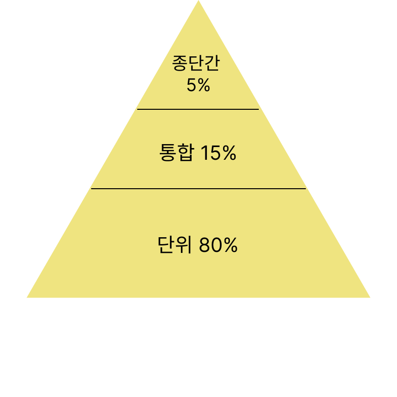
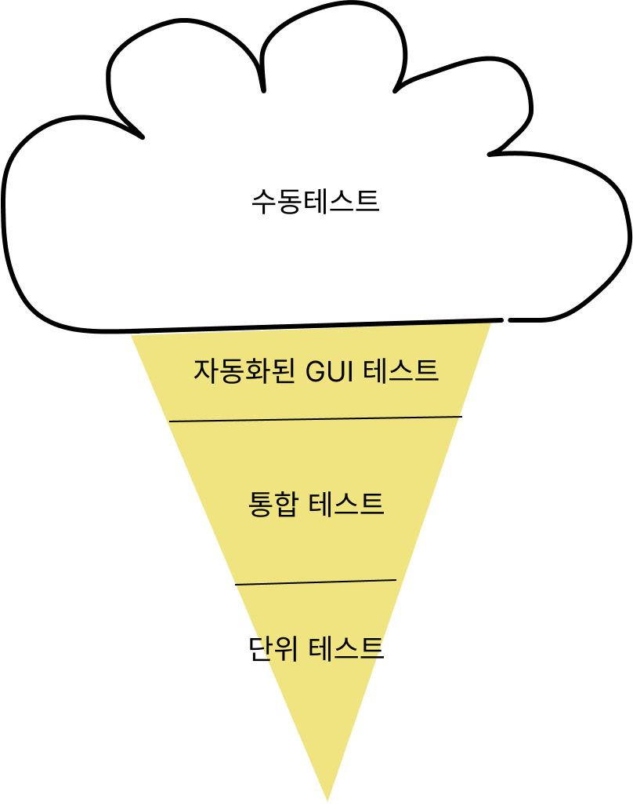

# 오늘 읽은 내용

## CHAPTER 11 테스트 개요

### TIL 3줄 요약

- 테스트 문화를 만드는 것은 오랜 시간이 걸린다.
- 테스트를 확장하려면 자동화가 필수
- 네가 좋아했다면 테스트를 준비해뒀어야지

### TIL (Today I Learned) 날짜

2023.06.05

### 오늘 읽은 범위

11.1 테스트를 작성하는 이유

[자동테스트]

- 테스트 하려는 단 하나의 행위(주로 메서드나 API)
- 특정한 입력(API에 전달하려는 값)
- 관측 가능한 출력 혹은 동작
- 통제된 조건(하나의 격리된 프로세스 등)

테스트 스위트: 간단한 테스트가 수백개 수 천개 모인 것.

11.1.3 작성하고 수행하고 조치하라.

가장 순수한 형태의 자동 테스트 '테스트 작성', '테스트 수행', '실패한 테스트의 대한 조치' 

건실한 자동테스트 문화에서는 모두가 테스트를 작성하고 공유하도록 장려한다.
테스트를 정기적으로 실행하고 
테스트가 실패한다면 바로 바로 조치하도록 권장해야 테스트 프로세스를 신뢰하고 이어갈 수 있다.

11.1.4 테스트 코드가 주는 혜택

- 디버깅감소
- 자신 있게 변경
- 더 나은 문서자료
- 더 단순한 리뷰
- 사려 깊은 설계
- 고품질의 릴리즈를 빠르게

11.2 테스트 스위트 설계하기

더 작은 테스트가 더 빠르고, 안정적이고, 평균적으로 고통이 적다.

테스트 케이스에는 두가지 독립된 요소가 있다.

크기 : 테스트 케이스 하나를 실행하는 데 필요한 자원

범위 : 검증하려는 특정한 코드 경로

11.2.1 테스트 크기

작은 테스트 : 프로세스 하나에서 동작 => 3가지 테스트 중 제약이 가장 엄격하다. 
중간 크기 테스트 : 기기 하나에서 동작
큰 테스트: 자원을 원하는 만큼 사용해서 동작

구글은 테스트하는범위와 상관없이 가능하면 언제나 작은 테스트를 작성하라고 권한다.

테스트 크기와 무관한 공통 특성

밀폐되어야 한다.
셋업, 실행, 테어다운 하는데 필요한 모든 정보를 담고 있어야 한다.
외부 환경에 관해서는 가정하지 않아야 한다.
테스트를 확인하려는 행위를 수행하는데 필요한 정보**만**을 포함해야 한다.
테스트 코드는 실패 했을 때만 다시 들여다 본다. 누군가 코드를 읽었을 때 부끄럽지 않도록 작성해라.

11.2.2 테스트 범위

테스트 범위: 주어진 테스트가 얼마나 많은 코드를 검증하느냐

좁은 범위 테스트(단위 테스트): 독립된 클래스나 메서드같이 코드 베이스 중 작은 일부 로직을 검증하도록 설계

중간 범위 테스트(통합 테스트): 적은 수의 컴포넌트들 사이의 상호작용을 검증하도록 설계

넓은 범위 테스트(종단간 테스트): 시스템의 서로 다른 부분들 사이의 상호작용, 혹은 클래스나 메서드 하나만 실행할 때는 괜찮다가 여럿을 조합해서 실행하면 나타나는 예기치 못한 동작을 검증하도록 설계.

구글의 테스트 피라미드

주의해야할 안티패턴들

아이스크림 콘

프로토타입에서 시작하여 급하게 프로덕션으로 이전하느라 테스트 부채를 미처 해결하지 못한 프로젝트에서 자주 나타나는 안티패턴입니다.

중간범위 테스트가 있었다면 더 빠르고 쉽게 해결할 수 있었겠지만 종단간 테스트로 막아내고 있다.
구성요소들이 강하게 커플링되어 각각의 인스턴스를 독립적으로 만들어낼 수 없을 때 나타난다.

11.2.3 비욘세규칙
어떤 것을 테스트해야하나 라는 질문에 '깨뜨려 보고 싶은 모든 것을 테스트 하라.'
시스템이 잘 돌아가는지 확인해보고 싶다면 그 행위를 검증하는 자동 테스트를 작성하는 것만이 유일한 선택지 이다.

비욘세 규칙이란? 네가 좋아했다면 (CI) 테스트를 준비해뒀어야지 라는 뜻이다.

11.2.4 코드 커버리지

코드 커버리지: 테스트가 기능 코드의 어느 라인을 실행하는지를 측정하는 수단.
ex) 100라인 짜리 코드가 있고 테스트가 90라인을 실행했다면 코드 커버리지는 90%

테스트 품질을 파악하는 표준 지표로 간주.
큰 테스트는 커버리지 인플레이션을 일으키므로 커버리지는 작은 테스트에만 측정하길 권한다.

11.3 구글 규모의 테스트
구글은 모든 코드를 모노리포, 즉 하나의 리포지터리에서 관리한다.

코드베이스를 열어 두어 코드베이스를 모두가 함께 책임지는 공동 소유 의식이 싹튼다.

11.3.1 대규모 테스트 스위트의 함정

깨지기 쉬운 테스트로 인한 저항

거대한 테스트 스위트를 잘 관리하는 비결은 테스트를 존중하는 문화이다.
엔지니어들이 테스트에 관심을 가지도록 장려해라.
적절한 성능 목표를 설정하고 느리거나 중요하지 않은 테스트들을 리펙터링 해라.
간단한 코드 변경에도 시간이 제법 소요된다면 테스트를 더 견고하게 만드는데 노력을 기울여라.
ex) 문화를 가꾸는 일, 린터를 개발하거나 문서자료를 보강하는 일 안 좋은 테스트를 만드는 실수를 줄여주는 테스트 인프라에도  투자를 해야한다.

테스트 관리 비용을 낮추는 데 투자하지 않는다면 엔지니어들은 테스트가 전혀 가치가 없다고 결론내게 될 것이다.

11.4 구글의 테스트 역사

11.4.1 오리엔테이션 수업

테스트의 가치를 이야기하는 수업이 있다. 생산성 향상, 더 나은 문서자료, 리펙터링지원 등 테스트의 다양한 이점을 다룬 수업을 듣는다.

11.4.2 테스트 인증

이 프로그램은 각 팀이 자신의 테스트 프로세스 수준을 알게 하고 한 단계 올라서기 위한 지침을 제공하는 것이다.
5개의 레벨로 구성되며 해당 레벨로 인정받는 데 필요한 구체적인 조건을 정의했다.

11.4.3 화장실에서도 테스트(TotT)

화장실 칸마다 변기 앞에 테스트 개선법에 관한 글이 붙었다. 
에피소드는 한페이지를 넘지 않게 제한 되었으며 자리로 돌아갔을 때 바로 시도해 볼 수 있도록  **실행 가능한 조언**에 집중하도록 유도했다.

11.4.4 오늘날의 테스트 문화

구글은 테스트를 경영진들에게 강제로 진행하게 하지 않고 테스트가 훌륭한 아이디어임을 입중하는데 초점을 두었다.
테스트는 우리 모두의 일이다 라는 생각을 아무도 의심하지 않게 만들었다.
테스트를 작성하는 것은 올바른 일이기에 아무도 강요하지 않아도 계속할 가능성이 크다는 의미이기도 하다.

### 오늘 읽은 소감은? 떠오르는 생각을 가볍게 적어보세요

구글이 테스트를 어떻게 생각하고 중요하게 여기는지 보여주는 장.

### 궁금한 내용이 있거나, 잘 이해되지 않는 내용이 있다면 적어보세요

테스트가 중요해 중요해라고 알고 있지만 실행이 안되는 면이 있는데 
프런트에 어떻게 테스트를 할지 좀 더 구체적으로 알고 실행시키려는 노력이 필요할 것 같다.
혼자가 안된다면 팀으로 일을 진행해보는 것이 좋을 것 같다.

### 해시태그: 키워드

#테스트 #테스트가중요한이유