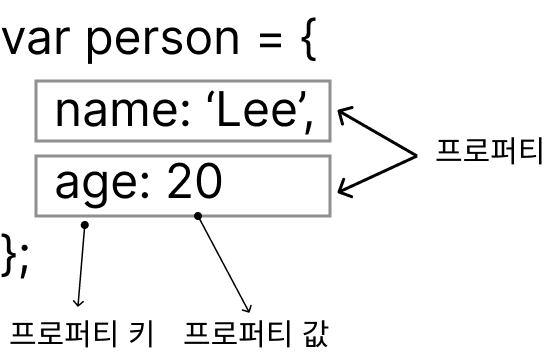

# 10. 객체 리터럴

## 10.1 객체란?

- 원시 타입의 값. 즉 원시 값은 변경 불가능한 값이지만 객체 타입의 값. 즉 객체는 변경 가능한 값.

- 프로퍼티 : 객체의 상태를 나타내는 값(data)
- 메서드 : 프로퍼티(상태 데이터)를 참조하고 조작할 수 있는 동작(behavior)

## 10.3 프로퍼티

객체는 프로퍼티의 집합이며, 프로퍼티는 키와 값으로 구성된다.

## 10.4 메서드

프로퍼티 값이 함수일 경우 일반 함수와 구분하기 위해 메소드라 부른다.
객체에 묶여 있는 함수를 의마한다.

## 10.5 프로퍼티 접근

- 마침표 프로퍼티 접근 연산자(.)를 사용하는 마침표 표기법
- 대괄호 프로퍼티 접근 연산자([...])를 사용하는 대괄호 표기법

