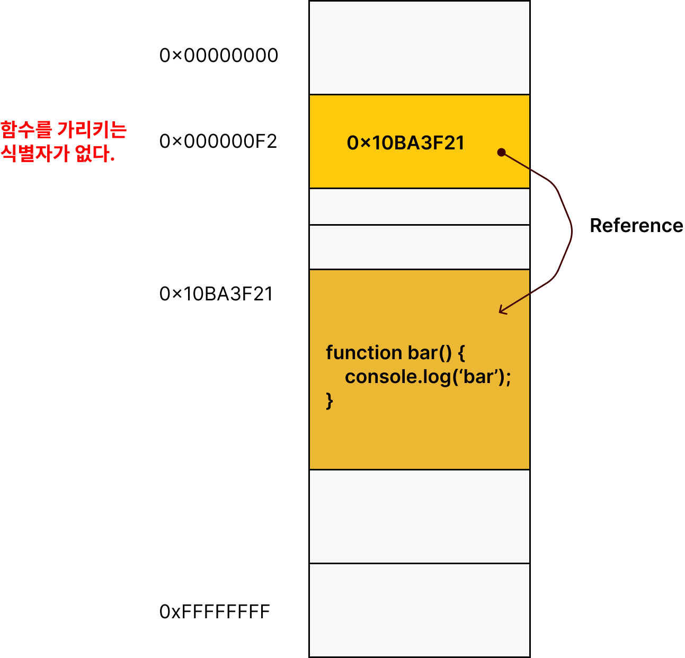
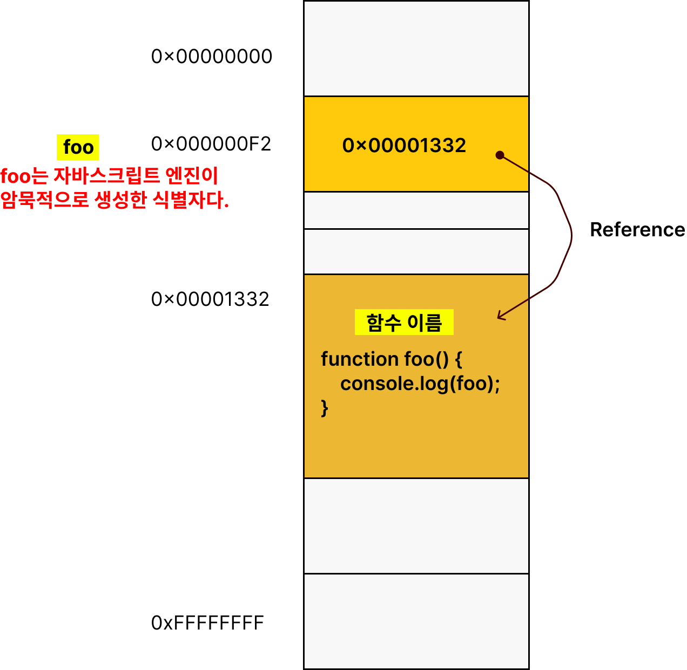
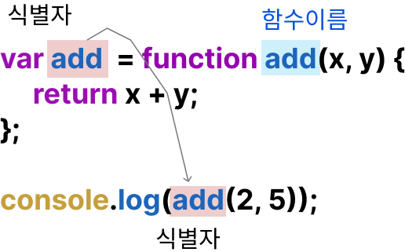
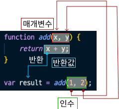

# 12. 함수

## 12.1 함수란?

함수: 일련의 과정을 문으로 구현하고 코드 블록으로 감싸서 하나의 실행 단위로 정의한 것.

```javascript
function add (x, y) {
    return x + y;
}
```

## 12.2 함수를 사용하는 이유

- 코드의 재사용할 수 있다.
- 유지보수의 편의성 높임.
- 코드의 신뢰성을 높임.
- 코드의 가독성 향상

## 12.3 함수 리터럴

```javascript
var f = function add (x, y) {
    return x + y;
}
```

함수는 객체다. 일반 객체는 호출할 수 없지만 함수는 호출할 수 있다.

## 12.4 함수 정의

### 12.4.1 함수 선언문

[예제 12-05]

```javascript
// 함수 선언문
function add(x, y) {
    return x + y;
}

// 함수 참조
// console.dir은 console.log와는 달리 객체의 프로퍼티까지 출력한다.
// 단, Node.js 환경에서는 console.log 와 같은 결과가 출력된다.
console.dir(add); // f add(x.y)

// 함수 호출
console.log(add(2, 5)); // 7
```

함수 선언문

- 함수이름을 생략할 수 없다.
- 표현식이 아닌 문이다.

[예제 12-07]

```javascript
// 함수 선언문은 표현식이 아닌 문이므로 변수에 할당할 수 없다.
// 하지만 함수 선언문이 변수에 할당되는 것처럼 보인다.
var add = function add(x, y) {
    return x + y;
}

// 함수 호출
console.log(add(2, 5)); // 7
```

[예제 12-08]

```javascript
// 기명함수 리터럴을 단독으로 사용하면 함수 선언문을 해석
// 함수 선언문에서는 함수 이름을 생략할 수 없다.
function foo() {
    console.log('foo');
}

foo();

// 함수 리터럴을 피연산자로 사용하면 함수 선언문이 아니라 함수 리터럴 표현식으로 해석된다.
// 함수 리터럴에서는 함수 이름을 생략할 수 있다.

(function bar() { console.log('bar'); });
bar(); // ReferenceError: bar is not defined
```





자바스크립트 엔진은 생성된 함수를 호출하기 위해함수 이름과 동일한 이름의 식별자를 암묵적으로 생성하고, 거기에 함수 객체를 할당한다.

[예제 12-09]

```javascript
// 기명함수 리터럴을 단독으로 사용하면 함수 선언문을 해석
// 함수 선언문에서는 함수 이름을 생략할 수 없다.
var add = function add(x, y) {
    return x + y;
}

console.log(add(2, 5)); // 7
```

함수는 함수이름으로 호출하는 것이 아니라함수 객체를 가리키는 식별자로 호출한다.


### 12.4.2 함수 표현식

지바스크립트의 함수는 일급 객체다.
일급 객체: 값의 성질을 갖는 객체.

[예제 12-10]

```javascript
// 함수 표현식
var add = function (x, y) {
    return x + y;
}

console.log(add(2, 5)); // 7
```

익명함수: 함수 리터럴은 함수 이름을 생략할 수 있다.

[예제 12-11]

```javascript
// 기명 함수 표현식
var add = function foo (x, y) {
    return x + y;
}

// 함수 객체를 가리키는 식별자로 호출
console.log(add(2, 5)); // 7

// 함수 이름으로 호출하면 ReferenceError가 발생한다.
// 함수 이름은 함수 몸체 내부에서만 유효한 식별자다.

console.log(foo(2, 5)); // ReferenceError가: foo is not defined
```

### 12.4.3 함수 생성 시점과 호이스팅

[예제 12-12]

```javascript
// 함수 참조
console.dir(add); // f add (x,y)
console.dir(sub); // undefined

// 함수 호출
console.log(add(2, 5)); // 7
console.log(sub(2, 5)); // TypeError: sub is not a function

// 함수 선언문
function add(x, y) {
    return x + y;
}

// 함수 표현식
var sub = function (x, y) {
    return x - y;
}
```

sub가 에러나는 이유:
함수 선언문으로 정의한 함수(add)와 함수 표현식으로 정의한 함수(sub)의 생성 시점이 다르기 때문이다.

함수 선언문이 코드의 선두로 끌어 올려진 것처럼 동작하는 자바 스크립트 고유의 특징인 **함수 호이스팅**이라고 한다.
함수 호이스팅은 함수를 호출하기 전에 반드시 함수를 선언해야 한다는 당연한 규칙을 무시하기 때문에 함수 표현식을 사용할 것을 권장한다.

변수 할당문의 값은 할당문이 실행되는 시점, 즉 런타임에 평가되므로 함수 표현식의 함수 리터럴도 할당문이 실행되는 시점에 평가되어 함수 객체가 된다.

함수 표현식으로 함수를 정의하면 함수 호이스팅이 발생하는 것이 아니라 변수 호이스팅이 발생한다.

### 12.4.4 Function 생성자 함수

생성자 함수: 객체를 생성하는 함수를 말한다.  17장 연동

[예제 12-13]

```javascript
var add = new Function('x', 'y', 'return x + y');

console.log(add(2, 5));
```

함수 선언문이나 함수 표현식으로 생성한 함수와 Function 생성자 함수로 생성한 함수가 동일하게 작동하지 않는다.
클로저를 생성하지 않는다 등. 다르게 작동한다.

### 12.4.5 화살표 함수

화살표를 사용하여 더 간략하게 함수를 선언 할 수 있다. 항상 익명함수로 정의한다.

```javascript
const add = (x, y) => x + y;
console.log(add(2, 5));
```

표현뿐 아니라 내부 동작 또한 간략하게 작동한다.

- 생성자 함수로 사용할 없다.
- 기존 함수와 this 바인딩이 다르다
- prototype 프로퍼티가 없고
- arguments 객체를 생성하지 않는다.
  
// TODO: 26.3 에서 더 자세히 다루니까 공부하고 연결시키기

## 12.5 함수 호출

### 12.5.1 매개변수와 인수

[예제 12-16]

```javascript
// 함수 선언문
function add(x, y) {
    return x + y;
}

// 함수 호출
// 인수 1과 2가 매개변수 x  y에 순서대로 할당되고 함수 몸체의 문들이 실행된다.
var result = add(1, 2);
```



[예제 12-17]

```javascript
function add(x, y) {
    console.log(x, y); // 2, 5
    return x + y;
}

add(2, 5);

// add 함수의 매개변수 x, y는 함수 몸체 내부에서만 참조할 수 있다.
console.log(x, y); // ReferenceError: x is not defined
```

[예제 12-18]

```javascript
function add(x, y) {
    return x + y
}

// 인수를 부족하게 입력한 경우
// 인수가 할당되지 않은 매개변수의 값은 undefined이다. 따라서 2 + undefined = NaN
console.log(add(2)); // NaN
```

[예제 12-19]

```javascript
function add(x, y) {
    return x + y
}

console.log(add(2, 5, 10)); // 7

// 인수를 초과하여 입력한 경우
// 초과된 인수는 무시된다. 그냥 버려지는 것은 아니고 모든 인수는 암묵적으로 arguments 객체의 프로퍼티로 보관된다.
```

[예제 12-20]

```javascript
function add(x, y) {
    console.log(arguments);
    // Arguments(3) [2, 5, 10, callee: f, Symbol(Symbol.iterator): f]

    return x + y
}

console.log(add(2, 5, 10));
```

//TODO: 18.2.1절 arguments에서 자세히 다룸(추후 연결)


### 12.5.2 인수 확인

## 12.6 참조에 의한 전달과 외부 상태의 변경

[예제 12-33]

```javascript
// 매개변수 primitive는 원시 값을 전달받고, 매개변수 obj는 객체를 전달받는다.
function changeVal(primitive, obj) {
    primitive += 100;
    obj.name = "Kim";
}

// 외부상태
var num = 100;
var person = { name: "Lee" };

console.log(num);       // 100
console.log(person);    // { name: "Lee" }

// 원시 값은 값 자체가 복사되어 전달되고 객체는 참조 값이 복사되어 전달된다.
changeVal(num, person);

// 원시 값은 원본이 훼손되지 않는다.
console.log(num);       // 100
// 객체는 원본이 훼손된다.
console.log(person);    // { name: "Kim" }
```

## 12.7 다양한 함수 형태

### 12.7.1 즉시 실행 함수

```javascript
// [예제 12-34] 익명 즉시 실행 함수
(function () {
    var a = 3;
    var b = 5;
    return a + b;
}());
```

```javascript
// [예제 12-35] 기명 즉시 실행 함수
(function foo() {
    var a = 3;
    var b = 5;
    return a + b;
}());

foo(); // ReferenceError: foo is not defined
```

```javascript
// [예제 12-36] 
function() { // SyntaxError: Function statements require a function name
   console.log("foo");
}();
// 함수 선언문의 형식에 맞지 않아서 에러 발생. 함수 선언문에서 함수이름을 생략할 수 없다.
```

```javascript
// [예제 12-37] 
function foo() { 
   console.log("foo");
}(); // SyntaxError: Unexpected token ')'

// 함수 선언문이 끝나는 위치, 즉 함수 코드 블록의 닫는 중괄호 뒤에 ";"이 암묵적으로 추가되기 때문에 에러 발생.
```

```javascript
// [예제 12-38] 
function foo() {}(); // function foo() {};();

// 함수 선언문 뒤의 (...)는 함수 호출 연산자가 아니라 그룹 연산자로 해석되고, 그룹 연산자에 피연산자가 없기 때문에 에러가 발생한다.
```

```javascript
// [예제 12-39] 
(); // SyntaxError: Unexpected token ')'
```

```javascript
// [예제 12-40]
console.log(typeof (function f(){})); // function
console.log(typeof (function (){})); // function
```

```javascript
// [예제 12-41]
(function () {
    console.log("function1");
}());

(function () {
    console.log("function2");
})();

!function () {
    console.log("function !");
}();

+function () {
    console.log("function +");
}();
```

```javascript
// [예제 12-42]
var res = (function () {
    var a = 3;
    var b = 5;
    return a * b;
}());

console.log(res);

// 즉시 실행 함수에도 일반 함수처럼 인수를 전달할 수 있다.
res = (function (a, b) {
    return a * b;
}(2, 7));

console.log(res);
```

### 12.7.2 재귀함수

재귀 호출: 함수가 자기 자신을 호출하는 것
재귀 함수: 자기자신을 호출하는 행위

```javascript
// [예제 12-43]

function countdown(n) {
     for (var i = n; i >= 0; i--) {
        console.log(i)
     }
}

countdown(10);
```

```javascript
// [예제 12-44]

function countdown(n) {
    if(n < 0) return;
    console.log(n);
    countdown(n - 1); // 재귀 호출
}

countdown(10);
```

```javascript
// [예제 12-45]
// 팩토리얼(계승)은 1부터 자신까지의 모든 양의 정수의 곱이다.
// n! = 1 * 2 * ... * (n-1) * n
function factorial(n) {
    // 탈출조건: n이 1 이하일 때 재귀 호출을 멈춘다.
    if(n <= 1) return 1;
    // 재귀호출
    return n * factorial(n - 1);
}

console.log(factorial(0));  // 0! = 1
console.log(factorial(1));  // 1! = 1
console.log(factorial(2));  // 2! = 2 * 1 = 2
console.log(factorial(3));  // 3! = 3 * 2 * 1 = 6
console.log(factorial(4));  // 4! = 4 * 3 * 2 * 1 = 24
console.log(factorial(5));  // 5! = 5 * 4 * 3 * 2 * 1 = 120
```

```javascript
// [예제 12-46]
// 함수표현식
var factorial = function foo(n) {
    // 탈출조건: n이 1 이하일 때 재귀 호출을 멈춘다.
    if(n <= 1) return 1;
    // 함수를 가리키는 식별자로 자기 자신을 호출
    return n * factorial(n - 1);
}

console.log(factorial(5));  // 5! = 5 * 4 * 3 * 2 * 1 = 120
```

```javascript
// [예제 12-47]
unction factorial(n) {
    // 탈출조건: n이 1 이하일 때 재귀 호출을 멈춘다.
    if(n <= 1) return 1;
    var res = n;
    while(--n) res *= n;
    return res;
}

console.log(factorial(0));  // 0! = 1
console.log(factorial(1));  // 1! = 1
console.log(factorial(2));  // 2! = 2 * 1 = 2
console.log(factorial(3));  // 3! = 3 * 2 * 1 = 6
console.log(factorial(4));  // 4! = 4 * 3 * 2 * 1 = 24
console.log(factorial(5));  // 5! = 5 * 4 * 3 * 2 * 1 = 120
```

### 12.7.3 중첩함수

내부 함수(중첩함수): 함수 내부에 정의된 함수. 자신을 포함하는 외부 함수를 돕는 헬퍼 함수의 역활을 한다.
외부함수: 중첩 함수를 포함하는 함수

```javascript
// [예제 12-48]

function outer() {
     var x = 1;

     // 중첩함수
     function inner() {
        var y = 2;
        // 외부 함수의 변수를 참조할 수 있다.
        console.log(x + y);
     }

     inner();
}

outer();
```

### 12.7.4 콜백함수

```javascript
// [예제 12-49]
// n만큼 어떤 일을 반복한다.
function repeat(n) {
    // i를 출력한다.
    for (var i = 0; i < n; i++) console.log(i);
}

repeat(5); // 0 1 2 3 4
```

```javascript
// [예제 12-50]
// n만큼 어떤 일을 반복한다.
function repeat1(n) {
    // i를 출력한다.
    for (var i = 0; i < n; i++) console.log(i);
}

repeat1(5); // 0 1 2 3 4

// n만큼 어떤 일을 반복한다.
function repeat2(n) {
    for (var i = 0; i < n; i++) {
        // i가 홀수일 때만 출력한다.
        if (i % 2) console.log(i);
    }
}

repeat2(5); // 1 3
```

```javascript
// [예제 12-51]
// 외부에서 전달받은 f를 n만큼 반복 호출한다.
function repeat(n, f) {
    // i를 출력한다.
    for (var i = 0; i < n; i++) {
        f(i);
    }
}

var logAll = function(i) {
    console.log(i);
}

// 반복 호출할 함수를 인수로 전달한다.
repeat(5, logAll); // 0 1 2 3 4

var logOdds = function(i) {
    if (i % 2) console.log(i);
}

repeat(5, logOdds); // 1 3
```

콜백함수

- 함수의 매개변수를 통해 다른 함수의 내부로 전달되는 함수
- 고차 함수에 의해 호출된다.

고차함수TODO:(27.9절 연결)

- 매개변수를 통해 함수의 외부에서 콜백 함수를 전달받은 함수  
- 콜백함수를 자신의 일부분으로 합성한다.
- 매개변수를 통해 전달받은 콜백함수의 호출 시점을 결정해서 호출한다.
- 필요에 따라 콜백 함수에 인수를 전달할 수 있다.

```javascript
// [예제 12-52]
// 익명함수 리터럴을 콜백 함수로 고차함수에 전달한다.
// 익명함수 리터럴은 repeat함수를 호출할 때마다 평가되어 함수 객체를 생성한다.
repeat(5, function(i) {
    if (i % 2) console.log(i);
}); // 1 3
```

```javascript
// [예제 12-53]
// logOdds 함수는 단 한번만 실행된다.
var logOdds = function(i) {
    console.log('logOdds');
    if (i % 2) console.log(i);
}

// 고차 함수에 함수 참조를 전달한다.
repeat(5, logOdds); // 1 3
```

```javascript
// [예제 12-54]
// 콜백 함수를 사용한 이벤트 처리
// myButton 버튼을 클릭하면 콜백함수를 실행한다.
document.getElementById('myButton').addEventListener('click', function () {
    console.log('myButton clicked!');
});

// 콜백 함수를 사용한 비동기 처리
// 1초 후에 메시지를 출력한다.
setTimeout(function ()  {
    console.log("1초 경과");
}, 1000);
```

```javascript
// [예제 12-55]
// 콜백 함수를 사용하는 고차함수 map
var res = [1, 2, 3].map(function(item) {
    return item * 2;
});

console.log(res); // [2, 4, 6]

// 콜백함수를 사용하는 고차함수 filter
res = [1, 2, 3].filter(function(item) {
    return item % 2;
});

console.log(res); // [1, 3]

// 콜백함수를 사용하는 고차함수 reduce
res = [1, 2, 3].reduce(function(acc, cur) {
    return acc + cur;
}, 0);

console.log(res); // 6
```

### 12.7.5 순수 함수와 비순수 함수

순수함수: 함수형 프로그래밍에서 어떤 외부 상태에 의존하지도 않고 변경하지도 않는, 즉 부수효과가 없는 함수
비순수 함수: 외부상태에 의존하거나 변경하는, 즉 부수효과가 있는 함수

순수함수는 동일한 인수가 전달되면 언제나 동일한 값을 반환하는 함수이다. 하나 이상의 인수를 전달받는다.

```javascript
// [예제 12-56]
var count = 0;  // 현재 카운트를 나타내는 상태

// 순수 함수 increase는 동일한 인수가 전달되면 언제나 동일한 값을 반환한다.
function increase(n) {
    return ++n;
}

// 순수 함수기 반환한 결과값을 변수에 재할당해서 상태를 변경
count = increase(count);
console.log(count);     // 1

count = increase(count);
console.log(count);     // 2
```

```javascript
// [예제 12-57]
var count = 0;  // 현재 카운트를 나타내는 상태, increase 함수에 의해 변화한다.

// 비순수 함수
function increase() {
    return ++count;
}

// 비순수 함수는 외부 상태(count)를 변경하므로 상태 변화를 추적하기 어려워진다.
increase();
console.log(count);     // 1

increase();
console.log(count);     // 2
```

함수형 프로그래밍은 순수함수와 보조 함수의 조합을 통해 외부상태를 변경하는 부수 효과를 최소화해서 **불변성**을 지향하는 프로그래밍 패러다임이다.
목표

- 조건문, 반복문을 제거해서 복잡성을 낮추고
- 변수 사용을 억제하고 생명주기를 최소화해서 상태 변경을 피해 오류를 최소화