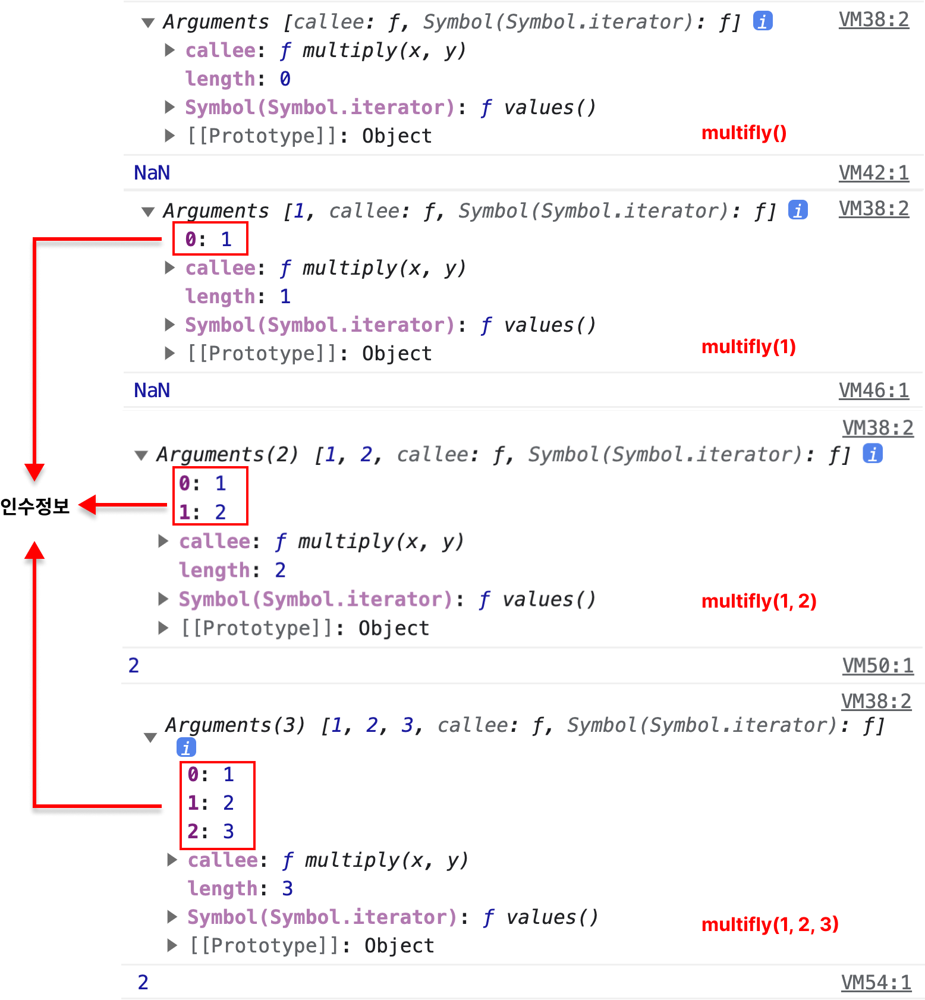

# 18. 함수와 일급객체

## 18.1 일급 객체

1. 무명의 리터럴로 생성할 수 있다. 즉 런타임에 생성 가능 하다.
2. 변수나 자료구조(객체, 배열 등)에 저장할 수 있다.
3. 함수의 매개변수에 전달할 수 있다.
4. 함수의 반환값으로 사용할 수 있다.

[예제 18-01]

```javascript
// 1. 함수는 무명의 리터럴로 생성할 수 있다.
// 2. 함수는 변수에 저장할 수 있다.
// 런타임(할당 단계)에 함수 리터럴이 평가되어 함수 객체가 생성되고 변수에 할당된다.
const increase = function (num) {
  return ++num;
};

const decrease = function (num) {
  return --num;
};

// 2. 함수는 객체에 저장할 수 있다.
const auxs = { increase, decrease };

// 3. 함수의 매개변수에게 전달할 수 있다.
// 4. 함수의 반환값으로 사용할 수 있다.
function makeCounter(aux) {
  let num = 0;

  return function () {
    num = aux(num);
    return num;
  };
}

// 3. 함수는 매개변수에게 함수를 전달할 수 있다.
const increaser = makeCounter(auxs.increase);
console.log(increaser()); // 1
console.log(increaser()); // 2

// 3. 함수는 매개변수에게 함수를 전달할 수 있다.
const decreaser = makeCounter(auxs.decrease);
console.log(decreaser()); // -1
console.log(decreaser()); // -2
```

## 18.2 함수 객체의 프로퍼티

[예제 18-02]

```javascript
function square(number) {
  return number * number;
}

console.dir(square);
```

[예제 18-03]

```javascript
function square(number) {
  return number * number;
}

console.log(Object.getOwnPropertyDescriptors(square));
/*
{
  length: {value: 1, writable: false, enumerable: false, configurable: true},
  name: {value: "square", writable: false, enumerable: false, configurable: true},
  arguments: {value: null, writable: false, enumerable: false, configurable: false},
  caller: {value: null, writable: false, enumerable: false, configurable: false},
  prototype: {value: {...}, writable: true, enumerable: false, configurable: false}
}
*/

// __proto__는 square 함수의 프로퍼티가 아니다.
console.log(Object.getOwnPropertyDescriptor(square, '__proto__')); // undefined

// __proto__는 Object.prototype 객체의 접근자 프로퍼티다.
// square 함수는 Object.prototype 객체로부터 __proto__ 접근자 프로퍼티를 상속받는다.
console.log(Object.getOwnPropertyDescriptor(Object.prototype, '__proto__'));
// {get: ƒ, set: ƒ, enumerable: false, configurable: true}
```

### 18.2.1 arguments 프로퍼티

[예제 18-04]

```javascript
function multiply(x, y) {
  console.log(arguments);
  return x * y;
}

console.log(multiply());        // NaN
console.log(multiply(1));       // NaN
console.log(multiply(1, 2));    // 2
console.log(multiply(1, 2, 3)); // 2
```



arguments 객체는 인수의 프로퍼티 값으로 소유하며 프로퍼티 키는 인수의 순서를 나타낸다.
arguments 객체의 callee 프로퍼티는 호출되어 arguments 객체를 생성한 함수, 즉 함수 자신을 가리키고
arguments 객체의 length 프로퍼티는 인수의 개수를 가리킨다.

arguments 객체는 매개변수 개수를 확정할 수 없느 **가변 인자 함수**를 구현할 때 유용하다.

[예제 18-06]

```javascript
function sum() {
  let res = 0;

  // arguments 객체는 length 프로퍼티가 있는 유사 배열 객체이므로 for 문으로 순회할 수 있다.
  for (let i = 0; i < arguments.length; i++) {
    res += arguments[i];
  }

  return res;
}

console.log(sum());        // 0
console.log(sum(1, 2));    // 3
console.log(sum(1, 2, 3)); // 6
```

> **유사 배열 객체와 이터러블**
> ES6에서 도입된 이터레이션 프로토콜을 준수하면 순회 가능한 자료구조인 이터러블이 된다.
> 이터러블 개념이 없던 ES5에서 arguments 객체는 유사배열 객체로 구분되었다.
> 하지만 이터러블이 도입된 ES6부터 arguments 객체는 유사배열 객체이면서 동시에 이터러블이다.

[예제 18-07]

```javascript
function sum() {
  // arguments 객체를 배열로 변환
  const array = Array.prototype.slice.call(arguments);
  console.log(array);
  return array.reduce(function (pre, cur) {
    return pre + cur;
  }, 0);
}

console.log(sum(1, 2));          // 3
console.log(sum(1, 2, 3, 4, 5)); // 15
```

[예제 18-08]

```javascript
// ES6 Rest parameter
function sum(...args) {
  return args.reduce((pre, cur) => pre + cur, 0);
}

console.log(sum(1, 2));          // 3
console.log(sum(1, 2, 3, 4, 5)); // 15
```

### 18.2.2 caller 프로퍼티

[예제 18-09]

```javascript
function foo(func) {
  return func();
}

function bar() {
  return 'caller : ' + bar.caller;
}

// 브라우저에서의 실행한 결과
console.log(foo(bar)); // caller : function foo(func) {...}
console.log(bar());    // caller : null
```

### 18.2.3 length 프로퍼티

[예제 18-10]

```javascript
function foo() {}
console.log(foo.length); // 0

function bar(x) {
  return x;
}
console.log(bar.length); // 1

function baz(x, y) {
  return x * y;
}
console.log(baz.length); // 2
```

### 18.2.4 name 프로퍼티

[예제 18-11]

```javascript
// 기명 함수 표현식
var namedFunc = function foo() {};
console.log(namedFunc.name); // foo

// 익명 함수 표현식
var anonymousFunc = function() {};
// ES5: name 프로퍼티는 빈 문자열을 값으로 갖는다.
// ES6: name 프로퍼티는 함수 객체를 가리키는 변수 이름을 값으로 갖는다.
console.log(anonymousFunc.name); // anonymousFunc

// 함수 선언문(Function declaration)
function bar() {}
console.log(bar.name); // bar
```

### 18.2.5 __proto__ 접근자 프로퍼티

[예제 18-12]

```javascript
const obj = { a: 1 };

// 객체 리터럴 방식으로 생성한 객체의 프로토타입 객체는 Object.prototype이다.
console.log(obj.__proto__ === Object.prototype); // true

// 객체 리터럴 방식으로 생성한 객체는 프로토타입 객체인 Object.prototype의 프로퍼티를 상속받는다.
// hasOwnProperty 메서드는 Object.prototype의 메서드다.
console.log(obj.hasOwnProperty('a'));         // true
console.log(obj.hasOwnProperty('__proto__')); // false
```

> **hasOwnProperty메서드**
> hasOwnProperty 메서드는 이름에서 알 수 있듯이 인수로 전달받은 프로퍼티 키가 객체 고유의 프로퍼티 키인 경우에만 true를 반환하고 상속받은 프로포타입의 프로퍼티 키인 경우 false를 반환한다.

### 18.2.6 prototype 프로퍼티

[예제 18-13]

```javascript
// 함수 객체는 prototype 프로퍼티를 소유한다.
(function () {}).hasOwnProperty('prototype'); // -> true

// 일반 객체는 prototype 프로퍼티를 소유하지 않는다.
({}).hasOwnProperty('prototype'); // -> false
```

