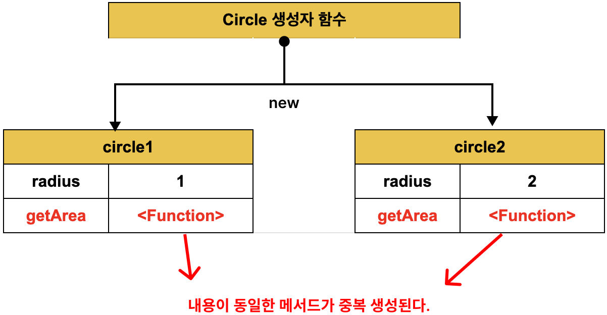
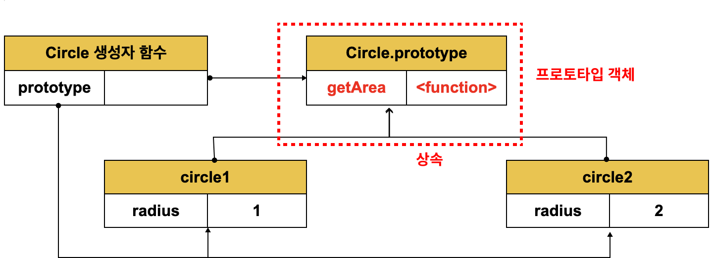

# 19. 프로토타입

//TODO: ch.25 클래스랑 연동하기
> **클래스(Class)**
> ES6에서 클래스가 도입되었다. 하지만 ES6의 클래스가 기존의 프로토타입 기반 객체지향 모델을 폐지하고 새로운 객체지향 모델을 제공하는 것은 아니다. 사실 클래스도 함수이며, 기존 프로토타입 기반 패턴 문법적 설탕 이라고 볼 수 있다.
> 클래스와 생성자 함수는 모두 프로토타입 기반의 인스턴스를 생성하지만 정확히 동일하게 동작하지는 않는다. 클래스는 생성자 함수보다 엄격하여 클래스는 생성자 함수에서는 제공하지 않는 기능도 제공한다.
> 따라서 클래스를 프로토타입 기반 객체 생성 패턴의 단순한 문법적 설탕으로 보기보다는 새로운 객체 생성 매커니즘으로 보는것이 좀 더 합당하다고 할 수 있다.

자바스크립트는 객체 기반의 프로그래밍 언어이며 **자바스크립트를 이루고 있는 거의 "모든 것"이 객체다.**

## 19.1 객체지향 프로그래밍

객체지향 프로그래밍은 실세계의 실체를 인식하는 철학적 사고를 프로그래밍에 접목하려는 시도에서 시작. 실체는 특징이나 성질을 나타내는 **속성**을 가지고 있다.

사람에게는 다양한 속성이 있으나 우리가 구현하려는 프로그램에서는 사람의 이름과 주소라는 속성만 관심이 있다. 다양한 속성 중에서 필요한 속성만 간추려 내어 표현 하는 것이 **추상화**라 한다.

[예제 19-01]

```javascript
// 이름과 주소 속성을 갖는 객체
const person = {
  name: 'Kim',
  address: 'Seoul'
};

console.log(person); // {name: "Kim", address: "Seoul"}
```

**속성을 통해 여러 개의 값을 하나의 단위로 구성한 복합적인 자료구조**를 객체라 한다.

원이라는 개념을 만들고 원에는 반지름이라는 속성이 있다. 이 반지름을 가지고 지름, 둘레, 넓이를 구할 수 있다. 이 때 반지름은 원의 **상태를 나타내는 데이터**이며 원의 지름, 둘레, 넓이를 구하는 것은 **동작**이다.

[예제 19-02]

```javascript
const circle = {
  radius: 5, // 반지름

  // 원의 지름: 2r
  getDiameter() {
    return 2 * this.radius;
  },

  // 원의 둘레: 2πr
  getPerimeter() {
    return 2 * Math.PI * this.radius;
  },

  // 원의 넓이: πrr
  getArea() {
    return Math.PI * this.radius ** 2;
  }
};

console.log(circle);
// {radius: 5, getDiameter: ƒ, getPerimeter: ƒ, getArea: ƒ}

console.log(circle.getDiameter());  // 10
console.log(circle.getPerimeter()); // 31.41592653589793
console.log(circle.getArea());      // 78.53981633974483
```

객체지향 프로그래밍은 객체의 **상태**를 나타내는 데이터와 상태 데이터를 조작할 수 있는 **동작**을 묶어서 생각한다.
따라서 객체는 **상태 데이터와 동작을 하나의 논리적인 단위로 묶은 복합적인 자료구조**라고 할 수 있다.

## 19.2 상속과 프로토타입

상속은 객체지향 프로그래밍의 핵심 개념이다. 어떤 객체의 프로퍼티 또는 메서드를 다른 객체가 상속받아 그대로 사용할 수 있는 것을 말한다.

[예제 19-03]

```javascript
// 생성자 함수
function Circle(radius) {
  this.radius = radius;
  this.getArea = function () {
    // Math.PI는 원주율을 나타내는 상수다.
    return Math.PI * this.radius ** 2;
  };
}

// 반지름이 1인 인스턴스 생성
const circle1 = new Circle(1);
// 반지름이 2인 인스턴스 생성
const circle2 = new Circle(2);

// Circle 생성자 함수는 인스턴스를 생성할 때마다 동일한 동작을 하는
// getArea 메서드를 중복 생성하고 모든 인스턴스가 중복 소유한다.
// getArea 메서드는 하나만 생성하여 모든 인스턴스가 공유해서 사용하는 것이 바람직하다.
console.log(circle1.getArea === circle2.getArea); // false

console.log(circle1.getArea()); // 3.141592653589793
console.log(circle2.getArea()); // 12.566370614359172
```



상속을 통해 불필요한 중복을 제거 하고 **자바스크립트는 프로토타입을 기반으로 상속을 구현한다.**

[예제 19-04]

```javascript
// 생성자 함수
function Circle(radius) {
  this.radius = radius;
}

// Circle 생성자 함수가 생성한 모든 인스턴스가 getArea 메서드를
// 공유해서 사용할 수 있도록 프로토타입에 추가한다.
// 프로토타입은 Circle 생성자 함수의 prototype 프로퍼티에 바인딩되어 있다.
Circle.prototype.getArea = function () {
  return Math.PI * this.radius ** 2;
};

// 인스턴스 생성
const circle1 = new Circle(1);
const circle2 = new Circle(2);

// Circle 생성자 함수가 생성한 모든 인스턴스는 부모 객체의 역할을 하는
// 프로토타입 Circle.prototype으로부터 getArea 메서드를 상속받는다.
// 즉, Circle 생성자 함수가 생성하는 모든 인스턴스는 하나의 getArea 메서드를 공유한다.
console.log(circle1.getArea === circle2.getArea); // true

console.log(circle1.getArea()); // 3.141592653589793
console.log(circle2.getArea()); // 12.566370614359172
```



## 19.3 프로토타입 객체


