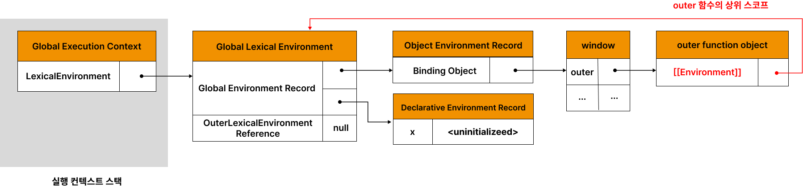
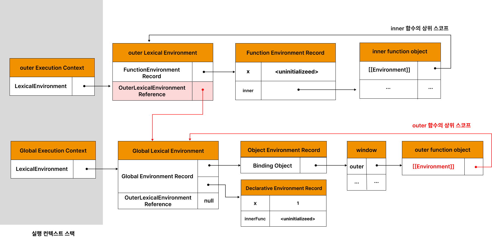
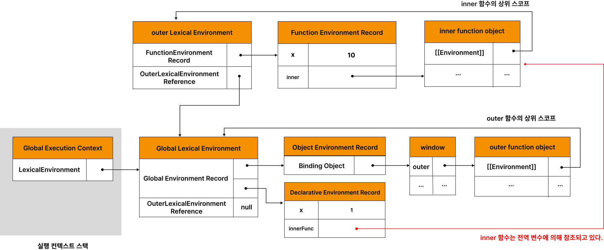
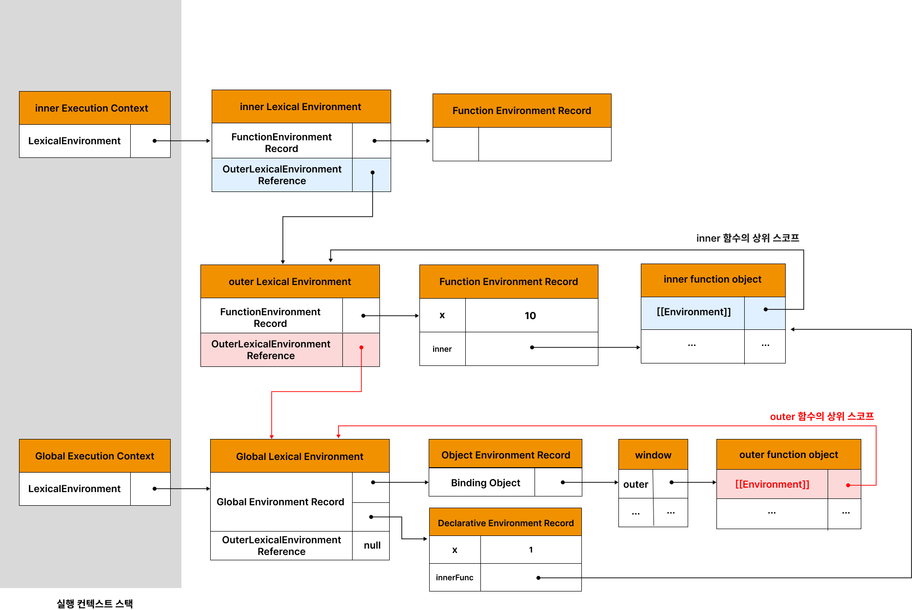
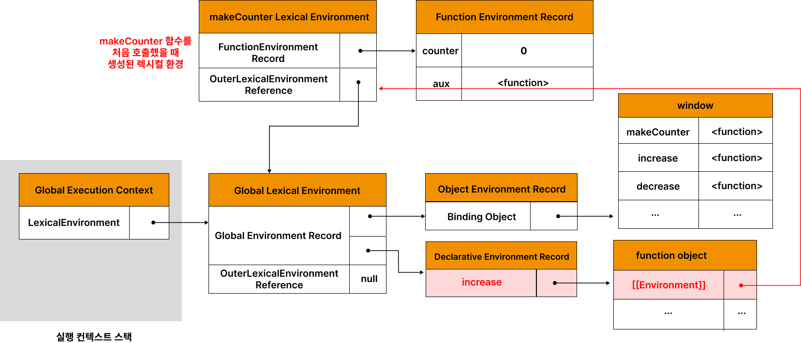
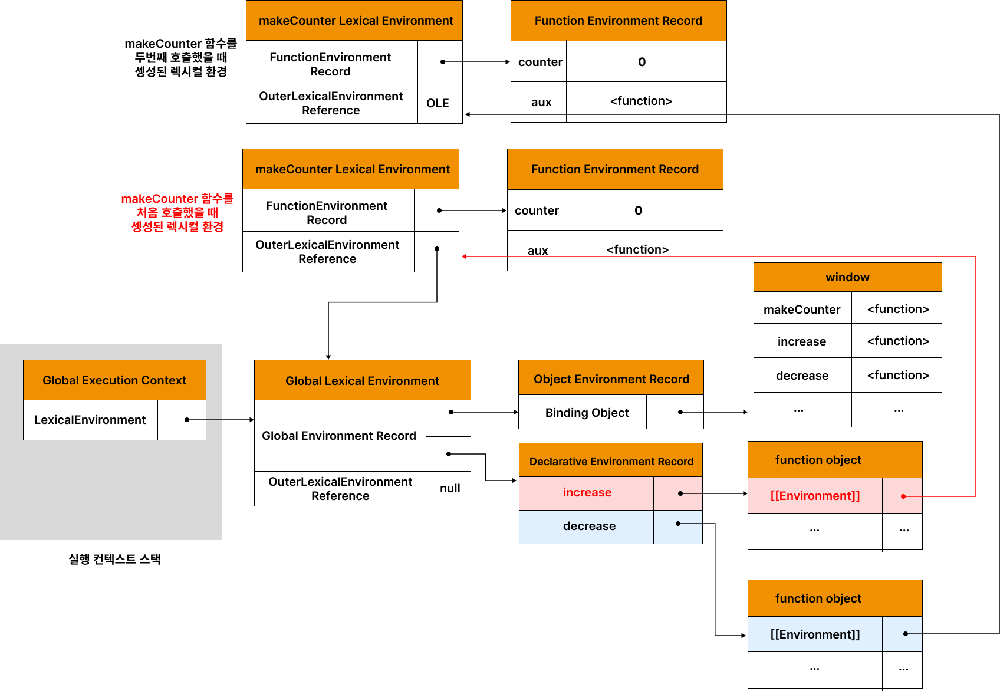

# 24. 클로저

클로저는 자바스크립트의 고유의 개념이 아닌 함수를 일급 객체로 취급하는 함수형 프로그래밍 언어(하스켈, 리스프, 얼랭, 스칼라 등)에서 사용되는 중요한 특성이다.

MDN에서 정의한 클로저
클로저는 함수와 그 함수가 선언된 렉시컬 환경과의 조합이다.

키워드: 함수가 선언된 렉시컬 환경

[예제 24-01]

```javascript
const x = 1;

function outerFunc() {
  const x = 10;

  function innerFunc() {
    console.log(x); // 10
  }

  innerFunc();
}

outerFunc();
```

innerFunc의 상위 스코프는 외부 함수 outerFunc의 스코프다.
중첩 함수 innerFunc 내부에서 자신을 포함하고 있는 외부 함수 outerFunc의 x 변수에 접근 가능하다.

하지만 24-02 예제처럼 innerFunc 함수가 outerFunc 함수의 내부의 중첩 함수가 아니라면 
innerFunc 함수를 outerFunc 함수의 내부에서 호출한다 하더라도 outerFunc 함수의 변수에 접근할 수 없다.

[예제 24-02]

```javascript
const x = 1;

function outerFunc() {
  const x = 10;
  innerFunc();
}

function innerFunc() {
  console.log(x); // 1
}

outerFunc();
```

이 같은 현상이 발생하는 이유는 자바스크립트가 **렉시컬 스코프**를 따르는 프로그래밍 언어이기 때문이다.

## 24.1 렉시컬 스코프

자바스크립트 엔진은 함수를 어디서 호출했는지가 아니라 함수를 어디에 정의했는지에 따라 상위 스코프를 결정한다. 이를 렉시컬 스코프(정적 스코프)라 한다.

[예제 24-03]

```javascript
const x = 1;

function foo() {
  const x = 10;
  bar();
}

function bar() {
  console.log(x);
}

foo(); // ?
bar(); // ?
```

두 개의 답은 1이다.
스코프의 실체는 실행 컨텍스트의 렉시컬 환경이다. 이 렉시컬 환경은 자신의 "외부 렉시컬 환경에 대한 참조"를 통해 상위 렉시컬 환경과 연결된다. 이를 **스코프 체인**이라고 한다.

렉시컬 환경의 "외부 렉시컬 환경에 대한 참조"에 저장할 참조값, 즉 상위 스코프에 대한 참조는 함수 정의가 평가되는 시점에 함수가 정의된 환경에 의해 결정된다. 이것이 바로 렉시컬 스코프다.

## 24.2 함수 객체의 내부 슬롯 [[Environment]]

렉시컬 스코프가 가능하려면 상위 스코프를 기억해야 한다.
함수는 자신의 내부 슬롯 [[Environment]]에 자신이 정의된 환경, 즉 상위 스코프의 참조를 저장한다.

따라서 함수 객체의 내부 슬롯 [[Environment]]에 저장된 현재 실행 중인 실행 컨텍스트의 렉시컬 환경의 참조가 바로 상위 스코프다. 또한 자신이 호출되었을 때 생성될 함수 렉시컬 환경의 "외부 렉시컬 환경에 대한 참조"에 저장될 참조값이다. 함수 객체는 내부 슬롯 [[Environment]]에 저장한 렉시컬 환경의 참조, 즉 상위 스코프를 자신이 존재하는 한 기억한다.

[예제 24-04]

```javascript
const x = 1;

function foo() {
  const x = 10;

  // 상위 스코프는 함수 정의 환경(위치)에 따라 결정된다.
  // 함수 호출 위치와 상위 스코프는 아무런 관계가 없다.
  bar();
}

// 함수 bar는 자신의 상위 스코프, 즉 전역 렉시컬 환경을 [[Environment]]에 저장하여 기억한다.
function bar() {
  console.log(x);
}

foo(); // ?
bar(); // ?
```

![그림 24-1 함수 객체의 내부 슬롯 [[Environment]]에는 상위 스코프가 저장된다.](../images/24-01.png)

전역 코드 평가 시점에 실행 중인 실행 컨텍스트의 렉시컬 환경인 전역 렉시컬 환경의 참조가 저장(그림 24-1 에서 1번) 함수 코드 평가는 아래 순서로 진행

1. 함수 실행 컨텍스트 생성
2. 함수 렉시컬 환경 생성
   2.1. 함수 환경 레코드 생성
   2.2. this 바인딩
   2.3. 외부 렉시컬 환경에 대한 참조 결정

외부 렉시컬 환경에 대한 참조에는 함수 객체의 내부 슬롯 [[environment]]에 저장된 렉시컬 환경의 참조가 할당된다.(그림 24-1 에서 2와 3)

## 24.3 클로저와 렉시컬 환경

[예제 24-05]

```javascript
const x = 1;

// ①
function outer() {
  const x = 10;
  const inner = function () { console.log(x); }; // ②
  return inner;
}

// outer 함수를 호출하면 중첩 함수 inner를 반환한다.
// 그리고 outer 함수의 실행 컨텍스트는 실행 컨텍스트 스택에서 팝되어 제거된다.
const innerFunc = outer(); // ③
innerFunc(); // ④ 10
```

**외부 함수보다 중첩 함수가 더 오래 유지되는 경우 중첩 함수는 이미 생명 주기가 종료한 외부 함수의 변수를 참조할 수 있다. 이러한 중첩 함수를 클로저 라고 부른다.**

클로저는 함수와 그 함수가 건언된 렉시컬 환경과의 조합이다.





outer 함수의 실행 컨텍스트는 실행 컨텍스트 스택에서 제거되지만 outer 함수의 렉시컬 환경까지 소멸 하는 것은 아니다.





[예제 24-06]

```html
<!DOCTYPE html>
<html>
<body>
  <script>
    function foo() {
      const x = 1;
      const y = 2;

      // 일반적으로 클로저라고 하지 않는다.
      function bar() {
        const z = 3;

        debugger;
        // 상위 스코프의 식별자를 참조하지 않는다.
        console.log(z);
      }

      return bar;
    }

    const bar = foo();
    bar();
  </script>
</body>
</html>
```

상위 스코프의 어떤 식별자도 참조하지 않는 함수는 클로저가 아니다

[예제 24-07]

```html
<!DOCTYPE html>
<html>
<body>
  <script>
    function foo() {
      const x = 1;

      // 일반적으로 클로저라고 하지 않는다.
      // bar 함수는 클로저였지만 곧바로 소멸한다.
      function bar() {
        debugger;
        // 상위 스코프의 식별자를 참조한다.
        console.log(x);
      }
      bar();
    }

    foo();
  </script>
</body>
</html>
```

중첩 함수 bar는 클로저였지만 외부 함수보다 일찍 소멸되기 떄문에 클로저의 본질에 부합하지 않는다.

[예제 24-08]

```html
<!DOCTYPE html>
<html>
<body>
  <script>
    function foo() {
      const x = 1;
      const y = 2;

      // 클로저
      // 중첩 함수 bar는 외부 함수보다 더 오래 유지되며 상위 스코프의 식별자를 참조한다.
      function bar() {
        debugger;
        console.log(x);

      }
      return bar;
    }

    const bar = foo();
    bar();
  </script>
</body>
</html>
```

클로저는 중첩 함수가 상위 스코프의 식별자를 참조하고 있고 중첩함수가 외부 함수보다 더 오래 유지되는 경우에 한정하는 것이 일반적이다.

## 24.4 클로저의 활용

클로저는 상태를 안전하게 변경하고 유지하기 위해 사용한다.
**상태를 안전하게 은닉하고 특정 함수에게만 상태 변경을 허용**하기 위해 사용한다.

[예제 24-09]

```javascript
// 카운트 상태 변수
let num = 0;

// 카운트 상태 변경 함수
const increase = function () {
  // 카운트 상태를 1만큼 증가 시킨다.
  return ++num;
};

console.log(increase()); // 1
console.log(increase()); // 2
console.log(increase()); // 3
```

위 코드는 잘 동작하지만 오류를 발생시킬 가능성을 내포하고 있다.
올바르게 동작하려면 아래의 전제 조건을 지켜져야 한다.

1. 카운트 상태(num 변수의 값)는 increase 함수가 호출되기 전까지 변경되지 않고 유지되어야 한다.
2. 이를 위해 카운트 상태(num 변수의 값)는 increase 함수만이 변경할 수 있어야 한다.

[오류] : 카운트 상태는 전역 변수로 관리되고 있어서 언제든 누그든지 접근할 수 있다.
전역 변수 num을 increase 함수의 지역 변수로 변경해보자.

[예제 24-10]

```javascript
// 카운트 상태 변경 함수
const increase = function () {
  // 카운트 상태 변수
  let num = 0;

  // 카운트 상태를 1만큼 증가 시킨다.
  return ++num;
};

// 이전 상태를 유지하지 못한다.
console.log(increase()); // 1
console.log(increase()); // 1
console.log(increase()); // 1
```

num 변수를 지역 변수로 변경했지만 increase 함수가 호출될 때마다 지역 변수 num은 다시 선언되고 0으로 초기화된다. 상태가 변경되기 이전 상태를 유지하지 못한다. 이전 상태를 유지하기 위해 **클로저**를 사용해보자.

[예제 24-11]

```javascript
// 카운트 상태 변경 함수
const increase = (function () {
  // 카운트 상태 변수
  let num = 0;

  // 클로저
  return function () {
    // 카운트 상태를 1만큼 증가 시킨다.
    return ++num;
  };
}());

console.log(increase()); // 1
console.log(increase()); // 2
console.log(increase()); // 3
```

이처럼 클로저는 상태가 의도치 않게 변경되지 않도록 안전하게 은닉하고 특정 함수에게만 상태 변경을 허용하여 상태를 안전하게 변경하고 유지하기 위해 사용한다.

[예제 24-12]

```javascript
const counter = (function () {
  // 카운트 상태 변수
  let num = 0;

  // 클로저인 메서드를 갖는 객체를 반환한다.
  // 객체 리터럴은 스코프를 만들지 않는다.
  // 따라서 아래 메서드들의 상위 스코프는 즉시 실행 함수의 렉시컬 환경이다.
  return {
    // num: 0, // 프로퍼티는 public하므로 은닉되지 않는다.
    increase() {
      return ++num;
    },
    decrease() {
      return num > 0 ? --num : 0;
    }
  };
}());

console.log(counter.increase()); // 1
console.log(counter.increase()); // 2

console.log(counter.decrease()); // 1
console.log(counter.decrease()); // 0
```

위의 예제를 생성자 함수로 표현

[예제 24-13]

```javascript
const Counter = (function () {
  // ① 카운트 상태 변수
  let num = 0;

  function Counter() {
    // this.num = 0; // ② 프로퍼티는 public하므로 은닉되지 않는다.
  }

  Counter.prototype.increase = function () {
    return ++num;
  };

  Counter.prototype.decrease = function () {
    return num > 0 ? --num : 0;
  };

  return Counter;
}());

const counter = new Counter();

console.log(counter.increase()); // 1
console.log(counter.increase()); // 2

console.log(counter.decrease()); // 1
console.log(counter.decrease()); // 0
```

함수형 프로그래밍에서 클로저를 활용하는 간단한 예제

[예제 24-14]

```javascript
// 함수를 인수로 전달받고 함수를 반환하는 고차 함수
// 이 함수는 카운트 상태를 유지하기 위한 자유 변수 counter를 기억하는 클로저를 반환한다.
function makeCounter(aux) {
  // 카운트 상태를 유지하기 위한 자유 변수
  let counter = 0;

  // 클로저를 반환
  return function () {
    // 인수로 전달 받은 보조 함수에 상태 변경을 위임한다.
    counter = aux(counter);
    return counter;
  };
}

// 보조 함수
function increase(n) {
  return ++n;
}

// 보조 함수
function decrease(n) {
  return --n;
}

// 함수로 함수를 생성한다.
// makeCounter 함수는 보조 함수를 인수로 전달받아 함수를 반환한다
const increaser = makeCounter(increase); // ①
console.log(increaser()); // 1
console.log(increaser()); // 2

// increaser 함수와는 별개의 독립된 렉시컬 환경을 갖기 때문에 카운터 상태가 연동하지 않는다.
const decreaser = makeCounter(decrease); // ②
console.log(decreaser()); // -1
console.log(decreaser()); // -2
```

makeCounter 함수를 호출해 함수를 반환할 때 반환된 함수는 자신만의 독립된 렉시컬 환경을 갖는다.





[예제 24-15]

```javascript
// 함수를 반환하는 고차 함수
// 이 함수는 카운트 상태를 유지하기 위한 자유 변수 counter를 기억하는 클로저를 반환한다.
const counter = (function () {
  // 카운트 상태를 유지하기 위한 자유 변수
  let counter = 0;

  // 함수를 인수로 전달받는 클로저를 반환
  return function (aux) {
    // 인수로 전달 받은 보조 함수에 상태 변경을 위임한다.
    counter = aux(counter);
    return counter;
  };
}());

// 보조 함수
function increase(n) {
  return ++n;
}

// 보조 함수
function decrease(n) {
  return --n;
}

// 보조 함수를 전달하여 호출
console.log(counter(increase)); // 1
console.log(counter(increase)); // 2

// 자유 변수를 공유한다.
console.log(counter(decrease)); // 1
console.log(counter(decrease)); // 0
```

## 24.5 캡슐화와 정보 은닉

캡슐화는 객체의 상태를 나타내는 프로퍼티와 프로퍼티를 참조하고 조작할 수 있는 매서드를 하나로 묶는 것.
캡슐화는 객체의 특정 프로퍼티를 감출 목적으로 사용하기도 하는데 이를 은닉이라고 한다.

정보 은닉은 객체의 상태가 변경되는 것을 방지해 정보를 보호하고 객체 간의 상호 의존성(결합도)을 낮추는 효과가 있다.

[예제 24-16]

```javascript
function Person(name, age) {
  this.name = name; // public
  let _age = age;   // private

  // 인스턴스 메서드
  this.sayHi = function () {
    console.log(`Hi! My name is ${this.name}. I am ${_age}.`);
  };
}

const me = new Person('Lee', 20);
me.sayHi(); // Hi! My name is Lee. I am 20.
console.log(me.name); // Lee
console.log(me._age); // undefined

const you = new Person('Kim', 30);
you.sayHi(); // Hi! My name is Kim. I am 30.
console.log(you.name); // Kim
console.log(you._age); // undefined
```

[예제 24-17]

```javascript
function Person(name, age) {
  this.name = name; // public
  let _age = age;   // private
}

// 프로토타입 메서드
Person.prototype.sayHi = function () {
  // Person 생성자 함수의 지역 변수 _age를 참조할 수 없다
  console.log(`Hi! My name is ${this.name}. I am ${_age}.`);
};
```

[예제 24-18]

```javascript
const Person = (function () {
  let _age = 0; // private

  // 생성자 함수
  function Person(name, age) {
    this.name = name; // public
    _age = age;
  }

  // 프로토타입 메서드
  Person.prototype.sayHi = function () {
    console.log(`Hi! My name is ${this.name}. I am ${_age}.`);
  };

  // 생성자 함수를 반환
  return Person;
}());

const me = new Person('Lee', 20);
me.sayHi(); // Hi! My name is Lee. I am 20.
console.log(me.name); // Lee
console.log(me._age); // undefined

const you = new Person('Kim', 30);
you.sayHi(); // Hi! My name is Kim. I am 30.
console.log(you.name); // Kim
console.log(you._age); // undefined
```

[예제 24-19]

```javascript
const me = new Person('Lee', 20);
me.sayHi(); // Hi! My name is Lee. I am 20.

const you = new Person('Kim', 30);
you.sayHi(); // Hi! My name is Kim. I am 30.

// _age 변수 값이 변경된다!
me.sayHi(); // Hi! My name is Lee. I am 30.
```

## 24.6 자주 발생하는 실수

[예제 24-20]

```javascript
var funcs = [];

for (var i = 0; i < 3; i++) {
  funcs[i] = function () { return i; }; // ①
}

for (var j = 0; j < funcs.length; j++) {
  console.log(funcs[j]()); // ②
}
```

[예제 24-21]

```javascript
var funcs = [];

for (var i = 0; i < 3; i++){
  funcs[i] = (function (id) { // ①
    return function () {
      return id;
    };
  }(i));
}

for (var j = 0; j < funcs.length; j++) {
  console.log(funcs[j]());
}
```

[예제 24-22]

```javascript
const funcs = [];

for (let i = 0; i < 3; i++) {
  funcs[i] = function () { return i; };
}

for (let i = 0; i < funcs.length; i++) {
  console.log(funcs[i]()); // 0 1 2
}
```

[예제 24-23]

```javascript
// 요소가 3개인 배열을 생성하고 배열의 인덱스를 반환하는 함수를 요소로 추가한다.
// 배열의 요소로 추가된 함수들은 모두 클로저다.
const funcs = Array.from(new Array(3), (_, i) => () => i); // (3) [ƒ, ƒ, ƒ]

// 배열의 요소로 추가된 함수 들을 순차적으로 호출한다.
funcs.forEach(f => console.log(f())); // 0 1 2
```


