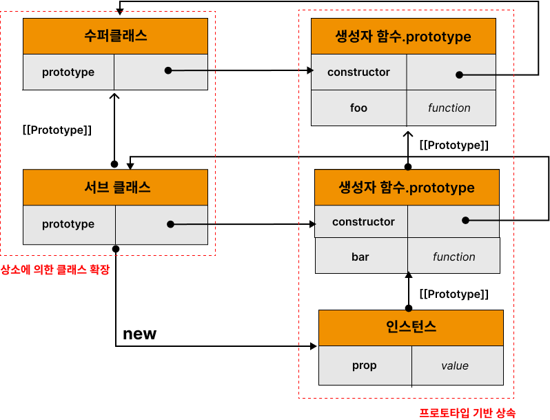
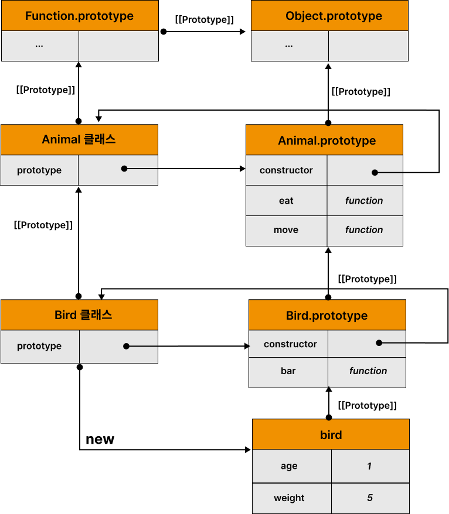
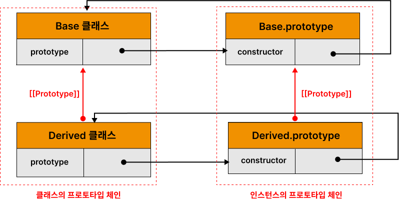

# 25. 클래스

## 25.1 클래스는 프로토타입의 문법적 설탕인가?

[예제 25-01]

```javascript
// ES5 생성자 함수
var Person = (function () {
  // 생성자 함수
  function Person(name) {
    this.name = name;
  }

  // 프로토타입 메서드
  Person.prototype.sayHi = function () {
    console.log('Hi! My name is ' + this.name);
  };

  // 생성자 함수 반환
  return Person;
}());

// 인스턴스 생성
var me = new Person('Baek');
me.sayHi(); // Hi! My name is Baek
```

클래스는 생성자 함수와 매우 유사하지만 다음과 같은 차이가 있다.

1. 클래스는 new 연산자 없이 호출하면 에러가 발생한다.
   하지만 생성자 함수는 new 연산자 없이 호출하면 일반 함수로 호출된다.
2. 클래스는 상속을 지원하는 extend와 super 키워드를 제공한다.
   하지만 생성자 함수는 extend와 super 지원하지 않는다.
3. 클래스는 호이스팅이 발생하지 않는 것처럼 동작한다.
   하지만 함수 선언문으로 정의도니 생성자 함수는 함수 호이스팅이, 함수 표현식으로 정의한 생성자 함수는 변수 호이스팅이 발생한다.
4. 클래스 내의 모든 코드에는 암묵적으로 strict mode가 지정되어 실행되며 strict mode를 해제할 수 없다.
   하지만 생성자 함수는 암묵적으로 strict mode가 지정되지 않는다.
5. 클래스의 constructor, 프로토타입 메서드, 정적 메서드는 모두 프로퍼티 어트리뷰트 [[Enumerable]]의 값이 false다. 다시 말해 열거되지 않는다.

클래스를 프로토타입의 문법적 설탕으로 보기보다는 새로운 객체 생성 메커니즘으로 보는 것이 합당하다.

## 25.2 클래스 정의

- 클래스는 class 키워드를 사용한다.
- 파스칼 케이스를 사용한다.
- 이름을 가질 수도 있고 갖지 않을 수도 있다.

[예제 25-02]

```javascript
// 클래스 선언문
class Person {}
```

[예제 25-03]

```javascript
// 익명 클래스 표현식
const Person = class {};

// 기명 클래스 표현식
const Person = class MyClass {};
```

클래스를 표현식으로 정의할 수 있다는 것은 클래스가 값으로 사용할 수 있는 일급 객체를 의미한다.

클래스의 일급 객체로서의 특징

- 무명의 리터럴로 생성될 수 있다. 즉 런타임에 생성이 가능하다.
- 변수나 자료구조(객체, 배열 등)에 저장할 수 있다.
- 함수의 매개변수에 전달할 수 있다.
- 함수의 반환값으로 사용할 수 있다.

클래스 몸체에는 0개 이상의 메서드만 정의할 수 있다.
constructor, 프로토타입 메서드, 정적 메서드 세가지를 정의할 수 있다.

[예제 25-04]

```javascript
// 클래스 선언문
class Person {
  // 생성자
  constructor(name) {
    // 인스턴스 생성 및 초기화
    this.name = name; // name 프로퍼티는 public하다.
  }

  // 프로토타입 메서드
  sayHi() {
    console.log(`Hi! My name is ${this.name}`);
  }

  // 정적 메서드
  static sayHello() {
    console.log('Hello!');
  }
}

// 인스턴스 생성
const me = new Person('Baek');

// 인스턴스의 프로퍼티 참조
console.log(me.name); // Baek
// 프로토타입 메서드 호출
me.sayHi(); // Hi! My name is Baek
// 정적 메서드 호출
Person.sayHello(); // Hello!
```

## 25.3 클래스 호이스팅

[예제 25-05]

```javascript
// 클래스 선언문
class Person {}

console.log(typeof Person); // function 클래스는 함수로 평가된다.
```

[예제 25-06]

```javascript
// 클래스 정의 이전에 참조할 수 없다.
console.log(Person);
// ReferenceError: Cannot access 'Person' before initialization

// 클래스 선언문
class Person {}
```

[예제 25-07]

```javascript
const Person = '';

{
  // 호이스팅이 발생하지 않는다면 ''이 출력되어야 한다.
  console.log(Person);
  // ReferenceError: Cannot access 'Person' before initialization

  // 클래스 선언문
  class Person {}
}
```

클래스 선언문도 변수 선언, 함수 정의와 마찬가지로 호이스팅이 발생한다.
단 클래스는 let, const 키워드로 선언한 변수처럼 호이스팅된다.
따라서 클래스 선언문 이전에 일시적 사각지대에 빠지기 때문에 호이스팅이 발생하지 않는 것처럼 동작한다.

var, let, const, function, class 키워드를 사용하여 선언된 모든식별자는 호이스팅 된다.
모든 선언문은 런타임 이전에 먼저 실행되기 때문이다.

## 25.4 인스턴스 생성

[예제 25-08]

```javascript
// 클래스는 생성자 함수이며 new 연산자와 함께 호출되어 인스턴스를 생성한다.
class Person {}

// 인스턴스 생성
const me = new Person();
console.log(me); // Person {}
```

[예제 25-09]

```javascript
// 클래스는 인스턴스를 생성하는 것이 유일한 존재 이유이므로 반드시 new 연산자와 함께 호출해야 한다.
class Person {}

// 클래스를 new 연산자 없이 호출하면 타입 에러가 발생한다.
const me = Person();
// TypeError: Class constructor Person cannot be invoked without 'new'
```

[예제 25-10]

```javascript
const Person = class MyClass {};

// 함수 표현식과 마찬가지로 클래스를 가리키는 식별자로 인스턴스를 생성해야 한다.
const me = new Person();

// 클래스 이름 MyClass는 함수와 동일하게 클래스 몸체 내부에서만 유효한 식별자다.
console.log(MyClass); // ReferenceError: MyClass is not defined

const you = new MyClass(); // ReferenceError: MyClass is not defined
```

## 25.5 메서드

### 25.5.1 constructor

constructor는 인스턴스를 생성하고 초기화하기 위한 특수한 메서드다. constructor는 이름을 변경할 수 없다.

[예제 25-11]

```javascript
class Person {
  // 생성자
  constructor(name) {
    // 인스턴스 생성 및 초기화
    this.name = name;
  }
}
```

[예제 25-12]

```javascript
// 클래스는 함수다.
console.log(typeof Person); // function
console.dir(Person);
```


[예제 25-13]

```javascript
// 인스턴스 생성
const me = new Person('Baek');
console.log(me);
```


[예제 25-14]

```javascript
// 클래스
class Person {
  // 생성자
  constructor(name) {
    // 인스턴스 생성 및 초기화
    this.name = name;
  }
}

// 생성자 함수
function Person(name) {
  // 인스턴스 생성 및 초기화
  this.name = name;
}
```

constructor는 메서드로 해석되는 것이 아니라 클래스가 평가되어 생성한 함수 객체 코드의 일부가 된다.
클래스 정의가 평가되면 constructor의 기술적 동작을 하는 함수 객체가 생성된다.

> 클래스의 constructor 메서드와 프로토타입의 constructor 프로퍼티.
> 이름은 같지만 직접적인 관련은 없다.
> 프로토타입의 constructor 프로퍼티는 모든 프로토타입이 가지고 있는 프로퍼티며, 생성자 함수를 가리킨다.


constructor는 생성자 함수와 유사하지만 몇가지 차이가 있다.

[예제 25-15]

```javascript
// constructor는 클래스 내에 최대 한개만 존재 할 수 있다.
class Person {
  constructor() {}
  constructor() {}
}
// SyntaxError: A class may only have one constructor
```

[예제 25-16]

```javascript
// constructor는 생략할 수 있다.
class Person {}
```

[예제 25-17]

```javascript
class Person {
  // constructor를 생략하면 다음과 같이 빈 constructor가 암묵적으로 정의된다.
  constructor() {}
}

// 빈 객체가 생성된다.
const me = new Person();
console.log(me); // Person {}
```

[예제 25-18]

```javascript
// 프로퍼티가 추가되어 초기화된 인스턴스를 생성하려면 constructor 내부에서 this 인스턴스 프로퍼티를 추가한다.
class Person {
  constructor() {
    // 고정값으로 인스턴스 초기화
    this.name = 'Baek';
    this.address = 'Seoul';
  }
}

// 인스턴스 프로퍼티가 추가된다.
const me = new Person();
console.log(me); // Person {name: "Baek", address: "Seoul"}
```

[예제 25-19]

```javascript
class Person {
  constructor(name, address) {
    // 인수로 인스턴스 초기화
    this.name = name;
    this.address = address;
  }
}

// 인수로 초기값을 전달한다. 초기값은 constructor에 전달된다.
const me = new Person('Baek', 'Seoul');
console.log(me); // Person {name: "Baek", address: "Seoul"}
```

[예제 25-20]

```javascript
class Person {
  constructor(name) {
    this.name = name;

    // 명시적으로 객체를 반환하면 암묵적인 this 반환이 무시된다.
    return {};
  }
}

// constructor에서 명시적으로 반환한 빈 객체가 반환된다.
const me = new Person('Baek');
console.log(me); // {}
```

[예제 25-21]

```javascript
class Person {
  constructor(name) {
    this.name = name;

    // 명시적으로 원시값을 반환하면 원시값 반환은 무시되고 암묵적으로 this가 반환된다.
    return 100;
  }
}

const me = new Person('Baek');
console.log(me); // Person { name: "Baek" }
```

예제 25-20, 25-21 처럼 constructor 내부에서 명시적으로 this가 아닌 다른 값을 반환하는 것은 클래스의 기본 동작을 훼손 한다.
따라서 constructor 내부에서 return 문은 반드시 생략해야 한다.

### 25.5.2 프로토타입 메서드

생성자 함수를 사용하여 인스턴스를 생성하는 경우 프로토타입 메서드를 생성하기 위해서 다음과 같이 명시적으로 프로토타입에 메서드를 추가해야한다.

[예제 25-22]

```javascript
// 생성자 함수
function Person(name) {
  this.name = name;
}

// 프로토타입 메서드
Person.prototype.sayHi = function () {
  console.log(`Hi! My name is ${this.name}`);
};

const me = new Person('Baek');
me.sayHi(); // Hi! My name is Baek
```

클래스에서는 클래스의 prototype 프로퍼티에 메서드를 추가하지 않아도 기본적으로 프로토타입 메소드가 된다.

[예제 25-23]

```javascript
class Person {
  // 생성자
  constructor(name) {
    // 인스턴스 생성 및 초기화
    this.name = name;
  }

  // 프로토타입 메서드
  sayHi() {
    console.log(`Hi! My name is ${this.name}`);
  }
}

const me = new Person('Baek');
me.sayHi(); // Hi! My name is Baek
```

[예제 25-24]

```javascript
// me 객체의 프로토타입은 Person.prototype이다.
Object.getPrototypeOf(me) === Person.prototype; // -> true
me instanceof Person; // -> true

// Person.prototype의 프로토타입은 Object.prototype이다.
Object.getPrototypeOf(Person.prototype) === Object.prototype; // -> true
me instanceof Object; // -> true

// me 객체의 constructor는 Person 클래스다.
me.constructor === Person; // -> true
```

### 25.5.3 정적 메서드

정적 메서드는 인스턴스를 생성하지 않아도 호출할 수 있는 메서드를 말한다.

[예제 25-25]

```javascript
// 생성자 함수
function Person(name) {
  this.name = name;
}

// 정적 메서드
Person.sayHi = function () {
  console.log('Hi!');
};

// 정적 메서드 호출
Person.sayHi(); // Hi!
```

[예제 25-26]

```javascript
// 클래스에서는 메서드에 static 키워드를 붙이면 정적 메서드가 된다.
class Person {
  // 생성자
  constructor(name) {
    // 인스턴스 생성 및 초기화
    this.name = name;
  }

  // 정적 메서드
  static sayHi() {
    console.log('Hi!');
  }
}
```

[예제 25-27]

```javascript
// 정적 메서드는 클래스로 호출한다.
// 정적 메서드는 인스턴스 없이도 호출할 수 있다.
Person.sayHi(); // Hi!
```

정적 메서드는 인스턴스로 호출할 수 없다. 정적 메서드가 바인딩된 클래스는 인스턴스의 프로토타입 체인상에 존재하지 않기 때문이다.
인스턴스의 프로토타입 체인 상에는 클래스가 존재 하지 않기 때문에 인스턴스로 클래스의 메소드를 상속받을 수 없다.

[예제 25-28]

```javascript
// 인스턴스 생성
const me = new Person('Baek');
me.sayHi(); // TypeError: me.sayHi is not a function
```

### 25.5.4 정적 메서드와 프로토타입 메서드의 차이

1. 정적 메서드와 프로토타입 메서드는 자신이 속해 있는 프로토타입 체인이 다르다.
2. 정적 메서드는 클래스로 호출하고 프로토타입 메서드는 인스턴스로 호출한다.
3. 정적 메서드는 인스턴스 프로퍼티를 참조할 수 없지만 프로토타입 메서드는 인스턴스 프로퍼티를 참조할 수 있다.

[예제 25-29]

```javascript
class Square {
  // 정적 메서드
  static area(width, height) {
    return width * height;
  }
}

console.log(Square.area(10, 10)); // 100
```

[예제 25-30]

```javascript
class Square {
  constructor(width, height) {
    this.width = width;
    this.height = height;
  }

  // 프로토타입 메서드
  area() {
    return this.width * this.height;
  }
}

const square = new Square(10, 10);
console.log(square.area()); // 100
```

메서드 내부의 this는 메서드를 소유한 객체가 아니라 메서드를 호출한 객체, 즉 메서드 이름 앞의 마침표(.) 연산자 앞에 기술한 객체에 바인딩 된다.

[예제 25-31]

```javascript
// 표준 빌트인 객체의 정적 메서드
Math.max(1, 2, 3);          // -> 3
Number.isNaN(NaN);          // -> true
JSON.stringify({ a: 1 });   // -> "{"a":1}"
Object.is({}, {});          // -> false
Reflect.has({ a: 1 }, 'a'); // -> true
```

### 25.5.5 클래스에 정의한 메서드의 특징

1. function 키워드를 생략한 메소드 축약 표현을 사용한다.
2. 객체 리터럴과는 다르게 클래스에 메서드를 정의할 때는 콤마가 필요 없다.
3. 암묵적으로 strict mode로 실행된다.
4. for ... in 문이나 Object.keys 메서드 등으로 열거할 수 없다. 즉, 프로퍼티의 열거 가능 여부를 나타내며,
   불리언 값을 갖는 프로퍼티 어트리뷰트 [[Enumerable]]의 값이 false다.
5. 내부 메서드 [[Construct]]를 갖지 않는 non-constructor다. 따라서 new 연산자와 함께 호출할 수 없다.

## 25.6 클래스의 인스턴스 생성 과정

1. 인스턴스 생성과 this 바인딩
2. 인스턴스 초기화
3. 인스턴스 반환

[예제 25-32]

```javascript
class Person {
  // 생성자
  constructor(name) {
    // 1. 암묵적으로 인스턴스가 생성되고 this에 바인딩된다.
    console.log(this); // Person {}
    console.log(Object.getPrototypeOf(this) === Person.prototype); // true

    // 2. this에 바인딩되어 있는 인스턴스를 초기화한다.
    this.name = name;

    // 3. 완성된 인스턴스가 바인딩된 this가 암묵적으로 반환된다.
  }
}
```

## 25.7 프로퍼티

### 25.7.1 인스턴스 프로퍼티

[예제 25-33]

```javascript
// 인스턴스 프로퍼티는 constructor 내부에서 정의해야 한다.
class Person {
  constructor(name) {
    // 인스턴스 프로퍼티
    this.name = name;
  }
}

const me = new Person('Baek');
console.log(me); // Person {name: "Baek"}
```

[예제 25-34]

```javascript
class Person {
  constructor(name) {
    // 인스턴스 프로퍼티
    this.name = name; // name 프로퍼티는 public하다.
  }
}

const me = new Person('Baek');

// name은 public하다.
console.log(me.name); // Baek
```

### 25.7.2 접근자 프로퍼티

접근자 프로퍼티는 자체적으로는 값([[Value]] 내부 슬롯)을 갖지 않고 다른 데이터 프로퍼티의 값을 읽거나 저장할 때 사용하는 접근자 함수로 구성된 프로퍼티다. 즉 getter와 setter 함수로 구성되어 있다.

[예제 25-35]

```javascript
const person = {
  // 데이터 프로퍼티
  firstName: 'Juhee',
  lastName: 'Baek',

  // fullName은 접근자 함수로 구성된 접근자 프로퍼티다.
  // getter 함수
  get fullName() {
    return `${this.firstName} ${this.lastName}`;
  },
  // setter 함수
  set fullName(name) {
    // 배열 디스트럭처링 할당: "36.1. 배열 디스트럭처링 할당" 참고
    [this.firstName, this.lastName] = name.split(' ');
  }
};

// 데이터 프로퍼티를 통한 프로퍼티 값의 참조.
console.log(`${person.firstName} ${person.lastName}`); // Juhee Baek

// 접근자 프로퍼티를 통한 프로퍼티 값의 저장
// 접근자 프로퍼티 fullName에 값을 저장하면 setter 함수가 호출된다.
person.fullName = 'Jisoo Baek';
console.log(person); // {firstName: "Jisoo", lastName: "Baek"}

// 접근자 프로퍼티를 통한 프로퍼티 값의 참조
// 접근자 프로퍼티 fullName에 접근하면 getter 함수가 호출된다.
console.log(person.fullName); // Jisoo Baek

// fullName은 접근자 프로퍼티다.
// 접근자 프로퍼티는 get, set, enumerable, configurable 프로퍼티 어트리뷰트를 갖는다.
console.log(Object.getOwnPropertyDescriptor(person, 'fullName'));
// {get: ƒ, set: ƒ, enumerable: true, configurable: true}
```

위 예제의 객체 리터럴을 클래스로 표현하면 다음과 같다.

[예제 25-36]

```javascript
class Person {
  constructor(firstName, lastName) {
    this.firstName = firstName;
    this.lastName = lastName;
  }

  // fullName은 접근자 함수로 구성된 접근자 프로퍼티다.
  // getter 함수
  get fullName() {
    return `${this.firstName} ${this.lastName}`;
  }

  // setter 함수
  set fullName(name) {
    [this.firstName, this.lastName] = name.split(' ');
  }
}

const me = new Person('Juhee', 'Baek');

// 데이터 프로퍼티를 통한 프로퍼티 값의 참조.
console.log(`${me.firstName} ${me.lastName}`); // Juhee Baek

// 접근자 프로퍼티를 통한 프로퍼티 값의 저장
// 접근자 프로퍼티 fullName에 값을 저장하면 setter 함수가 호출된다.
me.fullName = 'Jisoo Baek';
console.log(me); // {firstName: "Jisoo", lastName: "Baek"}

// 접근자 프로퍼티를 통한 프로퍼티 값의 참조
// 접근자 프로퍼티 fullName에 접근하면 getter 함수가 호출된다.
console.log(me.fullName); // Jisoo Baek

// fullName은 접근자 프로퍼티다.
// 접근자 프로퍼티는 get, set, enumerable, configurable 프로퍼티 어트리뷰트를 갖는다.
console.log(Object.getOwnPropertyDescriptor(Person.prototype, 'fullName'));
// {get: ƒ, set: ƒ, enumerable: false, configurable: true}
```

[예제 25-37]

```javascript
// Object.getOwnPropertyNames는 비열거형(non-enumerable)을 포함한 모든 프로퍼티의 이름을 반환한다.(상속 제외)
Object.getOwnPropertyNames(me); // -> ["firstName", "lastName"]
Object.getOwnPropertyNames(Object.getPrototypeOf(me)); // -> ["constructor", "fullName"]
```


### 25.7.3 클래스 필드 정의 제안

클래스 필드란 클래스 기반 객체 지향 언어에서 클래스가 생성할 인스턴스의 프로퍼티를 가리키는 용어다.
자바의 클래스 필드는 마치 클래스 내부에서 변수처럼 사용된다.

[예제 25-38]

```java
// 자바의 클래스 정의
public class Person {
  // ① 클래스 필드 정의
  // 클래스 필드는 클래스 몸체에 this 없이 선언해야 한다.
  private String firstName = "";
  private String lastName = "";

  // 생성자
  Person(String firstName, String lastName) {
    // ③ this는 언제나 클래스가 생성할 인스턴스를 가리킨다.
    this.firstName = firstName;
    this.lastName = lastName;
  }

  public String getFullName() {
    // ② 클래스 필드 참조
    // this 없이도 클래스 필드를 참조할 수 있다.
    return firstName + " " + lastName;
  }
}
```

[예제 25-39]

```javascript
class Person {
  // 클래스 필드 정의
  name = 'Lee';
}

const me = new Person('Lee');
```

[예제 25-40]

```javascript
class Person {
  // 클래스 필드 정의
  name = 'Lee';
}

const me = new Person();
console.log(me); // Person {name: "Lee"}
```

**클래스 몸체에서 클래스 필드를 정의하는 경우**

[예제 25-41]

```javascript
class Person {
  // this에 클래스 필드를 바인딩해서는 안된다.
  this.name = ''; // SyntaxError: Unexpected token '.'
}
```

[예제 25-42]

```javascript
class Person {
  // 클래스 필드
  name = 'Lee';

  constructor() {
    console.log(name); // ReferenceError: name is not defined
  }
}

new Person();
```

[예제 25-43]

```javascript
class Person {
  // 클래스 필드를 초기화하지 않으면 undefined를 갖는다.
  name;
}

const me = new Person();
console.log(me); // Person {name: undefined}
```

[예제 25-44]

```javascript
class Person {
  name;

  constructor(name) {
    // 클래스 필드 초기화.
    this.name = name;
  }
}

const me = new Person('Lee');
console.log(me); // Person {name: "Lee"}
```

[예제 25-45]

```javascript
class Person {
  constructor(name) {
    this.name = name;
  }
}

const me = new Person('Lee');
console.log(me); // Person {name: "Lee"}
```

[예제 25-46]

```javascript
class Person {
  // 클래스 필드에 문자열을 할당
  name = 'Lee';

  // 클래스 필드에 함수를 할당
  getName = function () {
    return this.name;
  }
  // 화살표 함수로 정의할 수도 있다.
  // getName = () => this.name;
}

const me = new Person();
console.log(me); // Person {name: "Lee", getName: ƒ}
console.log(me.getName()); // Lee
```

모든 클래스 필드는 인스턴스 프로퍼티가 되기 때문에 클래스 필드에 함수를 할당하는 것은 권장하지 않는다.

### 25.7.4 private 필드 정의 제안

자바스크립트는 캡슐화를 완전하게 지원하지 않는다.
private, public, protected 키워드와 같은 접근 제한자를 지원하지 않는다.
인스턴스 프로퍼티는 인스턴스를 통해 클래스 외부에서 언제나 참조할 수 있다. 즉 언제나 public이다.

[예제 25-48]

```javascript
class Person {
  constructor(name) {
    this.name = name; // 인스턴스 프로퍼티는 기본적으로 public하다.
  }
}

// 인스턴스 생성
const me = new Person('Lee');
console.log(me.name); // Lee
```

[예제 25-49]

```javascript
class Person {
  name = 'Lee'; // 클래스 필드도 기본적으로 public하다.
}

// 인스턴스 생성
const me = new Person();
console.log(me.name); // Lee
```

[예제 25-50]

```javascript
class Person {
  // private 필드 정의
  #name = '';

  constructor(name) {
    // private 필드 참조
    this.#name = name;
  }
}

const me = new Person('Lee');

// private 필드 #name은 클래스 외부에서 참조할 수 없다.
console.log(me.#name);
// SyntaxError: Private field '#name' must be declared in an enclosing class
```

|접근가능성|public|private|
|----------|------|-------|
|클래스 내부|O|O|
|자식 클래스 내부|O|X|
|클래스 인스턴스를 통한 접근|O|X|

클래스 외부에서 private 필드에 직접 접근할 수 있는 방법은 없다.
다만 접근자 프로퍼티를 통해 간접적으로 접근할 수 있다.

[예제 25-51]

```javascript
class Person {
  // private 필드 정의
  #name = '';

  constructor(name) {
    this.#name = name;
  }

  // name은 접근자 프로퍼티다.
  get name() {
    // private 필드를 참조하여 trim한 다음 반환한다.
    return this.#name.trim();
  }
}

const me = new Person(' Lee ');
console.log(me.name); // Lee
```


[예제 25-52]

```javascript
class Person {
  constructor(name) {
    // private 필드는 클래스 몸체에서 정의해야 한다.
    this.#name = name;
    // SyntaxError: Private field '#name' must be declared in an enclosing class
  }
}
```

### 25.7.5 static 필드 정의 제안

[예제 25-53]

```javascript
class MyMath {
  // static public 필드 정의
  static PI = 22 / 7;

  // static private 필드 정의
  static #num = 10;

  // static 메서드
  static increment() {
    return ++MyMath.#num;
  }
}

console.log(MyMath.PI); // 3.142857142857143
console.log(MyMath.increment()); //11
```

## 25.8 상속에 의한 클래스 확장

### 25.8.1 클래스 상속과 생성자 함수 상속

상속에 의한 클래스 확장은 기존 클래스를 상속 받아 새로운 클래스를 확장하여 정의



동물을 추상화란 Animal 클래스와 새와 사자를 추상화한 Bird, Lion 클래스를 각각 정의해보자


[예제 25-54]

```javascript
class Animal {
  constructor(age, weight) {
    this.age = age;
    this.weight = weight;
  }

  eat() { return 'eat'; }

  move() { return 'move'; }
}

// 상속을 통해 Animal 클래스를 확장한 Bird 클래스
class Bird extends Animal {
  fly() { return 'fly'; }
}

const bird = new Bird(1, 5);

console.log(bird); // Bird {age: 1, weight: 5}
console.log(bird instanceof Bird); // true
console.log(bird instanceof Animal); // true

console.log(bird.eat());  // eat
console.log(bird.move()); // move
console.log(bird.fly());  // fly
```



의사 클래스 상속 패턴을 사용하여 상속에 의한 클래스 확장을 흉내 냄.
클래스의 등장으로 다음과 같은 의사 클래스 상속 패턴은 더는 필요하지 않다.

[예제 25-55]

```javascript
// 의사 클래스 상속(pseudo classical inheritance) 패턴
var Animal = (function () {
  function Animal(age, weight) {
    this.age = age;
    this.weight = weight;
  }

  Animal.prototype.eat = function () {
    return 'eat';
  };

  Animal.prototype.move = function () {
    return 'move';
  };

  return Animal;
}());

// Animal 생성자 함수를 상속하여 확장한 Bird 생성자 함수
var Bird = (function () {
  function Bird() {
    // Animal 생성자 함수에게 this와 인수를 전달하면서 호출
    Animal.apply(this, arguments);
  }

  // Bird.prototype을 Animal.prototype을 프로토타입으로 갖는 객체로 교체
  Bird.prototype = Object.create(Animal.prototype);
  // Bird.prototype.constructor을 Animal에서 Bird로 교체
  Bird.prototype.constructor = Bird;

  Bird.prototype.fly = function () {
    return 'fly';
  };

  return Bird;
}());

var bird = new Bird(1, 5);

console.log(bird); // Bird {age: 1, weight: 5}
console.log(bird.eat());  // eat
console.log(bird.move()); // move
console.log(bird.fly());  // fly
```

### 25.8.2 extends 키워드

[예제 25-56]

```javascript
// 수퍼(베이스/부모)클래스
class Base {}

// 서브(파생/자식)클래스
class Derived extends Base {}
```

서브클래스 = 상속을 통해 확장된 클래스(=파생클래스(Derived Class), 자식클래스)
슈퍼클래스 = 서브클래스에게 상속된 클래스(=베이스클래스, 부모클래스)

extends 키워드의 역활은 수퍼클래스와 서브클래스 간의 상속 관계를 설정하는 것. 클래스도 프로토타입을 통해 상속 관계를 구현한다.



### 25.8.3 동적 상속

[예제 25-57]

```javascript
// 생성자 함수
function Base(a) {
  this.a = a;
}

// 생성자 함수를 상속받는 서브클래스
class Derived extends Base {}

const derived = new Derived(1);
console.log(derived); // Derived {a: 1}
```

[예제 25-58]

```javascript
function Base1() {}

class Base2 {}

let condition = true;

// 조건에 따라 동적으로 상속 대상을 결정하는 서브클래스
class Derived extends (condition ? Base1 : Base2) {}

const derived = new Derived();
console.log(derived); // Derived {}

console.log(derived instanceof Base1); // true
console.log(derived instanceof Base2); // false
```

### 25.8.4 서브클래스 constructor

[예제 25-59]

```javascript
constructor() {}
```

[예제 25-60]

```javascript
constructor(...args) { super(...args); }
```

[예제 25-61]

```javascript
// 수퍼클래스
class Base {}

// 서브클래스
class Derived extends Base {}
```

[예제 25-62]

```javascript
// 수퍼클래스
class Base {
  constructor() {}
}

// 서브클래스
class Derived extends Base {
  constructor() { super(); }
}

const derived = new Derived();
console.log(derived); // Derived {}
```


### 25.8.5 super 키워드

super 동작 방법

- super를 호출하면 수퍼클래스의 constructor(super-constructor)를 호출한다.
- super를 참조하면 수퍼클래스의 메서드를 호출할 수 있다.

#### super 호출

super를 호출하면 수퍼클래스의 constructor(super-constructor)를 호출한다.

[예제 25-63]

```javascript
// 수퍼클래스
class Base {
  constructor(a, b) {
    this.a = a;
    this.b = b;
  }
}

// 서브클래스
class Derived extends Base {
  // 다음과 같이 암묵적으로 constructor가 정의된다.
  // constructor(...args) { super(...args); }
}

const derived = new Derived(1, 2);
console.log(derived); // Derived {a: 1, b: 2}
```

[예제 25-64]

```javascript
// 수퍼클래스
class Base {
  constructor(a, b) { // ④
    this.a = a;
    this.b = b;
  }
}

// 서브클래스
class Derived extends Base {
  constructor(a, b, c) { // ②
    super(a, b); // ③
    this.c = c;
  }
}

const derived = new Derived(1, 2, 3); // ①
console.log(derived); // Derived {a: 1, b: 2, c: 3}
```

super를 호출할 때 주의할 사항

01 서브클래스에서 constructor를 생략하지 않는 경우 서브클래스의 constructor에서는 반드시 super를 호출해야 한다.

[예제 25-65]

```javascript
class Base {}

class Derived extends Base {
  constructor() {
    // ReferenceError: Must call super constructor in derived class before accessing 'this' or returning from derived constructor
    console.log('constructor call');
  }
}

const derived = new Derived();
```

02 서브클래스의 constructor에서 super를 호출하기 전에는 this를 참조할 수 있다.

[예제 25-66]

```javascript
class Base {}

class Derived extends Base {
  constructor() {
    // ReferenceError: Must call super constructor in derived class before accessing 'this' or returning from derived constructor
    this.a = 1;
    super();
  }
}

const derived = new Derived(1);
```

03 **super는 반드시 서브클래스의 constructor에서만 호출한다**. 서브클래스가 아닌 클래스의 constructor나 함수에서 super를 호출하면 에러가 발생한다.

[예제 25-67]

```javascript
class Base {
  constructor() {
    super(); // SyntaxError: 'super' keyword unexpected here
  }
}

function Foo() {
  super(); // SyntaxError: 'super' keyword unexpected here
}
```

#### super 참조

**매서드 내에서 super를 참조하면 수퍼클래스의 메소드를 호출할 수 있다.**

01 서브클래스의 프로토타입 메서드 내에서 super.sayHi는 수퍼클래스의 프로토타입 메서드 sayHi를 가리킨다.

[예제 25-68]

```javascript
// 수퍼클래스
class Base {
  constructor(name) {
    this.name = name;
  }

  sayHi() {
    return `Hi! ${this.name}`;
  }
}

// 서브클래스
class Derived extends Base {
  sayHi() {
    // super.sayHi는 수퍼클래스의 프로토타입 메서드를 가리킨다.
    return `${super.sayHi()}. how are you doing?`;
  }
}

const derived = new Derived('Lee');
console.log(derived.sayHi()); // Hi! Lee. how are you doing?
```

[예제 25-69]

```javascript
// 수퍼클래스의 prototype 프로퍼티에 바인딩된 프로토타입을 참조할 수 있어야 한다.
// 수퍼클래스
class Base {
  constructor(name) {
    this.name = name;
  }

  sayHi() {
    return `Hi! ${this.name}`;
  }
}

class Derived extends Base {
  sayHi() {
    // __super는 Base.prototype을 가리킨다.
    const __super = Object.getPrototypeOf(Derived.prototype);
    return `${__super.sayHi.call(this)} how are you doing?`;
  }
}
```

[예제 25-70]

```javascript
/*
[[HomeObject]]는 메서드 자신을 바인딩하고 있는 객체를 가리킨다.
[[HomeObject]]를 통해 메서드 자신을 바인딩하고 있는 객체의 프로토타입을 찾을 수 있다.
예를 들어, Derived 클래스의 sayHi 메서드는 Derived.prototype에 바인딩되어 있다.
따라서 Derived 클래스의 sayHi 메서드의 [[HomeObject]]는 Derived.prototype이고
이를 통해 Derived 클래스의 sayHi 메서드 내부의 super 참조가 Base.prototype으로 결정된다.
따라서 super.sayHi는 Base.prototype.sayHi를 가리키게 된다.
*/
super = Object.getPrototypeOf([[HomeObject]])
```

주의할 것은 ES6의 매서드 축약 표현으로 정의된 함수만이 [[HomeObject]]를 갖는다는 것이다.

[예제 25-71]

```javascript
const obj = {
  // foo는 ES6의 메서드 축약 표현으로 정의한 메서드다. 따라서 [[HomeObject]]를 갖는다.
  foo() {},
  // bar는 ES6의 메서드 축약 표현으로 정의한 메서드가 아니라 일반 함수다.
  // 따라서 [[HomeObject]]를 갖지 않는다.
  bar: function () {}
};
```

[예제 25-72]

```javascript
const base = {
  name: 'Lee',
  sayHi() {
    return `Hi! ${this.name}`;
  }
};

const derived = {
  __proto__: base,
  // ES6 메서드 축약 표현으로 정의한 메서드다. 따라서 [[HomeObject]]를 갖는다.
  sayHi() {
    return `${super.sayHi()}. how are you doing?`;
  }
};

console.log(derived.sayHi()); // Hi! Lee. how are you doing?
```

02 서브클래스의 정적 메서드 내에서 super.sayHi는 수퍼클래스의 정적 메서드 sayHi를 가리킨다.

[예제 25-73]

```javascript
// 수퍼클래스
class Base {
  static sayHi() {
    return 'Hi!';
  }
}

// 서브클래스
class Derived extends Base {
  static sayHi() {
    // super.sayHi는 수퍼클래스의 정적 메서드를 가리킨다.
    return `${super.sayHi()} how are you doing?`;
  }
}

console.log(Derived.sayHi()); // Hi! how are you doing?
```

### 25.8.6 상속 클래스의 인스턴스 생성 과정

직사각형을 추상화한 Rectangle 클래스와 상속 통해 Rectangle 클래스를 확장한 ColorRectangle 클래스를 정의

[예제 25-74]

```javascript
// 수퍼클래스
class Rectangle {
  constructor(width, height) {
    this.width = width;
    this.height = height;
  }

  getArea() {
    return this.width * this.height;
  }

  toString() {
    return `width = ${this.width}, height = ${this.height}`;
  }
}

// 서브클래스
class ColorRectangle extends Rectangle {
  constructor(width, height, color) {
    super(width, height);
    this.color = color;
  }

  // 메서드 오버라이딩
  toString() {
    return super.toString() + `, color = ${this.color}`;
  }
}

const colorRectangle = new ColorRectangle(2, 4, 'red');
console.log(colorRectangle); // ColorRectangle {width: 2, height: 4, color: "red"}

// 상속을 통해 getArea 메서드를 호출
console.log(colorRectangle.getArea()); // 8
// 오버라이딩된 toString 메서드를 호출
console.log(colorRectangle.toString()); // width = 2, height = 4, color = red
```

서브클래스 ColorRectangle이 new 연산자와 함께 호출되면 다음 과정을 통해 인스턴스를 생성한다.

#### 1. 서브클래스의 super 호출

서브클래스는 자신이 직접 인스턴스를 생성하지 않고 수퍼클래스에게 인스턴스 생성을 위임한다.
이것이 바로 서브클래스의 constructor에서 반드시 super를 호출해야 하는 이유다.

#### 2. 수퍼클래스의 인스턴스 생성과 this 바인딩

[예제 25-75]

```javascript
// 수퍼클래스
class Rectangle {
  constructor(width, height) {
    // 암묵적으로 빈 객체, 즉 인스턴스가 생성되고 this에 바인딩된다.
    console.log(this); // ColorRectangle {}
    // new 연산자와 함께 호출된 함수, 즉 new.target은 ColorRectangle이다.
    console.log(new.target); // ColorRectangle
...
```

즉 new 연산자와 함께 호출된 함수를 가리키는 new.target은 서브 클래스를 가리킨다.
**인스턴스는 new.target이 가리키는 서브클래스가 생성한 것으로 처리된다.**

[예제 25-76]

```javascript
// 수퍼클래스
class Rectangle {
  constructor(width, height) {
    // 암묵적으로 빈 객체, 즉 인스턴스가 생성되고 this에 바인딩된다.
    console.log(this); // ColorRectangle {}
    // new 연산자와 함께 호출된 함수, 즉 new.target은 ColorRectangle이다.
    console.log(new.target); // ColorRectangle

    // 생성된 인스턴스의 프로토타입으로 ColorRectangle.prototype이 설정된다.
    console.log(Object.getPrototypeOf(this) === ColorRectangle.prototype); // true
    console.log(this instanceof ColorRectangle); // true
    console.log(this instanceof Rectangle); // true
...
```

#### 3. 수퍼클래스의 인스턴스 초기화

[예제 25-77]

```javascript
// 수퍼클래스
class Rectangle {
  constructor(width, height) {
    // 암묵적으로 빈 객체, 즉 인스턴스가 생성되고 this에 바인딩된다.
    console.log(this); // ColorRectangle {}
    // new 연산자와 함께 호출된 함수, 즉 new.target은 ColorRectangle이다.
    console.log(new.target); // ColorRectangle

    // 생성된 인스턴스의 프로토타입으로 ColorRectangle.prototype이 설정된다.
    console.log(Object.getPrototypeOf(this) === ColorRectangle.prototype); // true
    console.log(this instanceof ColorRectangle); // true
    console.log(this instanceof Rectangle); // true

    // 인스턴스 초기화
    this.width = width;
    this.height = height;

    console.log(this); // ColorRectangle {width: 2, height: 4}
  }
...
```

#### 4.서브클래스 constructor로의 복귀와 this 바인딩

이 때 super가 반환한 인스턴스가 this 바인딩된다. 
서브클래스는 별도의 인스턴스를 생성하지 않고 super가 반환한 인스턴스를 this에 바인딩하여 그대로 사용한다.

[예제 25-78]

```javascript
// 서브클래스
class ColorRectangle extends Rectangle {
  constructor(width, height, color) {
    super(width, height);

    // super가 반환한 인스턴스가 this에 바인딩된다.
    console.log(this); // ColorRectangle {width: 2, height: 4}
...
```

이처럼 super가 호출되지 않으면 인스턴스가 생성되지 않으며, this 바인딩도 할 수 없다.
서브클래스의 constructor에서 super를 호출하기 전에는 this를 참조할 수 없는 이유가 바로 이 때문이다.

#### 5. 서브클래스의 인스턴스 초기화

#### 6. 인스턴스 반환

[예제 25-79]

```javascript
// 서브클래스
class ColorRectangle extends Rectangle {
  constructor(width, height, color) {
    super(width, height);

    // super가 반환한 인스턴스가 this에 바인딩된다.
    console.log(this); // ColorRectangle {width: 2, height: 4}

    // 인스턴스 초기화
    this.color = color;

    // 완성된 인스턴스가 바인딩된 this가 암묵적으로 반환된다.
    console.log(this); // ColorRectangle {width: 2, height: 4, color: "red"}
  }
...
```

### 25.8.7 표준 빌트인 생성자 함수 확장

[예제 25-80]

```javascript
// Array 생성자 함수를 상속받아 확장한 MyArray
class MyArray extends Array {
  // 중복된 배열 요소를 제거하고 반환한다: [1, 1, 2, 3] => [1, 2, 3]
  uniq() {
    return this.filter((v, i, self) => self.indexOf(v) === i);
  }

  // 모든 배열 요소의 평균을 구한다: [1, 2, 3] => 2
  average() {
    return this.reduce((pre, cur) => pre + cur, 0) / this.length;
  }
}

const myArray = new MyArray(1, 1, 2, 3);
console.log(myArray); // MyArray(4) [1, 1, 2, 3]

// MyArray.prototype.uniq 호출
console.log(myArray.uniq()); // MyArray(3) [1, 2, 3]
// MyArray.prototype.average 호출
console.log(myArray.average()); // 1.75
```

[예제 25-81]

```javascript
console.log(myArray.filter(v => v % 2) instanceof MyArray); // true
```

[예제 25-82]

```javascript
// 메서드 체이닝
// [1, 1, 2, 3] => [ 1, 1, 3 ] => [ 1, 3 ] => 2
console.log(myArray.filter(v => v % 2).uniq().average()); // 2
```

[예제 25-83]

```javascript
// Array 생성자 함수를 상속받아 확장한 MyArray
class MyArray extends Array {
  // 모든 메서드가 Array 타입의 인스턴스를 반환하도록 한다.
  static get [Symbol.species]() { return Array; }

  // 중복된 배열 요소를 제거하고 반환한다: [1, 1, 2, 3] => [1, 2, 3]
  uniq() {
    return this.filter((v, i, self) => self.indexOf(v) === i);
  }

  // 모든 배열 요소의 평균을 구한다: [1, 2, 3] => 2
  average() {
    return this.reduce((pre, cur) => pre + cur, 0) / this.length;
  }
}

const myArray = new MyArray(1, 1, 2, 3);

console.log(myArray.uniq() instanceof MyArray); // false
console.log(myArray.uniq() instanceof Array); // true

// 메서드 체이닝
// uniq 메서드는 Array 인스턴스를 반환하므로 average 메서드를 호출할 수 없다.
console.log(myArray.uniq().average());
// TypeError: myArray.uniq(...).average is not a function
```

메서드 체이닝: 연속적인 코드 줄에서 개체의 Method를 반복적으로 호출하는 것을 의미.
Method가 객체를 반환하면 그 반환 값(객체)이 또 다른 Method를 호출할 수 있다.
