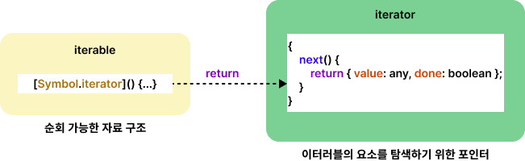

# 34. 이터러블

## 34.1 이터레이션 프로토콜

순회가능한 데이터 컬렉션을 만들기 위해 미리 약속한 규칙

예전엔 배열, 문자열, 유사 배열 객체, DOM 컬렉션 등은 통일된 규약 없이 각자 나름의 구조를 가지고 for문, for...in, foreach 메서드 등 다양한 방법으로 순회할 수 있었다. ES6에서 이터레이션 프로토콜을 준수하는 이터러블로 통일하여 정리.

- 이터러블 프로토콜
- 이터레이터 프로토콜



### 34.1.1 이터러블

Symbol.iterator를 프로퍼티 키로 사용한 메서드를 직접 구현하거나 프로토타입 체인을 통해 상속받은 객체를 말한다.

[예제 34-01]

```javascript
const isIterable = v => v !== null && typeof v[Symbol.iterator] === 'function';

// 배열, 문자열, Map, Set 등은 이터러블이다.
isIterable([]);        // -> true
isIterable('');        // -> true
isIterable(new Map()); // -> true
isIterable(new Set()); // -> true
isIterable({});        // -> false
```

[예제 34-02]

```javascript
const array = [1, 2, 3];

// 배열은 Array.prototype의 Symbol.iterator 메서드를 상속받는 이터러블이다.
console.log(Symbol.iterator in array); // true

// 이터러블인 배열은 for...of 문으로 순회 가능하다.
for (const item of array) {
  console.log(item); // 1 2 3
}

// 이터러블인 배열은 스프레드 문법의 대상으로 사용할 수 있다.
console.log([...array]); // [1, 2, 3]

// 이터러블인 배열은 배열 디스트럭처링 할당의 대상으로 사용할 수 있다.
const [a, ...rest] = array;
console.log(a, rest); // 1, [2, 3]
```

[예제 34-03]

```javascript
const obj = { a: 1, b: 2 };

// 일반 객체는 Symbol.iterator 메서드를 구현하거나 상속받지 않는다.
// 따라서 일반 객체는 이터러블 프로토콜을 준수한 이터러블이 아니다.
console.log(Symbol.iterator in obj); // false

// 이터러블이 아닌 일반 객체는 for...of 문으로 순회할 수 없다.
for (const item of obj) { // -> TypeError: obj is not iterable
  console.log(item);
}

// 이터러블이 아닌 일반 객체는 배열 디스트럭처링 할당의 대상으로 사용할 수 없다.
const [a, b] = obj; // -> TypeError: obj is not iterable
```

[예제 34-04]

```javascript
const obj = { a: 1, b: 2 };

// 스프레드 프로퍼티 제안(Stage 4)은 객체 리터럴 내부에서 스프레드 문법의 사용을 허용한다.
console.log({ ...obj }); // { a: 1, b: 2 }
```

### 34.1.2 이터레이터

이터러블의 Symbol.iterator 메서드가 반환한 이터레이터는 next 메서들르 갖는다.

[예제 34-05]

```javascript
// 배열은 이터러블 프로토콜을 준수한 이터러블이다.
const array = [1, 2, 3];

// Symbol.iterator 메서드는 이터레이터를 반환한다.
const iterator = array[Symbol.iterator]();

// Symbol.iterator 메서드가 반환한 이터레이터는 next 메서드를 갖는다.
console.log('next' in iterator); // true
```

[예제 34-06]

```javascript
// 배열은 이터러블 프로토콜을 준수한 이터러블이다.
const array = [1, 2, 3];

// Symbol.iterator 메서드는 이터레이터를 반환한다. 이터레이터는 next 메서드를 갖는다.
const iterator = array[Symbol.iterator]();

// next 메서드를 호출하면 이터러블을 순회하며 순회 결과를 나타내는 이터레이터 리절트 객체를
// 반환한다. 이터레이터 리절트 객체는 value와 done 프로퍼티를 갖는 객체다.
console.log(iterator.next()); // { value: 1, done: false }
console.log(iterator.next()); // { value: 2, done: false }
console.log(iterator.next()); // { value: 3, done: false }
console.log(iterator.next()); // { value: undefined, done: true }
```

## 34.2 빌트인 이터러블

|빌트인 이터러블|Symbol.iterator 메서드|
|---------------|----------------------|
|Array|Array.prototype[Symbol.iterator]|
|String|String.prototype[Symbol.iterator]|
|Map|Map.prototype[Symbol.iterator]|
|Set|Set.prototype[Symbol.iterator]|
|TypedArray|TypedArray.prototype[Symbol.iterator]|
|arguments|arguments.prototype[Symbol.iterator]|
|DOM 컬렉션|NodeList.prototype[Symbol.iterator]<br />HTMLCollection.prototype[Symbol.iterator]|

## 34.5 이터레이션 프로토콜의 필요성

데이터 소비자와 데이터 공급자를 연결하는 인터페이스의 역활을 한다.

## 34.6 사용자 정의 이터러블

### 무한 이터러블과 지연 평가

[예제 34-18]

```javascript
// 무한 이터러블을 생성하는 함수
const fibonacciFunc = function () {
  let [pre, cur] = [0, 1];

  return {
    [Symbol.iterator]() { return this; },
    next() {
      [pre, cur] = [cur, pre + cur];
      // 무한을 구현해야 하므로 done 프로퍼티를 생략한다.
      return { value: cur };
    }
  };
};

// fibonacciFunc 함수는 무한 이터러블을 생성한다.
for (const num of fibonacciFunc()) {
  if (num > 10000) break;
  console.log(num); // 1 2 3 5 8...4181 6765
}

// 배열 디스트럭처링 할당을 통해 무한 이터러블에서 3개의 요소만 취득한다.
const [f1, f2, f3] = fibonacciFunc();
console.log(f1, f2, f3); // 1 2 3
```

지연 평가: 데이터가 필요한 시점 이전까지는 미리 데이터를 생성하지 않다가 데이터가 필요한 시점이 되면 그 때 데이터를 생성하는 기법.
