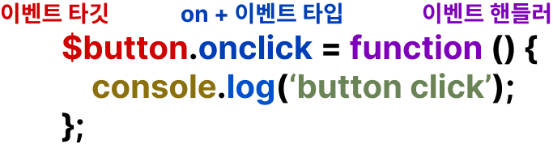
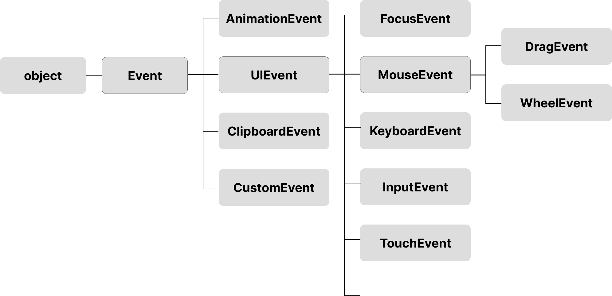
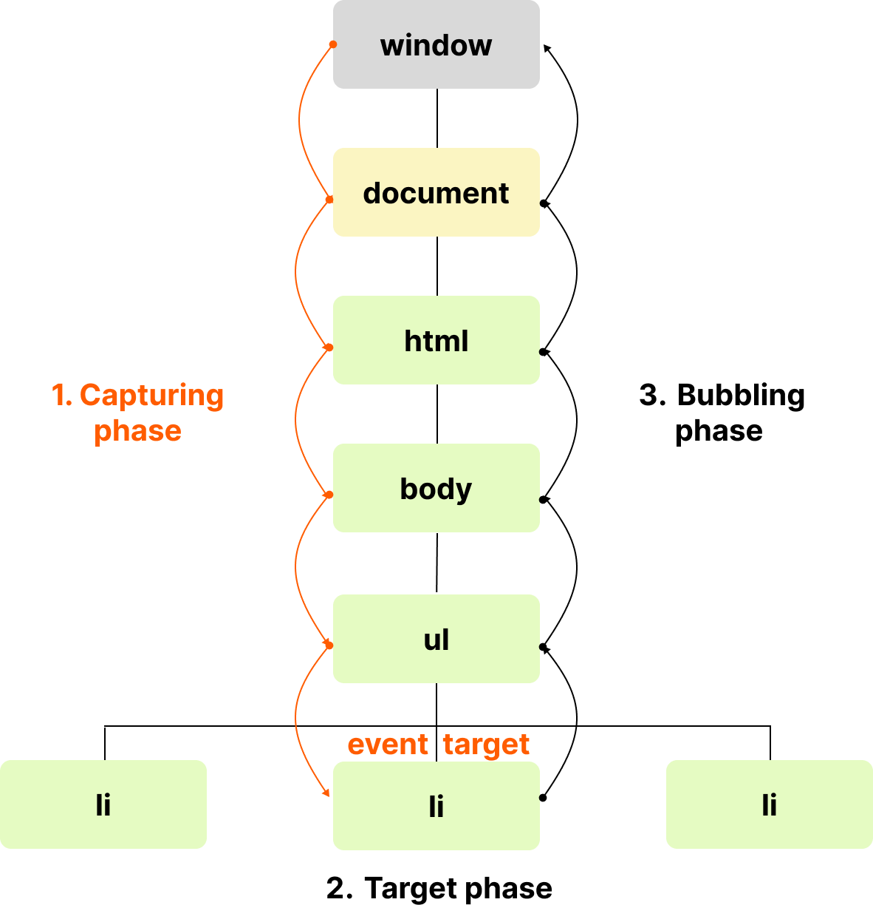

# 40. 이벤트

## 40.1 이벤트 드리븐 프로그래밍

이벤트 핸들러: 이벤트가 발생했을 때 호출될 함수
이벤트 핸들러 등록: 이벤트가 발생했을 때 브라우저에게 이벤트 핸들러의 호출을 위힘하는 것
이벤트 드리븐 프로그래밍: 프로그램의 흐름을 이벤트 중심으로 제어하는 프로그래밍 방식

## 40.2 이벤트 타입

[MDN Event Reference](https://developer.mozilla.org/en-US/docs/Web/Events)

## 40.3 이벤트 핸들러 등록

1. 어트리뷰트 방식
    onclick과 같이 on 접두사와 이벤트의 종류를 나타내는 이벤트 타입으로 이루어져 있다
    주의할 점은 이벤트 핸들러 어트리뷰트 값으로 함수 참조가 아닌 함수 호출문 등의 문으로 할당한다.
    이벤트 핸들러 어트리뷰트 값은 사실 암묵적으로 생성될 이벤트 핸들러의 함수 몸체를 의미한다.

    [예제 40-02]

    ```html
    <!DOCTYPE html>
    <html>
    <body>
    <button onclick="sayHi('Lee')">Click me!</button>
    <script>
        function sayHi(name) {
        console.log(`Hi! ${name}.`);
        }
    </script>
    </body>
    </html>
    ```

    [예제 40-03]

    ```javascript
    function onclick(event) {
    sayHi('Lee');
    }
    ```

    이처럼 동작하는 이유는 이벤트 핸들러에 **인수를 전달**하기 위해서다.
    이벤트 핸들러 어트리뷰트 값으로 함수 참조를 할당해야 한다면 이벤트 핸들러에 인수를 전달하기 어려워진다.

    [예제 40-04]

    ```html
        <!-- 이벤트 핸들러에 인수를 전달하기 곤란하다. -->
        <button onclick="sayHi">Click me!</button>
    ```

    모던 자바스크립트에서는 이베트 핸들러 어트리뷰트 방식으로 사용하는 경우가 있다.

    [예제 40-06]

    ```html
        <!-- Angular -->
        <button (click)="handleClick($event)">Save</button>

        { /* React */ }
        <button onClick={handleClick}>Save</button>

        <!-- Svelte -->
        <button on:click={handleClick}>Save</button>

        <!-- Vue.js -->
        <button v-on:click="handleClick($event)">Save</button>
    ```

2. 프로퍼티 방식

   [예제 40-07]

   ```html
        <!DOCTYPE html>
        <html>
        <body>
        <button>Click me!</button>
        <script>
            const $button = document.querySelector('button');

            // 이벤트 핸들러 프로퍼티에 이벤트 핸들러를 바인딩
            $button.onclick = function () {
            console.log('button click');
            };
        </script>
        </body>
        </html>
    ```

    

    이벤트 핸들러 프로퍼티에 하나의 이벤트만 바인딩할 수 있다.
    [예제 40-08]

    ```html
        <!DOCTYPE html>
        <html>
        <body>
        <button>Click me!</button>
        <script>
            const $button = document.querySelector('button');

            // 이벤트 핸들러 프로퍼티 방식은 하나의 이벤트에 하나의 이벤트 핸들러만을 바인딩할 수 있다.
            // 첫 번째로 바인딩된 이벤트 핸들러는 두 번째 바인딩된 이벤트 핸들러에 의해 재할당되어
            // 실행되지 않는다.
            $button.onclick = function () {
            console.log('Button clicked 1');
            };

            // 두 번째로 바인딩된 이벤트 핸들러
            $button.onclick = function () {
            console.log('Button clicked 2');
            };
        </script>
        </body>
        </html>
    ```

3. addEventListener 메서드 방식

    

    [예제 40-09]

    ```html
        <!DOCTYPE html>
        <html>
        <body>
        <button>Click me!</button>
        <script>
            const $button = document.querySelector('button');

            // 이벤트 핸들러 프로퍼티 방식
            // $button.onclick = function () {
            //   console.log('button click');
            // };

            // addEventListener 메서드 방식
            $button.addEventListener('click', function () {
            console.log('button click');
            });
        </script>
        </body>
        </html>
    ```

    [예제 40-12]

    ```html
        <!DOCTYPE html>
        <html>
        <body>
        <button>Click me!</button>
        <script>
            const $button = document.querySelector('button');

            const handleClick = () => console.log('button click');

            // 참조가 동일한 이벤트 핸들러를 중복 등록하면 하나의 핸들러만 등록된다.
            $button.addEventListener('click', handleClick);
            $button.addEventListener('click', handleClick);
        </script>
        </body>
        </html>
    ```

## 40.4 이벤트 핸들러 제거

- addEventListener 메서드에서 전달한 인수와 removeEventListener 메소드에서 전달한 인수가 일치하지 않으면 이벤트 핸들러가 제거되지 않는다.
- 무명 함수로 등록한 경우 제거할 수 없다. 이벤트 핸들러의 참조를 변수나 자료구조에 저장하고 있어야 한다.
- 기명 이벤트 핸들러 내부에 removeEventListener 메서드를 호출하여 제거하는 것은 가능하다.
- 이벤트 핸들러 프로퍼티로 등록한 경우에는 이벤트 핸들러 프로퍼티에 null을 할당하여 제거 가능하다.

[예제 40-13]

```html
<!DOCTYPE html>
<html>
<body>
  <button>Click me!</button>
  <script>
    const $button = document.querySelector('button');

    const handleClick = () => console.log('button click');

    // 이벤트 핸들러 등록
    $button.addEventListener('click', handleClick);

    // 이벤트 핸들러 제거
    // addEventListener 메서드에 전달한 인수와 removeEventListener 메서드에
    // 전달한 인수가 일치하지 않으면 이벤트 핸들러가 제거되지 않는다.
    $button.removeEventListener('click', handleClick, true); // 실패
    $button.removeEventListener('click', handleClick); // 성공
  </script>
</body>
</html>
```

[예제 40-17]

```html
<!DOCTYPE html>
<html>
<body>
  <button>Click me!</button>
  <script>
    const $button = document.querySelector('button');

    const handleClick = () => console.log('button click');

    // 이벤트 핸들러 프로퍼티 방식으로 이벤트 핸들러 등록
    $button.onclick = handleClick;

    // removeEventListener 메서드로 이벤트 핸들러를 제거할 수 없다.
    $button.removeEventListener('click', handleClick);

    // 이벤트 핸들러 프로퍼티에 null을 할당하여 이벤트 핸들러를 제거한다.
    $button.onclick = null;
  </script>
</body>
</html>
```

## 40.5 이벤트 객체

생성된 이벤트 객체는 이벤트 핸들러의 첫 번째 인수로 전달된다.

[예제 40-18]

```html
<!DOCTYPE html>
<html>
<body>
  <p>클릭하세요. 클릭한 곳의 좌표가 표시됩니다.</p>
  <em class="message"></em>
  <script>
    const $msg = document.querySelector('.message');

    // 클릭 이벤트에 의해 생성된 이벤트 객체는 이벤트 핸들러의 첫 번째 인수로 전달된다.
    function showCoords(e) {
      $msg.textContent = `clientX: ${e.clientX}, clientY: ${e.clientY}`;
    }

    document.onclick = showCoords;
  </script>
</body>
</html>
```

이벤트 객체는 이벤트 핸들러의 첫번째 인수로 전달되어 매개변수 e에 암묵적으로 할당.

[예제 40-19]

```html
<!DOCTYPE html>
<html>
<head>
  <style>
    html, body { height: 100%; }
  </style>
</head>
<!-- 이벤트 핸들러 어트리뷰트 방식의 경우 event가 아닌 다른 이름으로는 이벤트 객체를
전달받지 못한다. -->
<body onclick="showCoords(event)">
  <p>클릭하세요. 클릭한 곳의 좌표가 표시됩니다.</p>
  <em class="message"></em>
  <script>
    const $msg = document.querySelector('.message');

    // 클릭 이벤트에 의해 생성된 이벤트 객체는 이벤트 핸들러의 첫 번째 인수로 전달된다.
    function showCoords(e) {
      $msg.textContent = `clientX: ${e.clientX}, clientY: ${e.clientY}`;
    }
  </script>
</body>
</html>
```

### 40.5.1 이벤트 객체의 상속 구조



[예제 40-21]

```html
<!DOCTYPE html>
<html>
<body>
  <script>
    // Event 생성자 함수를 호출하여 foo 이벤트 타입의 Event 객체를 생성한다.
    let e = new Event('foo');
    console.log(e);
    // Event {isTrusted: false, type: "foo", target: null, ...}
    console.log(e.type); // "foo"
    console.log(e instanceof Event); // true
    console.log(e instanceof Object); // true

    // FocusEvent 생성자 함수를 호출하여 focus 이벤트 타입의 FocusEvent 객체를 생성한다.
    e = new FocusEvent('focus');
    console.log(e);
    // FocusEvent {isTrusted: false, relatedTarget: null, view: null, ...}

    // MouseEvent 생성자 함수를 호출하여 click 이벤트 타입의 MouseEvent 객체를 생성한다.
    e = new MouseEvent('click');
    console.log(e);
    // MouseEvent {isTrusted: false, screenX: 0, screenY: 0, clientX: 0, ... }

    // KeyboardEvent 생성자 함수를 호출하여 keyup 이벤트 타입의 KeyboardEvent 객체를
    // 생성한다.
    e = new KeyboardEvent('keyup');
    console.log(e);
    // KeyboardEvent {isTrusted: false, key: "", code: "", ctrlKey: false, ...}

    // InputEvent 생성자 함수를 호출하여 change 이벤트 타입의 InputEvent 객체를 생성한다.
    e = new InputEvent('change');
    console.log(e);
    // InputEvent {isTrusted: false, data: null, inputType: "", ...}
  </script>
</body>
</html>
```

[예제 40-22]

```html
<!DOCTYPE html>
<html>
<body>
  <input type="text">
  <input type="checkbox">
  <button>Click me!</button>
  <script>
    const $input = document.querySelector('input[type=text]');
    const $checkbox = document.querySelector('input[type=checkbox]');
    const $button = document.querySelector('button');

    // load 이벤트가 발생하면 Event 타입의 이벤트 객체가 생성된다.
    window.onload = console.log;

    // change 이벤트가 발생하면 Event 타입의 이벤트 객체가 생성된다.
    $checkbox.onchange = console.log;

    // focus 이벤트가 발생하면 FocusEvent 타입의 이벤트 객체가 생성된다.
    $input.onfocus = console.log;

    // input 이벤트가 발생하면 InputEvent 타입의 이벤트 객체가 생성된다.
    $input.oninput = console.log;

    // keyup 이벤트가 발생하면 KeyboardEvent 타입의 이벤트 객체가 생성된다.
    $input.onkeyup = console.log;

    // click 이벤트가 발생하면 MouseEvent 타입의 이벤트 객체가 생성된다.
    $button.onclick = console.log;
  </script>
</body>
</html>
```

### 40.5.2 이벤트 객체의 공통 프로퍼티

|공통 프로퍼티|설명|타입|
|-------------|----|----|
|type|이벤트타입|string|
|target|이벤트를 발생시킨 DOM 요소|DOM요소 노드|
|currentTarget|이벤트를 핸들러가 바인딩된 DOM 요소|DOM요소 노드|
|eventPhase|이벤트 전파 단계 <br /> 0: 이벤트 없음, 1: 캡쳐링 단계, 2: 타깃 단계, 3: 버블링 단계|number|
|bubbles|이벤트를 버블링으로 전파하는지 여부. 다음 이벤트는 bubbles: false로 버블링하지 않는다. <br /> - 포커스 이벤트 focus/blur <br /> - 리소스 이벤트 load/unload/abort/error <br /> - 마우스 이벤트 mouseenter/mouseleave|boolean|
|cancelable|preventDefault 메서드를 호출하여 이벤트의 기본 동작을 취소할 수 있는지 여부. 다음 이벤트는 cancelable: false로 취소할 수 없다. <br /> - 포커스 이벤트 focus/blur <br /> - 리소스 이벤트 load/unload/abort/error <br /> - 마우스 이벤트 dblclick/mouseenter/mouseleave|boolean|
|defaultPrevented|preventDefault 메서드를 호출하여 이벤트를 취소했는지 여부|boolean|
|isTrusted|사용자의 행위에 의해 발생한 이벤트인지 여부. 예를 들어, click 메서드 또는 dispatchEvent 메서드를 통해 인위적으로 발생시킨 이벤트인 경우 isTrusted는 false이다.|boolean|
|timeStamp|이벤트가 발생한 시각(1970/01/01/00:00:0부터 경과한 밀리초|number|

## 40.6 이벤트 전파

[예제 40-27]

```html
<!DOCTYPE html>
<html>
<body>
  <ul id="fruits">
    <li id="apple">Apple</li>
    <li id="banana">Banana</li>
    <li id="orange">Orange</li>
  </ul>
</body>
</html>
```

생성된 이벤트 객체는 이벤트를 발생시킨 DOM 요소인 이벤트 타깃을 중심으로 DOM 트리를 통해 전파된다.



- 캡쳐링 단계: 이벤트가 상위 요소에서 하위 요소 방향으로 전파
- 타깃 단계: 이벤트가 이벤트 타깃에 도달
- 버블링 단계: 이벤트가 하위 요소에서 상위 요소 방향으로 전파

[예제 40-29]

```html
<!DOCTYPE html>
<html>
<body>
  <ul id="fruits">
    <li id="apple">Apple</li>
    <li id="banana">Banana</li>
    <li id="orange">Orange</li>
  </ul>
  <script>
    const $fruits = document.getElementById('fruits');
    const $banana = document.getElementById('banana');

    // #fruits 요소의 하위 요소인 li 요소를 클릭한 경우
    // 캡처링 단계의 이벤트를 캐치한다.
    $fruits.addEventListener('click', e => {
      console.log(`이벤트 단계: ${e.eventPhase}`); // 1: 캡처링 단계
      console.log(`이벤트 타깃: ${e.target}`); // [object HTMLLIElement]
      console.log(`커런트 타깃: ${e.currentTarget}`); // [object HTMLUListElement]
    }, true);

    // 타깃 단계의 이벤트를 캐치한다.
    $banana.addEventListener('click', e => {
      console.log(`이벤트 단계: ${e.eventPhase}`); // 2: 타깃 단계
      console.log(`이벤트 타깃: ${e.target}`); // [object HTMLLIElement]
      console.log(`커런트 타깃: ${e.currentTarget}`); // [object HTMLLIElement]
    });

    // 버블링 단계의 이벤트를 캐치한다.
    $fruits.addEventListener('click', e => {
      console.log(`이벤트 단계: ${e.eventPhase}`); // 3: 버블링 단계
      console.log(`이벤트 타깃: ${e.target}`); // [object HTMLLIElement]
      console.log(`커런트 타깃: ${e.currentTarget}`); // [object HTMLUListElement]
    });
  </script>
</body>
</html>
```

이처럼 이벤트는 이벤트를 발생시킨 이벤트 타깃은 물론 상위 DOM 요소에서도 캐치할 수 있다.

## 40.7 이벤트 위임

여러개의 하위 DOM 요소에 각각 이벤트 핸들러를 등록하는 대신 하나의 상위 DOM요소에 이벤트 핸들러를 등록하는 방법

[예제 40-32]

```html
<!DOCTYPE html>
<html>
<head>
  <style>
    #fruits {
      display: flex;
      list-style-type: none;
      padding: 0;
    }

    #fruits li {
      width: 100px;
      cursor: pointer;
    }

    #fruits .active {
      color: red;
      text-decoration: underline;
    }
  </style>
</head>
<body>
  <nav>
    <ul id="fruits">
      <li id="apple" class="active">Apple</li>
      <li id="banana">Banana</li>
      <li id="orange">Orange</li>
    </ul>
  </nav>
  <div>선택된 내비게이션 아이템: <em class="msg">apple</em></div>
  <script>
    const $fruits = document.getElementById('fruits');
    const $msg = document.querySelector('.msg');

    // 사용자 클릭에 의해 선택된 내비게이션 아이템(li 요소)에 active 클래스를 추가하고
    // 그 외의 모든 내비게이션 아이템의 active 클래스를 제거한다.
    function activate({ target }) {
      // 이벤트를 발생시킨 요소(target)가 ul#fruits의 자식 요소가 아니라면 무시한다.
      if (!target.matches('#fruits > li')) return;

      [...$fruits.children].forEach($fruit => {
        $fruit.classList.toggle('active', $fruit === target);
        $msg.textContent = target.id;
      });
    }

    // 이벤트 위임: 상위 요소(ul#fruits)는 하위 요소의 이벤트를 캐치할 수 있다.
    $fruits.onclick = activate;
  </script>
</body>
</html>
```

## 40.8 DOM 요소의 기본 동작 조작

### 40.8.1 DOM 요소의 기본 동작 중단

이벤트 객체 preventDefault 메서드는 DOM 요소의 기본 동작을 중단시킨다.

[예제 40-35]

```html
<!DOCTYPE html>
<html>
<body>
  <a href="https://www.google.com">go</a>
  <input type="checkbox">
  <script>
    document.querySelector('a').onclick = e => {
      // a 요소의 기본 동작을 중단한다.
      e.preventDefault();
    };

    document.querySelector('input[type=checkbox]').onclick = e => {
      // checkbox 요소의 기본 동작을 중단한다.
      e.preventDefault();
    };
  </script>
</body>
</html>
```

### 40.8.2 이벤트 전파 방지

이벤트 객체 stopPropagation 메서드는 이벤트 전파를 중단시킨다.

[예제 40-36]

```html
<!DOCTYPE html>
<html>
<body>
  <div class="container">
    <button class="btn1">Button 1</button>
    <button class="btn2">Button 2</button>
    <button class="btn3">Button 3</button>
  </div>
  <script>
    // 이벤트 위임. 클릭된 하위 버튼 요소의 color를 변경한다.
    document.querySelector('.container').onclick = ({ target }) => {
      if (!target.matches('.container > button')) return;
      target.style.color = 'red';
    };

    // .btn2 요소는 이벤트를 전파하지 않으므로 상위 요소에서 이벤트를 캐치할 수 없다.
    document.querySelector('.btn2').onclick = e => {
      e.stopPropagation(); // 이벤트 전파 중단
      e.target.style.color = 'blue';
    };
  </script>
</body>
</html>
```

## 40.9 이벤트 핸들러 내부의 this

### 1. 이벤트 핸들러 어트리뷰트 방식

  handleClick 함수 내부의 this는 전역 객체 window를 가리킴.
  이벤트 핸들러로 호출할 때 인수로 전달한 this는 이벤트 바인당한 DOM 요소를 가리킨다.

  [예제 40-38]

  ```html
  <!DOCTYPE html>
  <html>
  <body>
    <button onclick="handleClick(this)">Click me</button>
    <script>
      function handleClick(button) {
        console.log(button); // 이벤트를 바인딩한 button 요소
        console.log(this);   // window
      }
    </script>
  </body>
  </html>
  ```

### 2. 이벤트 핸들러 프로퍼티 방식과 addEventListener 메서드 방식

  [예제 40-39]

  ```html
  <!DOCTYPE html>
  <html>
  <body>
    <button class="btn1">0</button>
    <button class="btn2">0</button>
    <script>
      const $button1 = document.querySelector('.btn1');
      const $button2 = document.querySelector('.btn2');

      // 이벤트 핸들러 프로퍼티 방식
      $button1.onclick = function (e) {
        // this는 이벤트를 바인딩한 DOM 요소를 가리킨다.
        console.log(this); // $button1
        console.log(e.currentTarget); // $button1
        console.log(this === e.currentTarget); // true

        // $button1의 textContent를 1 증가시킨다.
        ++this.textContent;
      };

      // addEventListener 메서드 방식
      $button2.addEventListener('click', function (e) {
        // this는 이벤트를 바인딩한 DOM 요소를 가리킨다.
        console.log(this); // $button2
        console.log(e.currentTarget); // $button2
        console.log(this === e.currentTarget); // true

        // $button2의 textContent를 1 증가시킨다.
        ++this.textContent;
      });
    </script>
  </body>
  </html>
  ```

  [예제 40-40]

  ```html
    <!DOCTYPE html>
    <html>
    <body>
      <button class="btn1">0</button>
      <button class="btn2">0</button>
      <script>
        const $button1 = document.querySelector('.btn1');
        const $button2 = document.querySelector('.btn2');

        // 이벤트 핸들러 프로퍼티 방식
        $button1.onclick = e => {
          // 화살표 함수 내부의 this는 상위 스코프의 this를 가리킨다.
          console.log(this); // window
          console.log(e.currentTarget); // $button1
          console.log(this === e.currentTarget); // false

          // this는 window를 가리키므로 window.textContent에 NaN(undefined + 1)을 할당한다.
          ++this.textContent;
        };

        // addEventListener 메서드 방식
        $button2.addEventListener('click', e => {
          // 화살표 함수 내부의 this는 상위 스코프의 this를 가리킨다.
          console.log(this); // window
          console.log(e.currentTarget); // $button2
          console.log(this === e.currentTarget); // false

          // this는 window를 가리키므로 window.textContent에 NaN(undefined + 1)을 할당한다.
          ++this.textContent;
        });
      </script>
    </body>
    </html>
  ```
  