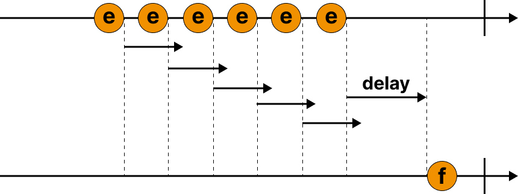

# 41. 타이머

자바스크립트 엔진은 싱글 스레드로 동작한다.
타이머 함수는 이런 이유로 비동기 처리 방식으로 동작한다.

## 41.2 타이머 함수

### 41.2.1 setTimeOut / clearTimeout

```javascript
const timeOutId = setTimeout(func|code[, delay, param1, param2, ...]);
// func: 타이머가 만료된 후 호출될 콜백 함수
// delay: 타이머 만료시간(밀리초단위). delay 시간으로 단 한 번 동작하는 타이머를 생성.
// param1, param2, ...: 호출 스케줄링된 콜백 함수에 전달해야 할 인수가 존재하는 경우 사용.
```

[예제 41-1]

```javascript
// 1초(1000ms) 후 타이머가 만료되면 콜백 함수가 호출된다.
setTimeout(() => console.log('Hi!'), 1000);

// 1초(1000ms) 후 타이머가 만료되면 콜백 함수가 호출된다.
// 이때 콜백 함수에 'Lee'가 인수로 전달된다.
setTimeout(name => console.log(`Hi! ${name}.`), 1000, 'Lee');

// 두 번째 인수(delay)를 생략하면 기본값 0이 지정된다.
setTimeout(() => console.log('Hello!'));
```

[예제 41-2]

```javascript
// 1초(1000ms) 후 타이머가 만료되면 콜백 함수가 호출된다.
// setTimeout 함수는 생성된 타이머를 식별할 수 있는 고유한 타이머 id를 반환한다.
const timerId = setTimeout(() => console.log('Hi!'), 1000);

// setTimeout 함수가 반환한 타이머 id를 clearTimeout 함수의 인수로 전달하여 타이머를
// 취소한다. 타이머가 취소되면 setTimeout 함수의 콜백 함수가 실행되지 않는다.
clearTimeout(timerId);
```

### 41.2.2 setInterval / clearInterval

```javascript
const timerId = setInterval(func|code[, delay, param1, param2, ...]);
```

[예제 41-3]

```javascript
let count = 1;

// 1초(1000ms) 후 타이머가 만료될 때마다 콜백 함수가 호출된다.
// setInterval 함수는 생성된 타이머를 식별할 수 있는 고유한 타이머 id를 반환한다.
const timeoutId = setInterval(() => {
  console.log(count); // 1 2 3 4 5
  // count가 5이면 setInterval 함수가 반환한 타이머 id를 clearInterval 함수의
  // 인수로 전달하여 타이머를 취소한다. 타이머가 취소되면 setInterval 함수의 콜백 함수가
  // 실행되지 않는다.
  if (count++ === 5) clearInterval(timeoutId);
}, 1000);
```

## 41.3 디바운스와 스로틀

[예제 41-4]

```html
<!DOCTYPE html>
<html>
<body>
  <button>click me</button>
  <pre>일반 클릭 이벤트 카운터    <span class="normal-msg">0</span></pre>
  <pre>디바운스 클릭 이벤트 카운터 <span class="debounce-msg">0</span></pre>
  <pre>스로틀 클릭 이벤트 카운터   <span class="throttle-msg">0</span></pre>
  <script>
    const $button = document.querySelector('button');
    const $normalMsg = document.querySelector('.normal-msg');
    const $debounceMsg = document.querySelector('.debounce-msg');
    const $throttleMsg = document.querySelector('.throttle-msg');

    const debounce = (callback, delay) => {
      let timerId;
      return (...args) => {
        if (timerId) clearTimeout(timerId);
        timerId = setTimeout(callback, delay, ...args);
      };
    };

    const throttle = (callback, delay) => {
      let timerId;
      return (...args) => {
        if (timerId) return;
        timerId = setTimeout(() => {
          callback(...args);
          timerId = null;
        }, delay);
      };
    };

    $button.addEventListener('click', () => {
      $normalMsg.textContent = +$normalMsg.textContent + 1;
    });

    $button.addEventListener('click', debounce(() => {
      $debounceMsg.textContent = +$debounceMsg.textContent + 1;
    }, 500));

    $button.addEventListener('click', throttle(() => {
      $throttleMsg.textContent = +$throttleMsg.textContent + 1;
    }, 500));
  </script>
</body>
</html>
```

### 41.3.1 디바운스

디바운스는 짧은 시간 간격으로 발생하는 이벤트를 그룹화해서 마지막에 이벤트 핸들러가 한 번만 호출되도록 한다.

사용하기 좋은 예제: resize 이벤트 처리, 입력 필드 자동환성 UI 구현, 버튼 중복 클릭 장지 처리 등

[예제 41-05]

```html
<!DOCTYPE html>
<html>
<body>
  <input type="text">
  <div class="msg"></div>
  <script>
    const $input = document.querySelector('input');
    const $msg = document.querySelector('.msg');

    const debounce = (callback, delay) => {
      let timerId;
      // debounce 함수는 timerId를 기억하는 클로저를 반환한다.
      return (...args) => {
        // delay가 경과하기 이전에 이벤트가 발생하면 이전 타이머를 취소하고
        // 새로운 타이머를 재설정한다.
        // 따라서 delay보다 짧은 간격으로 이벤트가 발생하면 callback은 호출되지 않는다.
        if (timerId) clearTimeout(timerId);
        timerId = setTimeout(callback, delay, ...args);
      };
    };

    // debounce 함수가 반환하는 클로저가 이벤트 핸들러로 등록된다.
    // 300ms보다 짧은 간격으로 input 이벤트가 발생하면 debounce 함수의 콜백 함수는
    // 호출되지 않다가 300ms 동안 input 이벤트가 더 이상 발생하면 한 번만 호출된다.
    $input.oninput = debounce(e => {
      $msg.textContent = e.target.value;
    }, 300);
  </script>
</body>
</html>
```



### 41.3.2 스로틀

스로틀은 짧은 시간 간격으로 연속해서 발생하는 이벤트를 그룹화해서 일정 신간 단위로 이벤트 핸들러가 호출되도록 호출 주기를 만든다.
사용하기 좋은 예제: scroll 이벤트 처리, 무한 스크롤 UI 구현 등

[예제 41-06]

```html
<!DOCTYPE html>
<html>
<head>
  <style>
    .container {
      width: 300px;
      height: 300px;
      background-color: rebeccapurple;
      overflow: scroll;
    }

    .content {
      width: 300px;
      height: 1000vh;
    }
  </style>
</head>
<body>
  <div class="container">
    <div class="content"></div>
  </div>
  <div>
    일반 이벤트 핸들러가 scroll 이벤트를 처리한 횟수:
    <span class="normal-count">0</span>
  </div>
  <div>
    스로틀 이벤트 핸들러가 scroll 이벤트를 처리한 횟수:
    <span class="throttle-count">0</span>
  </div>

  <script>
    const $container = document.querySelector('.container');
    const $normalCount = document.querySelector('.normal-count');
    const $throttleCount = document.querySelector('.throttle-count');

    const throttle = (callback, delay) => {
      let timerId;
      // throttle 함수는 timerId를 기억하는 클로저를 반환한다.
      return (...args) => {
        // delay가 경과하기 이전에 이벤트가 발생하면 아무것도 하지 않다가
        // delay가 경과했을 때 이벤트가 발생하면 새로운 타이머를 재설정한다.
        // 따라서 delay 간격으로 callback이 호출된다.
        if (timerId) return;
        timerId = setTimeout(() => {
          callback(...args);
          timerId = null;
        }, delay);
      };
    };

    let normalCount = 0;
    $container.addEventListener('scroll', () => {
      $normalCount.textContent = ++normalCount;
    });

    let throttleCount = 0;
    // throttle 함수가 반환하는 클로저가 이벤트 핸들러로 등록된다.
    $container.addEventListener('scroll', throttle(() => {
      $throttleCount.textContent = ++throttleCount;
    }, 100));
  </script>
</body>
</html>
```


