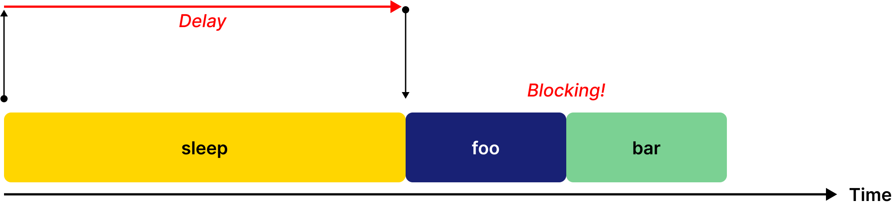
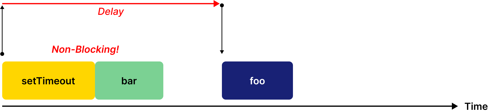
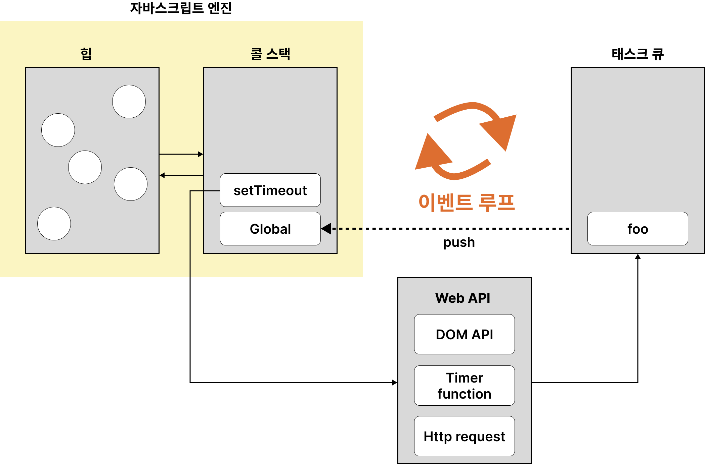

# 42. 비동기 프로그래밍

## 42.1 동기 처리와 비동기 처리

[예제 42-01]

```javascript
const foo = () => {};
const bar = () => {};

foo();
bar();
```


실행 컨텍스트 스택에 함수 실행 컨텍스트 푸시되는 것은 바로 함수 실행의 시작을 의미한다.

**자바스크립트 엔진은 단 하나의 실행 컨텍스트 스택을 갖는다.**
이를 한 번에 하나의 태스크만 실행 할 수 있는 **싱글 스레드** 방식으로 동작한다.

동시에 2개 이상의 함수를 동시에 실행할 수 없다는 것을 의미한다.
실행 중인 컨텍스트를 제외한 모든 실행 컨텍스트는 모두 실행 대기 중인 태스크들이다.
처리에 시간이 걸리는 태스크를 실행 하는 경우 블로킹(작업 중단)이 발생한다.

[예제 42-02]

```javascript
// sleep 함수는 일정 시간(delay)이 경과한 이후에 콜백 함수(func)를 호출한다.
function sleep(func, delay) {
  // Date.now()는 현재 시간을 숫자(ms)로 반환한다.("30.2.1. Date.now" 참고)
  const delayUntil = Date.now() + delay;

  // 현재 시간(Date.now())에 delay를 더한 delayUntil이 현재 시간보다 작으면 계속 반복한다.
  while (Date.now() < delayUntil);
  // 일정 시간(delay)이 경과한 이후에 콜백 함수(func)를 호출한다.
  func();
}

function foo() {
  console.log('foo');
}

function bar() {
  console.log('bar');
}

// sleep 함수는 3초 이상 실행된다..
sleep(foo, 3 * 1000);
// bar 함수는 sleep 함수의 실행이 종료된 이후에 호출되므로 3초 이상 블로킹된다.
bar();
// (3초 경과 후) foo 호출 -> bar 호출
```

현재 실행 중인 태스크가 종료할 때까지 다음에 실행될 태스크가 대기하는 방식 = **동기 처리**
예제 42-02를 표현한 그림



[예제 42-03]

```javascript
function foo() {
  console.log('foo');
}

function bar() {
  console.log('bar');
}

// 타이머 함수 setTimeout은 일정 시간이 경과한 이후에 콜백 함수 foo를 호출한다.
// 타이머 함수 setTimeout은 bar 함수를 블로킹하지 않는다.
setTimeout(foo, 3 * 1000);
bar();
// bar 호출 -> (3초 경과 후) foo 호출
```

sleep함수와 유사하게 콜백 함수를 호출하지만 setTimeout 함수 이후의 태스크를 블로킹하지 않고 곧바로 실행
이처럼 현재 실행 중인 태스크가 종료되지 않은 상태라도 다음 태스크를 곧바로 실행하는 방식을 **비동기 처리**라고 한다.
비동기 처리방식은 태스크의 실행 순서가 보장되지 않는 단점이 있다.



타이머함수인 setTimeout, setInterval, HTTP 요청, 이벤트 핸들러는 비동기 처리 방식으로 동작한다.
비동기 처리는 이벤트 루프와 태스크 큐와 깊은 관계가 있다.

## 42.2 이벤트 루프와 태스크 큐

자바스크립트의 *동시성*을 지원하는 것이 바로 **이벤트 루프**다.



- 콜 스택
    스택 자료구조인 실행 컨텍스트 스택 = 콜 스택
- 힙
    **객체가 저장되는 메모리 공간**이다. 콜 스택 요소인 실행 컨텍스트는 힙에 저장된 메모리 객체를 참조한다.
    메모리에 값을 저장하려면 먼저 값을 저장할 메모리 공간의 크기를 결정해야 한다.
    객체는 원시값과는 달리 크기가 정해져 있지 않으므로 할당해야 할 메모리 공간의 크기를 런타임에 결정해야 한다.
    객체가 저장되는 메모리 공간인 힙은 **구조화 되어 있지 않다**는 특징이 있다.
- 태스크 큐
    비동기 함수의 콜백 함수 또는 이벤트 핸들러가 **일시적으로 보관되는 영역**
- 이벤트 루프
    콜 스택에 현재 실행 중인 실행 컨텍스트가 있는지 그리고 태스크 큐에 대기중인 함수가 있는지 반복해서 확인한다.
    **만약 콜 스택이 비어 있고 태스크 큐에 대기 중인 함수가 있다면 이벤트 루프는 순차적으로 태스크 큐에 대기 중인 함수를 콜 스택으로 이동시킨다.**
    태스크 큐에 임시 보관된 함수들은 비동기 처리 방식으로 동작한다.

[예제 42-04]

```javascript
// 다음 두 함수 중에 먼저 호출되는 함수는?
function foo() {
  console.log('foo');
}

function bar() {
  console.log('bar');
}

setTimeout(foo, 0); // 0초(실제는 4ms) 후에 foo 함수가 호출된다.
bar();
```

정답 bar 함수 => 정답을 그림으로 표현

.png)
.png)
.png)

**비동기 함수인 setTimeout의 콜백 함수는 태스크 큐에 푸시되어 대기하다가 전역 코드 및 명시적으로 호출된 함수가 모두 종료하면 비로소 콜 스택에 푸시되어 실행된다**.

자바스크립트는 싱글 스레드 방식으로 동작한다. 싱글 스레드 방식으로 동작하는 것은 브라우저가 아닌 **브라우저에 내장된 자바스크립트 엔진**이다.
자바스크립트 엔진은 싱글 스레드로 동작하지만 브라우저는 멀티 스레드로 동작한다. 그렇기 때문에 비동기 동작할 수 있는 것이다.