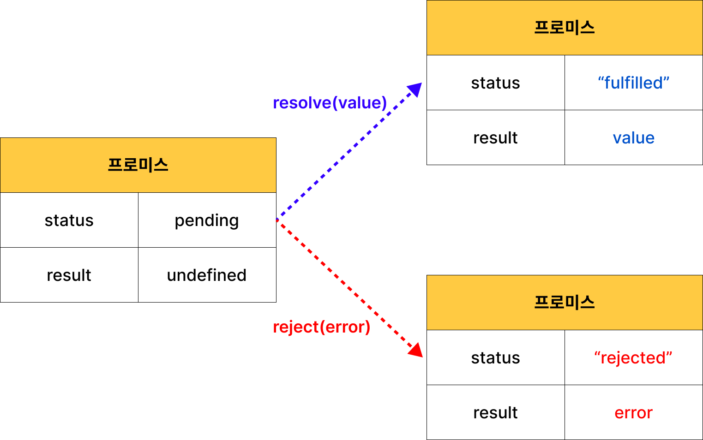
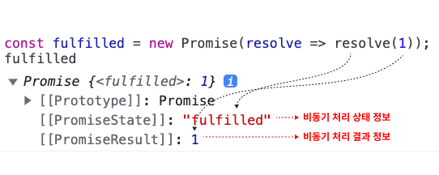
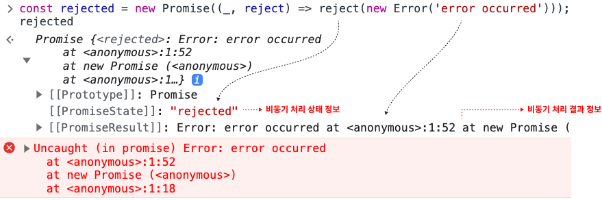

# 45 프로미스

## 45.1 비동기 처리를 위한 콜백 패턴의 단점

### 45.1.1 콜백 헬

[예제 45-01]

```javascript
// GET 요청을 위한 비동기 함수
const get = url => {
  const xhr = new XMLHttpRequest();
  xhr.open('GET', url);
  xhr.send();

  // onload 이벤트 핸들러가 비동기로 동작한다.
  xhr.onload = () => {
    if (xhr.status === 200) {
      // 서버의 응답을 콘솔에 출력한다.
      console.log(JSON.parse(xhr.response));
    } else {
      console.error(`${xhr.status} ${xhr.statusText}`);
    }
  };
};

// id가 1인 post를 취득
get('https://jsonplaceholder.typicode.com/posts/1');
/*
{
  "userId": 1,
  "id": 1,
  "title": "sunt aut facere ...",
  "body": "quia et suscipit ..."
}
*/
```

get 함수는 비동기 함수이다.
비동기 함수를 호출하면 함수 내부의 비동기로 동작하는 코드가 완료되지 않았다 해도 기다리지 않고 즉시 종료된다.
비동기 함수 내부의 비동기로 동작하는 코드는 비동기 함수가 종료된 이후에 완료된다.
따라서 비동기 함수 내부의 비동기로 동작하는 코드에서 처리 결과를 반환하거나 상위 스코프의 변수에 할당하면 기대한 대로 동작하지 않는다.

[예제 45-02]

```javascript
let g = 0;

// 비동기 함수인 setTimeout 함수는 콜백 함수의 처리 결과를 외부로 반환하거나
// 상위 스코프의 변수에 할당하지 못한다.
setTimeout(() => { g = 100; }, 0);
console.log(g); // 0
```

[예제 45-03]

```javascript
// GET 요청을 위한 비동기 함수
const get = url => {
  const xhr = new XMLHttpRequest();
  xhr.open('GET', url);
  xhr.send();

  xhr.onload = () => {
    if (xhr.status === 200) {
      // ① 서버의 응답을 반환한다.
      return JSON.parse(xhr.response);
    }
    console.error(`${xhr.status} ${xhr.statusText}`);
  };
};

// ② id가 1인 post를 취득
const response = get('https://jsonplaceholder.typicode.com/posts/1');
console.log(response); // undefined
```

[예제 45-04]

```html
<!DOCTYPE html>
<html>
<body>
  <input type="text">
  <script>
    document.querySelector('input').oninput = function () {
      console.log(this.value);
      // 이벤트 핸들러에서의 반환은 의미가 없다.
      return this.value;
    };
  </script>
</body>
</html>
```

[예제 45-05]

```javascript
let todos;

// GET 요청을 위한 비동기 함수
const get = url => {
  const xhr = new XMLHttpRequest();
  xhr.open('GET', url);
  xhr.send();

  xhr.onload = () => {
    if (xhr.status === 200) {
      // ① 서버의 응답을 상위 스코프의 변수에 할당한다.
      todos = JSON.parse(xhr.response);
    } else {
      console.error(`${xhr.status} ${xhr.statusText}`);
    }
  };

  // xhr.onload 핸들러 프로퍼티에 바인딩한 이벤트는 바로 실행 되는 것이 아니다. load 이벤트가 발생하면 태스크 큐에 저장되어 대기하다가, 콜 스택이 비면 이벤트 루프에 의해 콜 스택으로 푸시되어 실행된다.
};

// id가 1인 post를 취득
get('https://jsonplaceholder.typicode.com/posts/1');
console.log(todos); // ② undefined
```

비동기 함수는 비동기 처리 결과를 외부에 반환할 수 없고, 상위 스코프의 변수에 할당할 수도 없다. 따라서 비동기 함수의 처리 결과에 대한 후속 처리는 비동기 함수 내부에서 수행해야 한다.
[예제 45-06]

```javascript
// GET 요청을 위한 비동기 함수
const get = (url, successCallback, failureCallback) => {
  const xhr = new XMLHttpRequest();
  xhr.open('GET', url);
  xhr.send();

  xhr.onload = () => {
    if (xhr.status === 200) {
      // 서버의 응답을 콜백 함수에 인수로 전달하면서 호출하여 응답에 대한 후속 처리를 한다.
      successCallback(JSON.parse(xhr.response));
    } else {
      // 에러 정보를 콜백 함수에 인수로 전달하면서 호출하여 에러 처리를 한다.
      failureCallback(xhr.status);
    }
  };
};

// id가 1인 post를 취득
// 서버의 응답에 대한 후속 처리를 위한 콜백 함수를 비동기 함수인 get에 전달해야 한다.
get('https://jsonplaceholder.typicode.com/posts/1', console.log, console.error);
/*
{
  "userId": 1,
  "id": 1,
  "title": "sunt aut facere ...",
  "body": "quia et suscipit ..."
}
*/
```

콜백 함수로 비동기 처리 결과에 대한 후속 처리를 수행하는 비동기 함수가 처리 결과를 가지고 또 다시 비동기 함수를 호출해야 한다면 콜백 함수 호출이 중첩되어 복잡도가 높아지게 된다.
이를 콜백 헬이라 한다.

[예제 45-07]

```javascript
// GET 요청을 위한 비동기 함수
const get = (url, callback) => {
  const xhr = new XMLHttpRequest();
  xhr.open('GET', url);
  xhr.send();

  xhr.onload = () => {
    if (xhr.status === 200) {
      // 서버의 응답을 콜백 함수에 전달하면서 호출하여 응답에 대한 후속 처리를 한다.
      callback(JSON.parse(xhr.response));
    } else {
      console.error(`${xhr.status} ${xhr.statusText}`);
    }
  };
};

const url = 'https://jsonplaceholder.typicode.com';

// id가 1인 post의 userId를 취득
get(`${url}/posts/1`, ({ userId }) => {
  console.log(userId); // 1
  // post의 userId를 사용하여 user 정보를 취득
  get(`${url}/users/${userId}`, userInfo => {
    console.log(userInfo); // {id: 1, name: "Leanne Graham", username: "Bret",...}
  });
});
```

### 45.1.2 에러 처리의 한계

[예제 45-09]

```javascript
try {
  setTimeout(() => { throw new Error('Error!'); }, 1000);
} catch (e) {
  // 에러를 캐치하지 못한다
  console.error('캐치한 에러', e);
}
```

에러는 호출자 방향으로 전파된다.

## 45.2 프로미스의 생성

[예제 45-10]

```javascript
// 프로미스 생성
const promise = new Promise((resolve, reject) => {
  // Promise 함수의 콜백 함수 내부에서 비동기 처리를 수행한다.
  if (/* 비동기 처리 성공 */) {
    resolve('result');
  } else { /* 비동기 처리 실패 */
    reject('failure reason');
  }
});
```

[예제 45-11]

```javascript
// GET 요청을 위한 비동기 함수
const promiseGet = url => {
  return new Promise((resolve, reject) => {
    const xhr = new XMLHttpRequest();
    xhr.open('GET', url);
    xhr.send();

    xhr.onload = () => {
      if (xhr.status === 200) {
        // 성공적으로 응답을 전달받으면 resolve 함수를 호출한다.
        resolve(JSON.parse(xhr.response));
      } else {
        // 에러 처리를 위해 reject 함수를 호출한다.
        reject(new Error(xhr.status));
      }
    };
  });
};

// promiseGet 함수는 프로미스를 반환한다.
promiseGet('https://jsonplaceholder.typicode.com/posts/1');
```

|프로미스의 상태 정보|의미|상태 변경 조건|
|--------------------|----|--------------|
|pending|비동기 처리가 아직 수행되지 않은 상태|프로미스가 생성된 직후 기본 상태|
|fulfilled|비동기 처리가 수행된 상태(성공)|resolved 함수 호출|
|rejected|비동기 처리가 수행된 상태(실패)|reject 함수 호출|

- 비동기 처리 성공: resolve 함수를 호출해 프로미스를 fulfilled 상태로 변경
- 비동기 처리 실패: reject 함수를 호출해 프로미스를 rejected 상태로 변경

프로미스의 상태는 resolve, reject 함수를 호출하는 것으로 결정된다.



fulfilled 또는 rejected 상태를 settled 상태
settled 상태는 pending이 아닌 상태로 비동기 처리가 수행된 상태

[예제 45-12]

```javascript
// fulfilled된 프로미스
const fulfilled = new Promise(resolve => resolve(1));
```



[예제 45-13]

```javascript
// rejected된 프로미스
const rejected = new Promise((_, reject) => reject(new Error('error occurred')));
```



프로미스는 비동기 처리 상태와 처리 결과를 관리하는 객체다.

## 45.3 프로미스의 후속 처리 메서드

프로미스의 비동기 처리 상태가 변화하면 후속 처리 메서드에 인수로 전달한 콜백 함수가 선택적으로 호출된다.

### Promise.prototype.then

then 메서드는 두개의 콜백 함수를 인수로 전달받는다

1. 프로미스가 fullfilled 상태(resolve 함수가 호출된 상태)가 되면 호출된다. 이 때 콜백 함수는 프로미스의 비동기 처리 결과를 인수로 전달받는다.
2. 프로미스가 rejected 상태(reject 함수가 호출된 상태)가 되면 호출된다. 이 때 콜백 함수는 프로미스의 에러를 인수로 전달받는다.

[예제 45-14]

```javascript
// fulfilled
new Promise(resolve => resolve('fulfilled'))
  .then(v => console.log(v), e => console.error(e)); // fulfilled

// rejected
new Promise((_, reject) => reject(new Error('rejected')))
  .then(v => console.log(v), e => console.error(e)); // Error: rejected
```

### Promise.prototype.catch

catch 메서드는 한 개의 콜백함수를 인수로 전달받는다. 프로미스가 rejected 상태인 경우만 호출한다.

[예제 45-15]

```javascript
// rejected
new Promise((_, reject) => reject(new Error('rejected')))
  .catch(e => console.log(e)); // Error: rejected
```

[예제 45-16]

```javascript
// catch 메서드는 then(_, onRejected)와 동일하게 동작한다.
// rejected
new Promise((_, reject) => reject(new Error('rejected')))
  .then(undefined, e => console.log(e)); // Error: rejected
```

### Promise.prototype.finally

finally 매서드의 콜백 함수는 프로미스의 성공, 실패와 상관 없이 무조건 한 번 호출된다.
프로미스의 상태와 상관없이 공통적으로 수행해야할 처리 내용이 있을 때 유용하다.
언제나 프로미스를 반환한다.

[예제 45-17]

```javascript
new Promise(() => {})
  .finally(() => console.log('finally')); // finally
```

[예제 45-18]

```javascript
const promiseGet = url => {
  return new Promise((resolve, reject) => {
    const xhr = new XMLHttpRequest();
    xhr.open('GET', url);
    xhr.send();

    xhr.onload = () => {
      if (xhr.status === 200) {
        // 성공적으로 응답을 전달받으면 resolve 함수를 호출한다.
        resolve(JSON.parse(xhr.response));
      } else {
        // 에러 처리를 위해 reject 함수를 호출한다.
        reject(new Error(xhr.status));
      }
    };
  });
};

// promiseGet 함수는 프로미스를 반환한다.
promiseGet('https://jsonplaceholder.typicode.com/posts/1')
  .then(res => console.log(res))
  .catch(err => console.error(err))
  .finally(() => console.log('Bye!'));
```

## 45.4 프로미스의 에러 처리

[예제 45-19]

```javascript
const wrongUrl = 'https://jsonplaceholder.typicode.com/XXX/1';

// 부적절한 URL이 지정되었기 때문에 에러가 발생한다.
promiseGet(wrongUrl).then(
  res => console.log(res),
  err => console.error(err)
); // Error: 404
```

[예제 45-20]

```javascript
const wrongUrl = 'https://jsonplaceholder.typicode.com/XXX/1';

// 부적절한 URL이 지정되었기 때문에 에러가 발생한다.
promiseGet(wrongUrl)
  .then(res => console.log(res))
  .catch(err => console.error(err)); // Error: 404
```

[예제 45-21]

```javascript
const wrongUrl = 'https://jsonplaceholder.typicode.com/XXX/1';

// 부적절한 URL이 지정되었기 때문에 에러가 발생한다.
promiseGet(wrongUrl)
  .then(res => console.log(res))
  .then(undefined, err => console.error(err)); // Error: 404
```

[예제 45-22]

```javascript
promiseGet('https://jsonplaceholder.typicode.com/todos/1').then(
  res => console.xxx(res),
  err => console.error(err)
); // 두 번째 콜백 함수는 첫 번째 콜백 함수에서 발생한 에러를 캐치하지 못한다.
```

[예제 45-23]

```javascript
promiseGet('https://jsonplaceholder.typicode.com/todos/1')
  .then(res => console.xxx(res))
  .catch(err => console.error(err)); // TypeError: console.xxx is not a function
```

## 45.5 프로미스 체이닝

[예제 45-24]

```javascript
const url = 'https://jsonplaceholder.typicode.com';

// id가 1인 post의 userId를 취득
promiseGet(`${url}/posts/1`)
  // 취득한 post의 userId로 user 정보를 취득
  .then(({ userId }) => promiseGet(`${url}/users/${userId}`))
  .then(userInfo => console.log(userInfo))
  .catch(err => console.error(err));
```

프로미스 체이닝: 후속 처리 메서드는 언제나 프로미스를 반환하므로 연속적으로 호출할 수 있다.

## 45.6 프로미스의 정적 메서드

### Promise.resolve / Promise.reject

[예제 45-26]

```javascript
// 배열을 resolve하는 프로미스를 생성
const resolvedPromise = Promise.resolve([1, 2, 3]);
resolvedPromise.then(console.log); // [1, 2, 3]
```

예제 45-27는 예제 45-26과 동일하게 동작한다.

[예제 45-27]

```javascript
const resolvedPromise = new Promise(resolve => resolve([1, 2, 3]));
resolvedPromise.then(console.log); // [1, 2, 3]
```

[예제 45-28]

```javascript
// 에러 객체를 reject하는 프로미스를 생성
const rejectedPromise = Promise.reject(new Error('Error!'));
rejectedPromise.catch(console.log); // Error: Error!
```

예제 45-29는 예제 45-28과 동일하게 동작한다.

[예제 45-29]

```javascript
const rejectedPromise = new Promise((_, reject) => reject(new Error('Error!')));
rejectedPromise.catch(console.log); // Error: Error!
```

### Promise.all: 여러 개의 비동기 처리를 모두 병렬로 처리

[예제 45-31]

```javascript
const requestData1 = () => new Promise(resolve => setTimeout(() => resolve(1), 3000));
const requestData2 = () => new Promise(resolve => setTimeout(() => resolve(2), 2000));
const requestData3 = () => new Promise(resolve => setTimeout(() => resolve(3), 1000));

Promise.all([requestData1(), requestData2(), requestData3()])
  .then(console.log) // [ 1, 2, 3 ] ⇒ 약 3초 소요
  .catch(console.error);
```

Promise.all 메서드는 인수로 전달받은 배열의 프로미스가 하나라도 rejected 상태가 되면 나머지 프로미스가 fulfilled 상태가 되는 것은 기다리지 않고 즉시 종료한다.

[예제 45-32]

```javascript
Promise.all([
  new Promise((_, reject) => setTimeout(() => reject(new Error('Error 1')), 3000)),
  new Promise((_, reject) => setTimeout(() => reject(new Error('Error 2')), 2000)),
  new Promise((_, reject) => setTimeout(() => reject(new Error('Error 3')), 1000))
])
  .then(console.log)
  .catch(console.log); // Error: Error 3
```

### Promise.race: 가장 먼저 fulfilled 상태가 된 프로미스의 처리 결과를 resolve하는 새로운 프로미스를 반환한다. 하나라도 rejected 상태가 되면 에러를 reject하는 새로운 프로미스를 즉시 반환한다.

[예제 45-35]

```javascript
Promise.race([
  new Promise(resolve => setTimeout(() => resolve(1), 3000)), // 1
  new Promise(resolve => setTimeout(() => resolve(2), 2000)), // 2
  new Promise(resolve => setTimeout(() => resolve(3), 1000)) // 3
])
  .then(console.log) // 3
  .catch(console.log);
```

[예제 45-36]

```javascript
Promise.race([
  new Promise((_, reject) => setTimeout(() => reject(new Error('Error 1')), 3000)),
  new Promise((_, reject) => setTimeout(() => reject(new Error('Error 2')), 2000)),
  new Promise((_, reject) => setTimeout(() => reject(new Error('Error 3')), 1000))
])
  .then(console.log)
  .catch(console.log); // Error: Error 3
```

### Promise.allSettled: 전달받은 프로미스가 모두 settled 상태가 되면 처리 결과를 배열로 반환한다.

[예제 45-37]

```javascript
Promise.allSettled([
  new Promise(resolve => setTimeout(() => resolve(1), 2000)),
  new Promise((_, reject) => setTimeout(() => reject(new Error('Error!')), 1000))
]).then(console.log);
/*
[
  {status: "fulfilled", value: 1},
  {status: "rejected", reason: Error: Error! at <anonymous>:3:54}
]
*/
```

프로미스의 처리 결과를 나타내는 객체

- 프로미스가 fulfilled 상태인 경우 비동기 처리 상태 = status, 처리 결과 = value
- 프로미스가 rejected 상태인 경우 비동기 처리 상태 = status, 처리 결과 = reason

[예제 45-38]

```javascript
[
  // 프로미스가 fulfilled 상태인 경우
  {status: "fulfilled", value: 1},
  // 프로미스가 rejected 상태인 경우
  {status: "rejected", reason: Error: Error! at <anonymous>:3:60}
]
```

## 45.7 마이크로태스크 큐

[예제 45-39]

```javascript
setTimeout(() => console.log(1), 0);

Promise.resolve()
  .then(() => console.log(2))
  .then(() => console.log(3));
```

마이크로태스크 큐

- 프로미스의 후속 처리 메서드의 콜백 함수가 저장되는 곳.
- 태스크 큐와 별도의 큐.
- **마이크로 태스크 큐는 태스크 큐보다 우선순위가 높다**

## 45.8 fetch

HTTP 요청 전송 기능을 제공하는 클라이언트 사이드 Web API.
HTTP 응답을 나타내는 Response 객체를 래핑한 Promise 객체를 반환한다.

```javascript
const promise = fetch(url [, options])
```

[예제 45-40]

```javascript
fetch('https://jsonplaceholder.typicode.com/todos/1')
  .then(response => console.log(response));
```

fetch 문제점
fetch 함수가 반환하는 프로미스는 기본적으로 404 Not Found나 500 Internal Server Error와 같은 HTTP 에러가 발생해도 에러를 reject하지 않고 불리언 타입 ok 상태를 false로 설정한 Response 객체를 resolve 한다. 오프라인 등의 네트워크 장애나 CORS 에러에 의해 요청이 완료되지 못 한 경우만 프로미스를 reject 한다. 따라서 명시적으로 에러를 처리할 필요가 있다.

[예제 45-43]

```javascript
const wrongUrl = 'https://jsonplaceholder.typicode.com/XXX/1';

// 부적절한 URL이 지정되었기 때문에 404 Not Found 에러가 발생한다.
fetch(wrongUrl)
  // response는 HTTP 응답을 나타내는 Response 객체다.
  .then(response => {
    if (!response.ok) throw new Error(response.statusText);
    return response.json();
  })
  .then(todo => console.log(todo))
  .catch(err => console.error(err));
```
